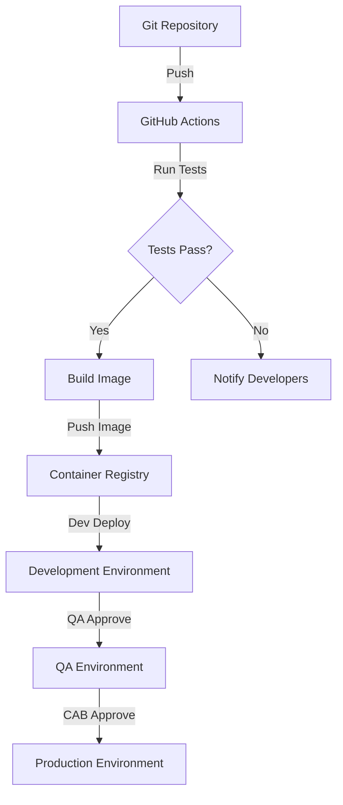

# Cloud Composer 1 to Cloud Composer 2 Migration Project

## Introduction

This project facilitates the migration of an Apache Airflow 1.10.15 codebase from Cloud Composer 1 to Cloud Composer 2 with Airflow 2.X. It provides an overview of the project structure, setup instructions, and guidance on migration processes.

## Project Overview

This migration project aims to modernize the organization's workflow orchestration platform. By migrating to Cloud Composer 2 with Airflow 2.X, the project delivers improved performance, enhanced security features, and better scalability.

The key benefits of this migration include:

-   Improved performance and scalability with Cloud Composer 2's infrastructure
-   Enhanced security features
-   Compatibility with the latest Airflow features and updates
-   Streamlined CI/CD pipeline for DAG deployment
-   Multi-environment deployment process with approval workflows

## Repository Structure

The repository is structured as follows:

-   `src/backend`: Contains the backend code, including DAGs, plugins, configurations, and deployment scripts for Airflow 2.X. See [Backend Documentation](src/backend/README.md) for details.
-   `src/test`: Contains the comprehensive test suite, including unit, integration, and migration tests. See [Test Suite Documentation](src/test/README.md) for details.
-   `infrastructure`: Contains infrastructure configuration, including Terraform files and scripts for deploying Cloud Composer 2 environments.
-   `.github`: Contains GitHub-specific files, including workflow definitions and templates for CI/CD.
-   `README.md`: This file, providing an overview of the project.

## Getting Started

To get started with the migration project, follow these steps:

1.  **Prerequisites**: Ensure you have the following prerequisites installed:
    -   Git
    -   Python 3.8+
    -   Docker and Docker Compose
    -   Google Cloud SDK (optional)
    -   Terraform (optional)
2.  **Clone the repository**:

    ```bash
    git clone https://github.com/username/repo.git
    cd repo
    ```
3.  **Set up environment variables**: Copy the `.env.example` file to `.env` and configure the necessary environment variables.
4.  **Start local development environment**:

    ```bash
    docker-compose up -d
    ```

5.  **Access Airflow UI**: Access the Airflow UI at http://localhost:8080.

See [Backend Documentation](src/backend/README.md) for detailed setup instructions.

## Migration Process

The migration process involves several key steps:

1.  **Code Migration**: Update DAG code to be compatible with Airflow 2.X. This includes updating import statements, replacing deprecated operators, and adopting the TaskFlow API where appropriate.
2.  **Infrastructure Migration**: Provision a new Cloud Composer 2 environment.
3.  **Data Migration**: Migrate Airflow metadata, including connections and variables, to the new environment.
4.  **Testing**: Implement comprehensive testing to ensure functional parity and performance improvements.
5.  **Deployment**: Deploy the migrated DAGs and configurations to the Cloud Composer 2 environment.

See the [Migration Guide](src/backend/docs/migration_guide.md) for detailed migration processes.

## CI/CD Pipeline

The project implements a CI/CD pipeline using GitHub Actions for automated testing and deployment. The pipeline includes the following stages:

1.  **Development**: Automated deployment to the DEV environment after successful test run and peer review.
2.  **QA**: Deployment to the QA environment with peer review and QA approval.
3.  **Production**: Deployment to the PROD environment with CAB, Architect, and Stakeholder approval.



## Environment Management

The project uses a multi-environment deployment process with approval workflows. The environments include:

-   **DEV**: For development and testing.
-   **QA**: For quality assurance and validation.
-   **PROD**: For live workload execution.

Each environment has specific configurations and deployment procedures.

## Testing Strategy

The project uses a multi-layered testing approach to ensure a successful migration:

1.  **Unit Testing**: Testing individual components in isolation.
2.  **Integration Testing**: Testing component interactions.
3.  **Migration Testing**: Verifying migration correctness.
4.  **Performance Testing**: Comparing performance metrics.
5.  **End-to-End Testing**: Complete workflow validation.

See [Test Suite Documentation](src/test/README.md) for testing strategy and execution instructions.

## Code of Conduct

We pledge to make participation in our project a harassment-free experience for everyone, regardless of background or identity.

Our standards include:

-   Using welcoming and inclusive language
-   Respecting differing viewpoints and experiences
-   Gracefully accepting constructive criticism
-   Focusing on what is best for the community and project
-   Showing empathy towards other community members
-   Providing detailed, constructive feedback on migration approaches

Instances of unacceptable behavior may be reported to the project maintainers. Given the complexity of the Airflow migration, we emphasize the importance of constructive feedback and collaborative problem-solving.

## Contribution Guidelines

We welcome contributions to the project. Please follow these guidelines:

-   **Branching Strategy**:
    -   `feature/descriptive-name` for new features
    -   `bugfix/issue-number-description` for bug fixes
    -   `release/version-number` for releases
-   **Commit Message Format**: `<type>(<scope>): <subject>`
-   **Pull Request Process**: Create feature branch, implement changes, run tests, submit PR for review
-   **Code Standards**: Use black for Python formatting, pylint for linting, and pytest for testing

## Documentation

-   [Backend Documentation](src/backend/README.md): Detailed backend component documentation
-   [Test Suite Documentation](src/test/README.md): Comprehensive test suite documentation
-   [Migration Guide](src/backend/docs/migration_guide.md): Detailed migration process from Airflow 1.10.15 to 2.X
-   [Airflow Documentation](https://airflow.apache.org/docs/apache-airflow/2.5.1/): Official Apache Airflow 2.X documentation
-   [Cloud Composer 2 Documentation](https://cloud.google.com/composer/docs): Official Google Cloud Composer 2 documentation

## License

Apache 2.0 License