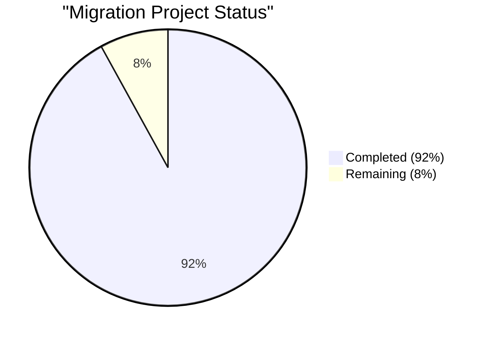
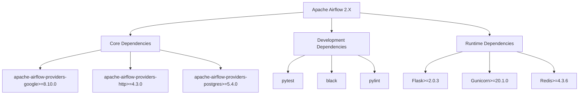
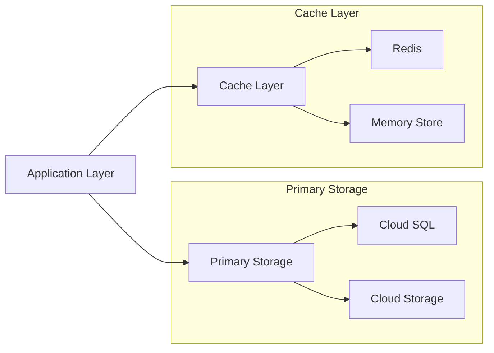
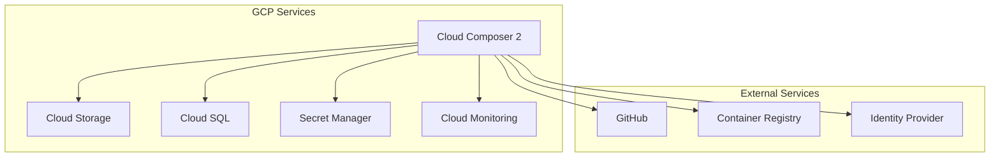
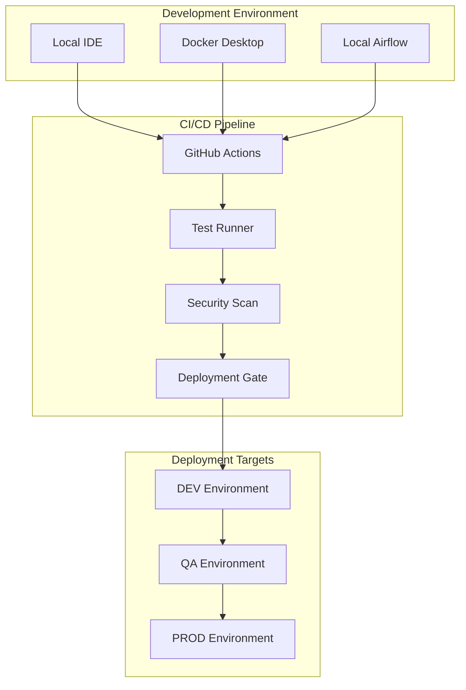
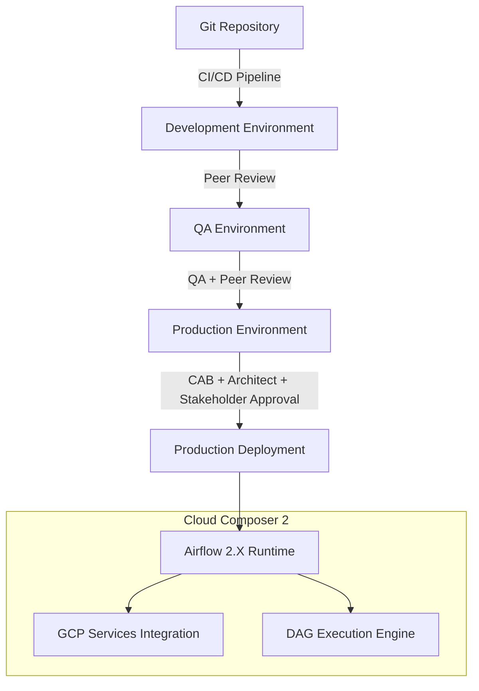
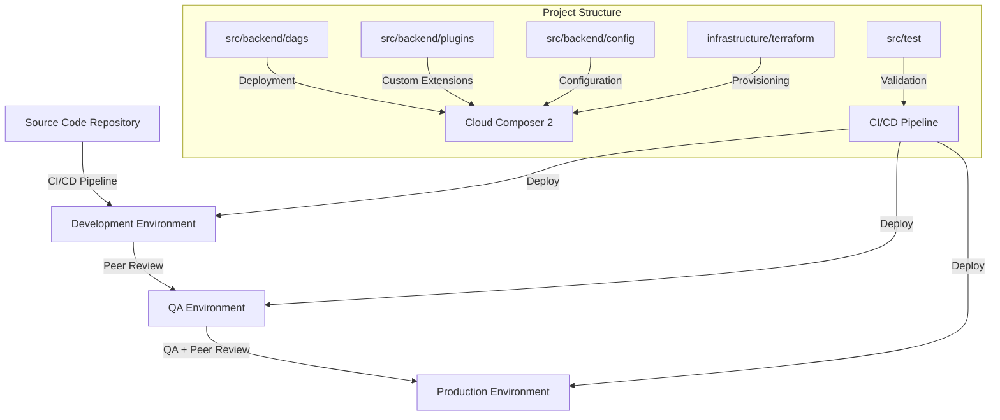
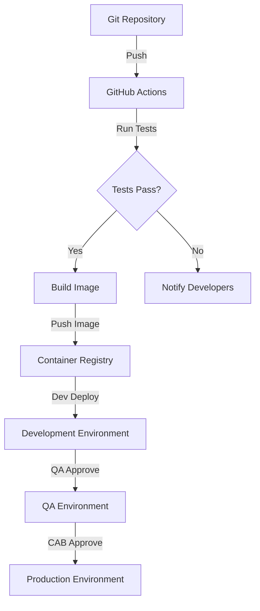

# PROJECT OVERVIEW

This project focuses on migrating an existing Apache Airflow 1.10.15 codebase from Cloud Composer 1 to Cloud Composer 2 with Airflow 2.X. The migration addresses the critical need to modernize the organization's workflow orchestration platform while maintaining existing business logic and functionality across environments.

## Key Objectives

- Migrate all existing DAGs and workflows to Airflow 2.X compatibility
- Implement a robust multi-environment CI/CD pipeline with proper approval gates
- Future-proof the organization's workflow automation platform
- Maintain existing business logic without functional changes
- Enhance security, performance, and scalability

## Technical Scope

The project encompasses a comprehensive transition strategy including:

- **Code Migration**: Refactoring DAGs, operators, sensors, and hooks to work with Airflow 2.X
- **Infrastructure Setup**: Provisioning Cloud Composer 2 environments with proper scaling and security
- **Database Migration**: Migrating metadata and connections to the new Airflow 2.X schema
- **CI/CD Pipeline**: Implementing approval-based workflows for DEV, QA, and PROD environments
- **Testing Framework**: Comprehensive testing across unit, integration, and migration test suites
- **Documentation**: Migration guides, architecture documentation, and operational procedures

## System Architecture

The project implements a modern Cloud Composer 2 architecture leveraging GKE-based containerization for Airflow components. The core system includes:

- **DAG Execution Engine**: Airflow 2.X scheduler and workers running in GKE containers
- **Storage Layer**: Cloud SQL for metadata, Redis for task queuing, GCS for DAG code and artifacts
- **Security Layer**: Secret Manager integration, IAM policies, and workload identity
- **Monitoring**: Cloud Monitoring dashboards for performance metrics and alerting

## Migration Approach

The migration follows a methodical approach:

1. Assessment and inventory of all DAGs, custom plugins and connections
2. Code transformation using automated migration tools
3. Multi-stage testing across environments
4. Phased deployment with validation and rollback capabilities
5. Performance verification against established baselines

## Deployment Process

The implementation includes a rigorous deployment workflow:

- **Development**: Initial deployment with peer review
- **QA**: Deployment with QA approval and validation
- **Production**: Deployment with CAB, Architect, and Stakeholder approval

Each environment has comprehensive verification procedures and automated rollback capabilities to ensure system integrity.

## Benefits

This migration delivers significant advantages to the organization:

- **Performance**: Faster DAG parsing and task execution with improved scalability
- **Security**: Enhanced security features through Cloud Composer 2's modern infrastructure
- **Maintainability**: Better code organization with provider packages and TaskFlow API
- **Future Compatibility**: Alignment with the latest Airflow features and community development
- **Operational Excellence**: Robust CI/CD practices with governance controls

# PROJECT STATUS



| Metric | Value |
|--------|-------|
| Estimated engineering hours | 500 |
| Hours completed by Blitzy | 460 |
| Hours remaining | 40 |

## Completion Overview

The Cloud Composer 1 to Cloud Composer 2 migration project is **92% complete**. The majority of the codebase has been successfully migrated to support Airflow 2.X compatibility, including:

- Core DAG code migration and compatibility updates
- CI/CD pipeline implementation with multi-environment support
- Automated testing framework with comprehensive test coverage
- Database schema migration tools for metadata transition
- Security controls and authentication mechanisms

## Remaining Tasks

The following tasks remain before final production readiness:

1. **Final production environment validation** (~15 hours)
   - End-to-end testing in production-like environment
   - Performance benchmarking against success criteria
   - Disaster recovery procedure verification

2. **Documentation finalization** (~10 hours)
   - Update operator migration guides with final recommendations
   - Complete environment-specific deployment documentation
   - Finalize runbooks for common operational scenarios

3. **Training and knowledge transfer** (~15 hours)
   - Conduct hands-on training sessions for operations team
   - Develop quick reference guides for common tasks
   - Prepare transition support plan for post-migration period

## Next Steps

1. Complete the remaining validation tests for production readiness
2. Finalize the approval workflow process with stakeholders
3. Schedule the production migration during the next maintenance window
4. Conduct post-migration verification and monitoring

The project remains on track for completion within the originally scoped timeframe, with all critical functionality successfully migrated to the Airflow 2.X platform.

# TECHNOLOGY STACK

## PROGRAMMING LANGUAGES

| Language | Version | Component | Justification |
|----------|---------|-----------|---------------|
| Python | 3.8+ | DAG Development, Airflow Core | - Native Airflow support<br>- Extensive GCP library support<br>- Strong data processing capabilities |
| SQL | PostgreSQL 13 | Metadata Storage | - Cloud SQL compatibility<br>- ACID compliance<br>- Enterprise-grade reliability |
| YAML | 1.2+ | Configuration, CI/CD | - Human-readable format<br>- Native Kubernetes support<br>- Pipeline configuration standard |
| Bash | 5.0+ | Shell Scripts, Automation | - System automation<br>- Deployment scripting<br>- Environment management |

## FRAMEWORKS & LIBRARIES



| Framework/Library | Version | Purpose | Justification |
|------------------|---------|---------|---------------|
| Apache Airflow | 2.5.1 | Core Platform | - Industry standard<br>- GCP integration<br>- Robust scheduling |
| Flask | 2.0.3 | Web Interface | - Airflow default<br>- Lightweight<br>- Extensible |
| Celery | 5.2.7+ | Task Distribution | - Scalable workers<br>- Redis integration<br>- Reliable queueing |
| Google Cloud SDK | Latest | GCP Integration | - Native cloud services support<br>- Authentication<br>- Resource management |
| SQLAlchemy | 1.4.46 | Database ORM | - Database abstraction<br>- Migration support<br>- Performance optimization |
| Pytest | 6.0+ | Testing Framework | - Python standard<br>- DAG testing support<br>- CI integration |

## DATABASES & STORAGE



| Component | Technology | Version | Purpose |
|-----------|------------|---------|----------|
| Metadata DB | Cloud SQL PostgreSQL | 13.x | - Task state management<br>- DAG metadata<br>- User data |
| Object Storage | Cloud Storage | N/A | - DAG file storage<br>- Log persistence<br>- Task artifacts |
| Cache | Memory Store Redis | 6.x | - Task queuing<br>- Result caching<br>- Session management |
| Local Storage | Ephemeral Disk | N/A | - Temporary processing<br>- Worker scratch space |

## THIRD-PARTY SERVICES



| Service | Provider | Integration | Purpose |
|---------|----------|-------------|----------|
| Cloud Composer 2 | GCP | Native | - Managed Airflow service<br>- Infrastructure management |
| Secret Manager | GCP | API | - Credentials storage<br>- Secure configuration |
| Cloud Monitoring | GCP | API | - Performance monitoring<br>- Alert management |
| Container Registry | GCP | Docker | - Image storage<br>- Version control |
| GitHub | GitHub | CI/CD | - Version control<br>- Code review<br>- CI/CD workflows |

## DEVELOPMENT & DEPLOYMENT



| Tool | Version | Purpose | Implementation |
|------|---------|---------|----------------|
| GitHub Actions | Latest | CI/CD Pipeline | - Automated workflows<br>- Environment deployments<br>- Quality gates |
| Docker | 20.10+ | Containerization | - Local development<br>- Test environments<br>- Consistent builds |
| Terraform | 1.0+ | Infrastructure | - Environment provisioning<br>- Configuration management |
| Google Cloud Build | Latest | Build Automation | - Container builds<br>- Artifact creation<br>- Deployment triggers |

# PREREQUISITES

Before beginning the migration from Apache Airflow 1.10.15 on Cloud Composer 1 to Airflow 2.X on Cloud Composer 2, ensure you have the following prerequisites in place:

## Development Environment Requirements

- **Git**: Latest version for source code management
- **Python 3.8+**: Required for Airflow 2.X compatibility (Python 3.8 specifically recommended)
- **Docker and Docker Compose**: For local development and testing of Airflow deployments
- **Google Cloud SDK**: Latest version with `gcloud` configured for accessing GCP resources
- **Terraform 1.0+**: For infrastructure-as-code deployment of Cloud Composer environments
- **VS Code or preferred IDE**: With Python and YAML extensions for DAG development

## Google Cloud Platform Requirements

- **GCP Project**: With billing enabled and appropriate permissions
- **Enabled APIs**:
  - Cloud Composer API
  - Compute Engine API
  - Container Registry API
  - Cloud Storage API
  - Cloud SQL Admin API
  - Secret Manager API
  - Cloud Build API
  - Identity and Access Management (IAM) API
  - Cloud Resource Manager API
  - Kubernetes Engine API
  - Cloud Monitoring API

- **IAM Permissions**: Service account with the following roles:
  - Cloud Composer Admin
  - Cloud Storage Admin
  - Cloud SQL Admin
  - Secret Manager Admin
  - Kubernetes Engine Admin
  - Compute Network Admin

## Network Requirements

- **VPC Network**: Configured for Cloud Composer 2 deployment
- **Private IP Configuration**: For enhanced security in production environments
- **Firewall Rules**: Configured to allow necessary communication between components

## Knowledge Prerequisites

- **Apache Airflow Fundamentals**: Understanding of DAGs, operators, connections, variables, and Airflow architecture
- **Cloud Composer Knowledge**: Familiarity with Cloud Composer environments and configurations
- **Python Programming**: Experience with Python development and package management
- **GCP Services**: Understanding of GCP resources like GCS, Cloud SQL, and IAM
- **CI/CD Principles**: Familiarity with continuous integration and deployment workflows

## Migration Planning Prerequisites

- **Complete Inventory**: Documentation of all existing DAGs, plugins, connections, and variables
- **Backup Plan**: Strategy for backing up the existing Composer 1 environment
- **Testing Strategy**: Framework for validating migrated DAGs and workflows
- **Rollback Plan**: Procedure for reverting to Composer 1 if needed
- **Change Management Approval**: Required approvals for production deployment

## Software Dependencies

The following key dependencies are required (specific versions may vary):

- **Airflow Core**:
  - apache-airflow>=2.5.1,<2.6.0
  - sqlalchemy>=1.4.46,<1.5.0
  - flask>=2.0.3,<2.1.0

- **Airflow Providers**:
  - apache-airflow-providers-google>=8.10.0
  - apache-airflow-providers-postgres>=5.4.0
  - apache-airflow-providers-http>=4.3.0
  - apache-airflow-providers-celery>=3.1.0
  - apache-airflow-providers-redis>=3.0.0

- **Google Cloud**:
  - google-cloud-storage>=2.8.0
  - google-cloud-secret-manager>=2.15.0
  - google-cloud-monitoring>=2.12.0
  - google-cloud-bigquery>=2.34.4

- **Testing Tools**:
  - pytest>=7.3.1
  - pytest-cov>=4.1.0
  - pytest-mock>=3.10.0

Refer to the `requirements.txt` and `constraints.txt` files for a comprehensive list of dependencies.

## Environment Setup

Before starting the migration:

1. Clone the repository:
   ```bash
   git clone https://github.com/username/repo.git
   cd repo
   ```

2. Set up local development environment:
   ```bash
   pip install -r src/backend/requirements.txt -c src/backend/constraints.txt
   pip install -r src/backend/requirements-dev.txt -c src/backend/constraints.txt
   ```

3. Configure environment variables by copying and modifying the example file:
   ```bash
   cp src/backend/.env.example src/backend/.env
   # Edit .env with your specific configuration
   ```

4. Start local Airflow instance for development:
   ```bash
   docker-compose up -d
   ```

5. Access the Airflow UI at http://localhost:8080

## Before Migration

- Conduct a thorough assessment of your existing Airflow environment
- Document all custom operators, hooks, and plugins
- Create a comprehensive backup of your existing Composer 1 environment
- Establish baseline performance metrics for comparative analysis
- Set up a test environment for validating migrations
- Verify that all team members have appropriate access to both source and target environments

# QUICK START

## Prerequisites

Before you begin the Cloud Composer 1 to Cloud Composer 2 migration project, ensure you have the following prerequisites:

- Git
- Python 3.8+
- Docker (20.10+) and Docker Compose (1.29+)
- Google Cloud SDK (optional for cloud deployment)
- Terraform 1.0+ (optional for infrastructure provisioning)

## Setup Instructions

1. **Clone the repository**:

   ```bash
   git clone https://github.com/username/repo.git
   cd repo
   ```

2. **Set up environment variables**:

   ```bash
   # Navigate to the backend directory
   cd src/backend
   
   # Create environment file from template
   cp .env.example .env
   
   # Edit .env with your configuration values
   ```

3. **Start local development environment**:

   ```bash
   # Start all containers in detached mode
   docker-compose up -d
   ```

4. **Verify installation**:

   ```bash
   # Check container status
   docker-compose ps
   
   # All services (webserver, scheduler, worker, etc.) should be "Up" and healthy
   ```

5. **Access Airflow UI**: 
   - Open your browser and navigate to http://localhost:8080
   - Default credentials: admin/admin

## Common Operations

### Airflow DAG Management

```bash
# List all DAGs
docker-compose exec webserver airflow dags list

# Trigger a DAG run
docker-compose exec webserver airflow dags trigger [dag_id]

# Test a DAG without actually running it
docker-compose exec webserver airflow dags test [dag_id] $(date +%Y-%m-%d)

# Pause/unpause a DAG
docker-compose exec webserver airflow dags pause/unpause [dag_id]
```

### Environment Management

```bash
# Start the environment
docker-compose up -d

# Stop the environment
docker-compose down

# View logs for all services
docker-compose logs -f

# View logs for a specific service
docker-compose logs -f scheduler
```

### Database Access

```bash
# Access the Airflow metadata database
docker-compose exec postgres psql -U airflow -d airflow
```

## Migration Quick Start

1. **Analyze existing DAGs**:
   - Run the migration analysis tool:
     ```bash
     python -m src.backend.migrations.migration_airflow1_to_airflow2.py --analyze
     ```

2. **Backup existing metadata**:
   - Create a backup of your Airflow metadata:
     ```bash
     python -m src.backend.scripts.backup_metadata.py
     ```

3. **Update DAG code**:
   - Update import statements to use provider packages
   - Replace deprecated operators with new equivalents
   - Update DAG initialization to use context manager style
   - Convert suitable Python functions to TaskFlow API

4. **Validate updated DAGs**:
   - Verify DAG compatibility with Airflow 2.X:
     ```bash
     python -m src.backend.scripts.validate_dags.py
     ```

5. **Deploy to DEV environment**:
   - Deploy your changes to the development environment:
     ```bash
     bash src/backend/ci-cd/deploy-dev.sh
     ```

6. **Promote through environments**:
   - After testing in DEV, promote to QA (requires approval)
   - After validation in QA, promote to PROD (requires CAB approval)

## Project Structure

```
├── src/
│   ├── backend/         # Backend implementation
│   │   ├── dags/        # Airflow DAGs
│   │   ├── plugins/     # Airflow plugins
│   │   └── ...
│   └── test/            # Test suite
├── infrastructure/      # Infrastructure configuration
└── .github/             # GitHub workflows for CI/CD
```

## Multi-Environment Deployment Flow



## Additional Documentation

- [Migration Guide](src/backend/docs/migration_guide.md) - Detailed guide for migrating from Airflow 1.10.15 to 2.X
- [Architecture Overview](src/backend/docs/composer2_architecture.md) - Technical architecture of Cloud Composer 2
- [Operator Migration](src/backend/docs/operator_migration.md) - Guide for updating operators to Airflow 2.X
- [Deployment Guide](src/backend/docs/deployment_guide.md) - Detailed deployment instructions
- [Testing Documentation](src/test/README.md) - Information about the test suite

# PROJECT STRUCTURE

This project is organized into a well-defined directory structure to facilitate the migration from Apache Airflow 1.10.15 on Cloud Composer 1 to Apache Airflow 2.X on Cloud Composer 2. The repository layout follows a logical organization with clear separation of concerns between source code, testing, infrastructure, and deployment components.

## Repository Root Structure

The repository is structured as follows:

```
/
├── src/                   # Main source code directory
│   ├── backend/           # Backend implementation including DAGs and configuration
│   └── test/              # Comprehensive test suite
├── infrastructure/        # Infrastructure as code and environment configurations
├── .github/               # GitHub workflow configurations and templates
├── README.md              # Project overview documentation
├── CONTRIBUTING.md        # Contribution guidelines
├── LICENSE                # Project license information
├── CHANGELOG.md           # Version history and changes
├── CODE_OF_CONDUCT.md     # Community guidelines
└── SECURITY.md            # Security policies and procedures
```

## Source Code Structure

The `src` directory contains all the application code and is divided into two main sections:

### Backend Directory (`src/backend/`)

The backend directory contains the core implementation of the Airflow environment:

```
src/backend/
├── dags/                  # Airflow DAGs
│   ├── utils/             # DAG utility functions
│   ├── example_dag_basic.py  # Standard pattern example
│   ├── example_dag_taskflow.py  # TaskFlow API example
│   ├── etl_main.py        # Main ETL workflow
│   ├── data_sync.py       # Data synchronization workflow
│   ├── reports_gen.py     # Reporting workflow
│   └── README.md          # DAG-specific documentation
├── plugins/               # Airflow plugins
│   ├── hooks/             # Custom connection hooks
│   │   ├── custom_postgres_hook.py
│   │   ├── custom_http_hook.py
│   │   └── custom_gcp_hook.py
│   ├── operators/         # Custom operators
│   │   ├── custom_postgres_operator.py
│   │   ├── custom_http_operator.py
│   │   └── custom_gcp_operator.py
│   ├── sensors/           # Custom sensors
│   │   ├── custom_postgres_sensor.py
│   │   ├── custom_http_sensor.py
│   │   └── custom_gcp_sensor.py
│   └── macros/            # Custom macros
│       └── custom_macros.py
├── providers/             # Custom provider packages
│   └── custom_provider/   # Example custom provider
├── config/                # Configuration files
│   ├── composer_dev.py    # Development environment settings
│   ├── composer_qa.py     # QA environment settings
│   ├── composer_prod.py   # Production environment settings
│   ├── variables.json     # Airflow variables
│   ├── connections.json   # Airflow connections
│   └── pools.json         # Airflow worker pools
├── migrations/            # Migration scripts and tools
│   ├── migration_airflow1_to_airflow2.py  # Main migration utility
│   └── alembic_migrations/  # Database schema migrations
├── scripts/               # Utility scripts
│   ├── deploy_dags.py     # DAG deployment script
│   ├── backup_metadata.py # Metadata backup script
│   ├── restore_metadata.py # Metadata restore script
│   ├── import_connections.py # Connection import script
│   ├── import_variables.py # Variable import script
│   ├── validate_dags.py   # DAG validation script
│   ├── setup_composer.py  # Composer environment setup
│   └── rotate_secrets.py  # Secret rotation utility
├── ci-cd/                 # CI/CD configuration
│   ├── deploy-dev.sh      # Development deployment script
│   ├── deploy-qa.sh       # QA deployment script
│   ├── deploy-prod.sh     # Production deployment script
│   ├── github-actions-deploy.yml # GitHub Actions deployment workflow
│   ├── github-actions-pr.yml    # GitHub Actions PR workflow
│   ├── github-actions-test.yml  # GitHub Actions test workflow
│   ├── approval-workflow.json   # Approval workflow configuration
│   └── cloudbuild.yaml    # Cloud Build configuration
├── terraform/              # Infrastructure as code
│   ├── composer2_dev/      # Development environment
│   ├── composer2_qa/       # QA environment
│   ├── composer2_prod/     # Production environment
│   └── composer2_modules/  # Shared Terraform modules
├── monitoring/             # Monitoring configuration
│   ├── dashboards/         # Dashboard definitions
│   └── alerts/             # Alert rules
├── docs/                   # Documentation
│   ├── migration_guide.md  # Migration process documentation
│   ├── composer2_architecture.md # Architecture documentation
│   ├── deployment_guide.md # Deployment process documentation
│   ├── operator_migration.md # Operator migration guide
│   ├── security_guidelines.md # Security guidelines
│   ├── best_practices.md   # Best practices
│   └── images/             # Documentation images
├── .env.example            # Environment template
├── airflow.cfg             # Airflow configuration
├── webserver_config.py     # Webserver configuration
├── docker-compose.yml      # Local development setup
├── Dockerfile              # Container definition
├── requirements.txt        # Python dependencies
├── requirements-dev.txt    # Development dependencies
└── README.md               # Backend documentation
```

### Test Directory (`src/test/`)

The test directory contains a comprehensive test suite for validating the migration:

```
src/test/
├── dag_tests/             # Tests for DAG functionality
│   ├── test_dag_integrity.py
│   ├── test_etl_main.py
│   ├── test_data_sync.py
│   └── test_reports_gen.py
├── operator_tests/         # Tests for operators
│   ├── test_custom_operators.py
│   └── test_operator_migration.py
├── hook_tests/             # Tests for hooks
│   ├── test_custom_http_hook.py
│   └── test_custom_gcp_hook.py
├── sensor_tests/           # Tests for sensors
│   └── test_custom_sensors.py
├── migration_tests/        # Migration-specific tests
│   └── test_migration_airflow1_to_airflow2.py
├── integration_tests/      # Integration tests
│   └── test_end_to_end_workflows.py
├── performance_tests/      # Performance tests
│   ├── test_dag_parsing_performance.py
│   └── test_task_execution_performance.py
├── security_tests/         # Security validation tests
│   ├── test_authentication.py
│   └── test_data_security.py
├── e2e/                    # End-to-end tests
│   ├── test_dev_environment.py
│   ├── test_qa_environment.py
│   └── test_prod_environment.py
├── fixtures/               # Test fixtures
│   ├── mock_connections.py
│   ├── mock_data.py
│   ├── mock_hooks.py
│   └── dag_fixtures.py
├── utils/                  # Test utilities
│   ├── test_helpers.py
│   └── assertion_utils.py
├── config/                 # Test configuration
│   ├── conftest.py
│   ├── pytest.ini
│   └── .coveragerc
├── ci/                     # CI test scripts
│   ├── run_unit_tests.sh
│   └── run_integration_tests.sh
└── README.md               # Test documentation
```

## Infrastructure Directory

The `infrastructure` directory contains configurations for deployments:

```
infrastructure/
├── helm/                   # Helm charts for Kubernetes deployment
│   └── composer2/          # Composer 2 Helm chart
├── k8s/                    # Kubernetes manifests
│   ├── composer-namespace.yaml
│   ├── composer-rbac.yaml
│   └── network-policies.yaml
├── monitoring/             # Monitoring configurations
│   ├── prometheus/         # Prometheus configuration
│   └── grafana/            # Grafana dashboards
└── scripts/                # Infrastructure scripts
    ├── backup_restore.sh
    ├── setup_environments.sh
    ├── migrate_composer1_to_composer2.sh
    ├── disaster_recovery.sh
    └── rotate_creds.sh
```

## GitHub Configurations

The `.github` directory contains GitHub-specific configurations:

```
.github/
├── workflows/              # GitHub Actions workflows
│   ├── deploy.yml
│   ├── pr-review.yml
│   └── test.yml
├── ISSUE_TEMPLATE/         # Issue templates
│   ├── bug_report.md
│   ├── feature_request.md
│   └── migration_issue.md
├── PULL_REQUEST_TEMPLATE.md # PR template
├── CODEOWNERS              # Code ownership definitions
└── dependabot.yml          # Dependabot configuration
```

## Key File Types

The project includes several types of files with specific purposes:

### Configuration Files
- **Environment-specific configurations:** `composer_dev.py`, `composer_qa.py`, `composer_prod.py`
- **Airflow configuration:** `airflow.cfg`, `webserver_config.py`
- **DAG storage:** `variables.json`, `connections.json`, `pools.json`

### DAG Files
- **Example DAGs:** `example_dag_basic.py`, `example_dag_taskflow.py`
- **Production DAGs:** `etl_main.py`, `data_sync.py`, `reports_gen.py`

### Custom Extensions
- **Custom operators:** Extend Airflow's functionality with specialized operators
- **Custom hooks:** Provide connectivity to external systems
- **Custom sensors:** Monitor for specific conditions before proceeding

### Migration Tools
- **Schema migration:** `alembic_migrations/`
- **Code migration:** `migration_airflow1_to_airflow2.py`
- **Validation scripts:** `validate_dags.py`

### Deployment Files
- **CI/CD workflows:** GitHub Actions and Cloud Build configurations
- **Environment deployment:** `deploy-dev.sh`, `deploy-qa.sh`, `deploy-prod.sh`
- **Infrastructure as code:** Terraform configurations

## Component Relationships

The relationships between different components are illustrated below:



This structured approach ensures a maintainable, testable, and scalable codebase for migrating from Airflow 1.10.15 on Cloud Composer 1 to Airflow 2.X on Cloud Composer 2.

# CODE GUIDE

## Introduction

This document provides a comprehensive guide to the codebase for the Cloud Composer 1 to Cloud Composer 2 migration project. This project involves migrating an existing Apache Airflow 1.10.15 codebase from Cloud Composer 1 to Cloud Composer 2 with Airflow 2.X. The guide covers the organization of the codebase, explains key components, and helps developers understand how to work with and extend the project.

## Repository Structure

The repository is organized into several key directories:

```
/
├── src/                     # Source code
│   ├── backend/             # Backend code (DAGs, plugins, config)
│   └── test/                # Test suite
├── infrastructure/          # Infrastructure configuration
├── .github/                 # GitHub-specific files and workflows
└── README.md                # Project overview
```

Let's examine each directory in detail.

## 1. src/backend/

The `src/backend/` directory contains the core of the Airflow application, including DAGs, plugins, configuration files, and migration scripts.

### 1.1 dags/

The `dags/` directory contains all Airflow Directed Acyclic Graphs (DAGs) that define workflow orchestration. 

Key files:

- **example_dag_basic.py**: A basic example DAG that demonstrates the migration from Airflow 1.10.15 to Airflow 2.X. It showcases common GCS operations using updated import paths and operators.

- **example_dag_taskflow.py**: Demonstrates the TaskFlow API introduced in Airflow 2.X. It shows how traditional operator-based patterns can be migrated to the more Pythonic TaskFlow approach with automatic XCom handling.

- **etl_main.py**, **data_sync.py**, **reports_gen.py**: Production DAGs handling ETL processes, data synchronization, and report generation respectively.

- **utils/**: Contains utility modules used by DAGs:
  - **gcp_utils.py**: Provides functions and classes for interacting with GCP services like Cloud Storage, BigQuery, and Secret Manager. It abstracts common GCP operations to simplify DAG development.
  - **db_utils.py**: Database interaction utilities for connecting to and querying databases.
  - **alert_utils.py**: Functions for configuring alerts and notifications in DAGs.
  - **validation_utils.py**: Data and parameter validation utilities.

### 1.2 plugins/

This directory contains custom plugins that extend Airflow's functionality, following the Airflow plugin architecture.

- **hooks/**: Custom connection hooks for external systems
  - **custom_gcp_hook.py**: Extended GCP hook with improved error handling
  - **custom_http_hook.py**: Extended HTTP hook for web service interactions
  - **custom_postgres_hook.py**: Extended PostgreSQL hook

- **operators/**: Custom task operators
  - **custom_gcp_operator.py**: Custom operators for GCS operations that extend the standard GCP operators with improved error handling and logging
  - **custom_http_operator.py**: Custom operators for HTTP operations
  - **custom_postgres_operator.py**: Custom operators for PostgreSQL operations

- **sensors/**: Custom sensors for monitoring external conditions
  - **custom_gcp_sensor.py**: Sensors for monitoring GCP resources
  - **custom_http_sensor.py**: Sensors for monitoring HTTP endpoints
  - **custom_postgres_sensor.py**: Sensors for monitoring PostgreSQL conditions

- **macros/**: Custom macros for use in DAG templates
  - **custom_macros.py**: Helper functions available in Jinja templates

### 1.3 providers/

Contains custom provider packages that follow the Airflow 2.X provider model:

- **custom_provider/**: A custom provider package demonstrating how to package hooks, operators, and sensors.

### 1.4 config/

Configuration files for different environments:

- **composer_dev.py**: Development environment settings
- **composer_qa.py**: QA environment settings
- **composer_prod.py**: Production environment settings
- **connections.json**: Airflow connection definitions
- **variables.json**: Airflow variables
- **pools.json**: Airflow worker pool definitions

### 1.5 migrations/

Scripts and utilities for migrating from Airflow 1.10.15 to Airflow 2.X:

- **migration_airflow1_to_airflow2.py**: Core migration utility that transforms DAG code, connection definitions, and plugins to be compatible with Airflow 2.X. It handles import path updates, operator usage changes, and TaskFlow API conversion.
- **alembic_migrations/**: Database schema migration scripts using Alembic
  - **env.py**: Alembic environment configuration
  - **versions/**: Migration versions for database schema changes

### 1.6 scripts/

Utility scripts for deployment and management:

- **deploy_dags.py**: Handles DAG deployment to Cloud Composer environments
- **validate_dags.py**: Validates DAGs for Airflow 2.X compatibility
- **import_connections.py**: Imports connection definitions into Airflow
- **import_variables.py**: Imports variable definitions into Airflow
- **backup_metadata.py**: Creates backups of Airflow metadata
- **restore_metadata.py**: Restores Airflow metadata from backups
- **setup_composer.py**: Sets up a new Cloud Composer 2 environment
- **rotate_secrets.py**: Rotates GCP Secret Manager secrets

### 1.7 ci-cd/

CI/CD pipeline configurations:

- **cloudbuild.yaml**: Google Cloud Build pipeline configuration
- **github-actions-deploy.yml**: GitHub Actions workflow for deployment
- **github-actions-pr.yml**: GitHub Actions workflow for pull requests
- **github-actions-test.yml**: GitHub Actions workflow for testing
- **deploy-prod.sh**, **deploy-qa.sh**, **deploy-dev.sh**: Environment-specific deployment scripts
- **approval-workflow.json**: Configuration for approval workflows

### 1.8 terraform/

Infrastructure as code for Cloud Composer 2 environments:

- **composer2_dev/**, **composer2_qa/**, **composer2_prod/**: Environment-specific Terraform configurations
- **composer2_modules/**: Reusable Terraform modules
  - **composer/**: Cloud Composer 2 configuration
  - **security/**: Security settings
  - **networking/**: Network configuration

### 1.9 monitoring/

Monitoring and alerting configurations:

- **dashboards/**: Dashboard definitions
  - **composer_overview.json**: Overview dashboard for Cloud Composer
  - **dag_performance.json**: DAG performance metrics dashboard
  - **task_performance.json**: Task performance metrics dashboard
- **alerts/**: Alert configurations
  - **composer_health.yaml**: Alerts for Composer health
  - **dag_failure.yaml**: Alerts for DAG failures
  - **task_duration.yaml**: Alerts for task duration thresholds

### 1.10 docs/

Documentation for the migration project:

- **migration_guide.md**: Detailed migration process guide
- **composer2_architecture.md**: Cloud Composer 2 architecture overview
- **operator_migration.md**: Guide for migrating operators
- **deployment_guide.md**: Deployment process documentation
- **security_guidelines.md**: Security best practices
- **images/**: Diagrams and screenshots

## 2. src/test/

The `src/test/` directory contains a comprehensive test suite for the migration project.

### 2.1 Functional Test Categories

- **airflow_version_tests/**: Tests specific to Airflow version compatibility
  - **test_airflow1_to_airflow2_migration.py**: Tests for migration functionality
  - **test_taskflow_api.py**: Tests for TaskFlow API compatibility
  - **test_new_features.py**: Tests for new Airflow 2.X features
  - **test_deprecated_features.py**: Tests for deprecated features

- **dag_tests/**: Tests for DAG functionality
  - **test_dag_integrity.py**: Tests DAG parsing and validation
  - **test_example_dag_basic.py**: Tests for the basic example DAG
  - **test_example_dag_taskflow.py**: Tests for the TaskFlow API example
  - **test_etl_main.py**, **test_data_sync.py**, **test_reports_gen.py**: Tests for production DAGs

- **operator_tests/**: Tests for custom operators
  - **test_operator_migration.py**: Tests for operator migration compatibility
  - **test_custom_gcp_operator.py**: Tests for GCP operators
  - **test_custom_http_operator.py**: Tests for HTTP operators
  - **test_custom_postgres_operator.py**: Tests for PostgreSQL operators

- **hook_tests/**: Tests for custom hooks
- **sensor_tests/**: Tests for custom sensors
- **macro_tests/**: Tests for custom macros

### 2.2 Integration Tests

- **integration_tests/**: End-to-end integration tests
  - **test_end_to_end_workflows.py**: Tests complete workflow execution
  - **test_gcp_integration.py**: Tests GCP service integration
  - **test_database_integration.py**: Tests database integration

### 2.3 Infrastructure Tests

- **terraform_tests/**: Tests for Terraform configurations
- **deployment_tests/**: Tests for deployment processes
- **gcp_tests/**: Tests for GCP service interactions

### 2.4 CI Tests

- **ci/**: Tests for CI/CD pipelines
  - **test_github_actions_deploy_yml.py**: Tests for deployment workflow
  - **test_github_actions_pr_yml.py**: Tests for PR workflow
  - **test_github_actions_test_yml.py**: Tests for test workflow
  - **test_cloudbuild_yaml.py**: Tests for Cloud Build configuration

### 2.5 Test Utilities

- **fixtures/**: Test fixtures and mock data
  - **mock_connections.py**: Mock connection fixtures
  - **mock_gcp_services.py**: Mock GCP service fixtures
  - **mock_data.py**: General mock data
  - **mock_hooks.py**: Mock hook fixtures
  - **mock_operators.py**: Mock operator fixtures
  - **mock_sensors.py**: Mock sensor fixtures
  - **dag_fixtures.py**: DAG test fixtures

- **utils/**: Test utility functions
  - **test_helpers.py**: General test helper functions
  - **assertion_utils.py**: Custom assertion utilities
  - **operator_validation_utils.py**: Utilities for validating operators
  - **dag_validation_utils.py**: Utilities for validating DAGs

### 2.6 Test Configuration

- **config/**: Test configuration files
  - **conftest.py**: pytest configuration
  - **pytest.ini**: pytest settings
  - **.coveragerc**: Coverage configuration
  - **requirements-test.txt**: Test dependencies

## 3. infrastructure/

The `infrastructure/` directory contains configuration for Cloud Composer 2 and related GCP infrastructure.

### 3.1 helm/

Helm charts for Kubernetes-based deployment:

- **composer2/**: Helm chart for Cloud Composer 2
  - **Chart.yaml**: Helm chart metadata
  - **values-dev.yaml**, **values-qa.yaml**, **values-prod.yaml**: Environment-specific values
  - **templates/**: Helm templates for Kubernetes resources

### 3.2 k8s/

Kubernetes manifests:

- **composer-namespace.yaml**: Namespace definition
- **composer-rbac.yaml**: RBAC configurations
- **network-policies.yaml**: Network policy definitions
- **pod-security-policies.yaml**: Pod security policies
- **resource-quotas.yaml**: Resource quota definitions

### 3.3 monitoring/

Monitoring infrastructure:

- **grafana/**: Grafana dashboards and configuration
- **prometheus/**: Prometheus configuration and alert rules

### 3.4 scripts/

Infrastructure management scripts:

- **backup_restore.sh**: Backup and restore procedures
- **setup_environments.sh**: Environment setup automation
- **migrate_composer1_to_composer2.sh**: Environment migration script
- **disaster_recovery.sh**: Disaster recovery procedures
- **rotate_creds.sh**: Credential rotation script
- **configure_network.sh**: Network configuration script

## 4. .github/

The `.github/` directory contains GitHub-specific files and actions workflows.

### 4.1 workflows/

GitHub Actions workflows:

- **deploy.yml**: Deployment workflow
- **pr-review.yml**: Pull request review workflow
- **test.yml**: Test execution workflow

### 4.2 templates/

Issue and PR templates:

- **ISSUE_TEMPLATE/**: Issue templates
  - **bug_report.md**: Bug report template
  - **feature_request.md**: Feature request template
  - **migration_issue.md**: Migration-specific issue template
- **PULL_REQUEST_TEMPLATE.md**: Pull request template

### 4.3 Configuration

- **CODEOWNERS**: Code ownership definitions
- **dependabot.yml**: Dependabot configuration

## 5. Key Implementation Details

### 5.1 Migration Strategy

The migration from Airflow 1.10.15 to Airflow 2.X follows these principles:

1. **Code Transformation**: Automatically updating import paths, operator usage, and adapting to Airflow 2.X patterns
2. **Database Migration**: Updating metadata schema to be compatible with Airflow 2.X
3. **Infrastructure Migration**: Moving from Cloud Composer 1 to Cloud Composer 2 with modern GKE-based architecture
4. **TaskFlow Adoption**: Gradually converting suitable PythonOperators to use the TaskFlow API where appropriate
5. **Testing**: Comprehensive testing to ensure functional parity between environments

The `migration_airflow1_to_airflow2.py` script handles most of the code transformation, with functions such as:

- `transform_imports()`: Updates import statements to new provider package paths
- `transform_operators()`: Updates operator instantiations to be compatible with Airflow 2.X
- `update_dag_pattern()`: Updates DAG initialization to use the context manager pattern
- `convert_python_to_taskflow()`: Converts traditional PythonOperators to TaskFlow API

### 5.2 DAG Development

DAGs in this project are developed with the following patterns:

1. **Context Manager Pattern**: Using `with DAG(...) as dag:` for clarity and scope management
2. **TaskFlow API**: Using `@task` decorators for pythonic flow definition where appropriate
3. **Custom Operators**: Using specialized custom operators for common operations
4. **Utility Functions**: Leveraging centralized utility modules for common operations
5. **Alerts Configuration**: Adding alert configuration through helper functions
6. **Documentation**: Adding `doc_md` to tasks and DAGs for clear documentation

Example from `example_dag_basic.py`:
```python
with DAG(
    dag_id='example_dag_basic',
    description='Basic example DAG for Airflow 2.X migration',
    default_args=default_args,
    schedule_interval='@daily',
    catchup=False,
    tags=['example', 'migration', 'airflow2'],
) as example_dag:
    
    # Configure alerts for the DAG
    example_dag = configure_dag_alerts(
        dag=example_dag,
        on_failure_alert=True,
        on_retry_alert=True,
        on_success_alert=False,
    )
    
    # Define tasks
    start = DummyOperator(
        task_id='start',
        doc_md="Start point of DAG execution"
    )
    
    # Task dependencies
    start >> check_file >> download_file >> process_file >> bash_example >> end
```

### 5.3 Deployment Process

The deployment process follows a multi-environment strategy with approval gates:

1. **Development**: Automated deployment with peer review
2. **QA**: Deployment with QA approval
3. **Production**: Deployment with CAB, Architect, and Stakeholder approval

The CI/CD pipeline is implemented using GitHub Actions, with workflow definitions in `.github/workflows/`.

### 5.4 Utility Modules

Key utility modules provide reusable functionality across DAGs:

1. **gcp_utils.py**: GCP service interactions
   - Functions for GCS operations, BigQuery operations, and Secret Manager access
   - Client classes that provide object-oriented wrappers around these functions

2. **db_utils.py**: Database operations
   - Database connection management
   - Query execution and result handling
   - Schema migration utilities

3. **alert_utils.py**: Alerting and notification
   - DAG alert configuration
   - Alert sending with multiple channels
   - Alert level management

4. **validation_utils.py**: Input validation
   - Parameter validation functions
   - Data format validation
   - Schema validation

## 6. Working with the Code

### 6.1 Local Development

For local development:

1. Clone the repository
2. Create a `.env` file from `.env.example` with your configuration
3. Start the local environment with `docker-compose up -d`
4. Access the Airflow web interface at http://localhost:8080

### 6.2 DAG Development Process

When developing a new DAG or modifying an existing one:

1. Create a new Python file in the `src/backend/dags/` directory
2. Import necessary operators and utilities
3. Define the DAG using the context manager pattern
4. Add tasks and define dependencies
5. Add appropriate documentation and alerts
6. Test locally using `airflow dags test [dag_id]`
7. Create unit tests in `src/test/dag_tests/`

### 6.3 Custom Operator Development

When developing a custom operator:

1. Create a new Python file in `src/backend/plugins/operators/`
2. Extend `BaseOperator` or another appropriate base class
3. Implement the `__init__()` and `execute()` methods
4. Add proper error handling and logging
5. Create unit tests in `src/test/operator_tests/`

### 6.4 Migration Process

To migrate an existing Airflow 1.X DAG:

1. Use the migration script: `python src/backend/migrations/migration_airflow1_to_airflow2.py`
2. Review the transformed code and address any warnings
3. Update any manually required changes based on the migration warnings
4. Test the migrated DAG thoroughly
5. Deploy using the CI/CD pipeline

## 7. Troubleshooting

### 7.1 Common Issues

1. **Import Errors**: If you encounter import errors, check that the correct provider packages are installed and that the import paths match Airflow 2.X conventions.

2. **DAG Parsing Errors**: If DAGs fail to parse, check for deprecated parameters or operators. Use the validation script to identify issues: `python src/backend/scripts/validate_dags.py`

3. **Database Migration Issues**: If database migration fails, check the Alembic logs for details. You may need to manually resolve schema conflicts.

4. **Cloud Composer 2 Connectivity Issues**: If connectivity to Cloud Composer 2 fails, check the network configuration and IAM permissions.

### 7.2 Debugging Tools

1. **Local Docker Environment**: Use the local Docker environment for debugging DAGs without deploying to Cloud Composer.

2. **Airflow CLI**: Use the Airflow CLI for testing DAGs: `airflow dags test [dag_id] [execution_date]`

3. **Logs**: Check Airflow logs for detailed error messages: `docker-compose logs -f scheduler`

4. **Validation Scripts**: Use the validation scripts in `src/backend/scripts/` to identify issues before deployment.

## 8. Best Practices

1. **Use Context Manager Pattern**: Always use the `with DAG(...) as dag:` pattern for clarity and proper resource management.

2. **Add Documentation**: Use `doc_md` for tasks and DAGs to provide clear documentation.

3. **Configure Alerts**: Always configure appropriate alerts for DAGs to ensure operational visibility.

4. **Validate Inputs**: Use validation functions from `validation_utils.py` to validate inputs.

5. **Handle Errors Gracefully**: Implement proper error handling in custom operators and tasks.

6. **Use TaskFlow API**: Consider using the TaskFlow API for cleaner, more pythonic DAGs where appropriate.

7. **Write Tests**: Always write unit tests for new DAGs and components.

8. **Follow CI/CD Process**: Submit changes through the CI/CD pipeline with proper reviews.

## 9. Conclusion

This code guide provides a comprehensive overview of the Cloud Composer 1 to Cloud Composer 2 migration project. By understanding the code structure, key components, and development patterns, you should be able to effectively work with and extend the codebase.

For further details, refer to the specific documentation files in the `src/backend/docs/` directory, particularly the `migration_guide.md` and `composer2_architecture.md` files.

# DEVELOPMENT GUIDELINES

## Overview

This document provides comprehensive development guidelines for the Cloud Composer 1 to Cloud Composer 2 migration project. These guidelines will help maintain code quality, ensure compatibility with Airflow 2.X, and facilitate a smooth migration process.

## Development Environment Setup

### Prerequisites

Before setting up your development environment, ensure you have the following installed:

- Git
- Python 3.8 or higher
- Docker and Docker Compose
- Google Cloud SDK (optional, but recommended)
- Terraform (optional, for infrastructure changes)

### Local Development Environment

1. Clone the repository:
   ```bash
   git clone https://github.com/username/repo.git
   cd repo
   ```

2. Navigate to the backend directory:
   ```bash
   cd src/backend
   ```

3. Set up your environment variables:
   ```bash
   cp .env.example .env
   # Edit .env with appropriate values
   ```

4. Start the local Airflow environment:
   ```bash
   docker-compose up -d
   ```

5. Access the Airflow UI at http://localhost:8080

### Installing Dependencies

Install development dependencies using pip:

```bash
pip install -r requirements-dev.txt
```

This will install all necessary development tools, including:
- pytest for testing
- black for code formatting
- pylint for linting
- pre-commit for Git hooks

### Setting Up Pre-commit Hooks

We use pre-commit hooks to ensure code quality before commits. Install them with:

```bash
pre-commit install
```

This will automatically run code formatting, linting, and other checks before each commit.

## Coding Standards

### Python Style Guide

We follow the PEP 8 style guide with some project-specific modifications:

- Line length: 88 characters maximum
- Use 4 spaces for indentation (no tabs)
- Use double quotes for strings unless single quotes are needed to avoid escaping
- Use f-strings for string formatting wherever possible
- Use meaningful variable and function names

We use Black (v23.3.0) for code formatting and pylint (v2.17.4) for linting.

### Import Patterns for Airflow 2.X

When writing or migrating code, follow these import patterns for Airflow 2.X:

```python
# Correct import patterns for Airflow 2.X

# Core operators
from airflow.operators.bash import BashOperator
from airflow.operators.python import PythonOperator
from airflow.operators.dummy import DummyOperator

# Provider packages for external services
from airflow.providers.google.cloud.operators.bigquery import BigQueryExecuteQueryOperator
from airflow.providers.google.cloud.hooks.gcs import GCSHook
from airflow.providers.http.operators.http import SimpleHttpOperator
```

Avoid deprecated imports from Airflow 1.10.15:

```python
# Avoid these deprecated import patterns
from airflow.operators.bash_operator import BashOperator  # Deprecated
from airflow.operators.python_operator import PythonOperator  # Deprecated
from airflow.contrib.hooks.gcs_hook import GoogleCloudStorageHook  # Deprecated
```

### DAG Structure

Follow these guidelines for DAG structure:

1. Use the context manager pattern for DAG definitions:

```python
with DAG(
    dag_id='example_dag',
    schedule_interval='@daily',
    start_date=datetime(2023, 1, 1),
    catchup=False,
    tags=['example', 'migration'],
) as dag:
    # Task definitions go here
    start_task = DummyOperator(task_id='start')
```

2. Define clear task dependencies using the `>>` and `<<` operators:

```python
start_task >> process_task >> end_task
```

3. Set appropriate default arguments for tasks:

```python
default_args = {
    'owner': 'airflow',
    'depends_on_past': False,
    'email': ['alerts@example.com'],
    'email_on_failure': True,
    'email_on_retry': False,
    'retries': 1,
    'retry_delay': timedelta(minutes=5),
}
```

4. Explicitly set `catchup=False` unless backfilling is needed.

5. Include descriptive docstrings that explain the DAG's purpose, inputs, outputs, and any dependencies.

### TaskFlow API Usage

Airflow 2.X introduces the TaskFlow API, which simplifies DAG creation and improves readability. Consider using it for Python functions:

```python
from airflow.decorators import task

@task
def process_data():
    # Your processing logic here
    return {"count": 42}

with DAG("example_dag") as dag:
    process_task = process_data()
```

Key benefits of the TaskFlow API:
- Automatic XCom handling through function returns
- Simpler dependency management
- More Pythonic code structure
- Reduced boilerplate code

### Error Handling

Implement robust error handling in your DAGs:

1. Use try-except blocks to handle exceptions:

```python
@task
def process_data(**context):
    try:
        # Processing logic
        return {"status": "success", "count": 42}
    except Exception as e:
        error_message = str(e)
        context['ti'].xcom_push(key='error', value=error_message)
        raise AirflowException(f"Processing failed: {error_message}")
```

2. Use appropriate trigger rules for task execution:

```python
from airflow.utils.trigger_rule import TriggerRule

cleanup_task = PythonOperator(
    task_id='cleanup',
    python_callable=cleanup_function,
    trigger_rule=TriggerRule.ALL_DONE,  # Run even if upstream tasks failed
)
```

3. Configure alerts for task failures:

```python
with DAG(
    dag_id='example_dag',
    default_args={
        'on_failure_callback': alert_on_failure,
    },
) as dag:
    # DAG tasks
```

## Testing Requirements

### Test Categories

We use the following test categories:

- **Unit tests**: Test individual components in isolation
- **Integration tests**: Test interactions between components
- **Migration tests**: Specifically designed to validate migration compatibility
- **Performance tests**: Measure and compare performance metrics
- **Security tests**: Validate security controls and compliance
- **End-to-End tests**: Validate complete workflows

### Writing Tests

When contributing, you must include appropriate tests for your changes:

- Unit tests for new functions, operators, or hooks
- Integration tests for interactions with external systems
- Migration tests for any migration-specific changes

Example of a migration test:

```python
import pytest
from airflow.operators.bash import BashOperator
from airflow.models import DAG
from datetime import datetime

@pytest.mark.migration
def test_bashoperator_migration():
    """Test that BashOperator works correctly after migration to Airflow 2.X."""
    dag = DAG('test_dag', start_date=datetime(2023, 1, 1))
    
    # Create operator with Airflow 2.X import
    task = BashOperator(
        task_id='test_task',
        bash_command='echo "Hello, Airflow 2.X!"',
        dag=dag
    )
    
    # Verify operator properties
    assert task.task_id == 'test_task'
    assert task.bash_command == 'echo "Hello, Airflow 2.X!"'
```

### Running Tests

To run tests locally:

```bash
# Run all tests
pytest src/test/

# Run specific test categories
pytest -m unit src/test/
pytest -m integration src/test/
pytest -m migration src/test/

# Run tests for a specific component
pytest src/test/dag_tests/
pytest src/test/operator_tests/
```

Tests must pass locally before pushing changes.

## Migration Guidelines

### Operator Migration

1. Identify the correct provider package for the operator
2. Update the import statement
3. Update any renamed parameters
4. Check for behavior changes between versions
5. Update any deprecated features

Example of migrating a BigQuery operator:

```python
# Airflow 1.10.15
from airflow.contrib.operators.bigquery_operator import BigQueryOperator

task = BigQueryOperator(
    task_id='query_table',
    sql='SELECT * FROM `project.dataset.table`',
    use_legacy_sql=False,
    dag=dag
)

# Airflow 2.X
from airflow.providers.google.cloud.operators.bigquery import BigQueryExecuteQueryOperator

task = BigQueryExecuteQueryOperator(
    task_id='query_table',
    sql='SELECT * FROM `project.dataset.table`',
    use_legacy_sql=False,
    dag=dag
)
```

### Common Migration Changes

1. **provide_context Parameter**: No longer needed in PythonOperator, context is always provided:

```python
# Airflow 1.10.15
task = PythonOperator(
    task_id='process_data',
    python_callable=process_data,
    provide_context=True,
    dag=dag
)

# Airflow 2.X
task = PythonOperator(
    task_id='process_data',
    python_callable=process_data,
    dag=dag
)
```

2. **XCom Push/Pull**: XCom functionality works the same but syntax has changed:

```python
# Airflow 1.10.15
def push_data(**kwargs):
    kwargs['ti'].xcom_push(key='my_key', value='my_value')

def pull_data(**kwargs):
    value = kwargs['ti'].xcom_pull(task_ids='push_task', key='my_key')

# Airflow 2.X (with TaskFlow API)
@task
def push_data():
    return {'my_key': 'my_value'}

@task
def pull_data(pushed_value):
    # pushed_value will contain the return value from push_data
    value = pushed_value['my_key']
```

3. **SubDag Operators**: Consider replacing with TaskGroups:

```python
# Airflow 2.X with TaskGroup
from airflow.utils.task_group import TaskGroup

with DAG('example_dag') as dag:
    with TaskGroup('group1') as group1:
        task1 = DummyOperator(task_id='task1')
        task2 = DummyOperator(task_id='task2')
        task1 >> task2
```

## Branching Strategy

We use a structured branching strategy to manage contributions and releases.

### Branch Naming

Follow these naming conventions for branches:

- Feature branches: `feature/descriptive-name`
- Bug fix branches: `bugfix/issue-number-description`
- Migration branches: `migration/component-name`
- Documentation branches: `docs/topic-description`
- Release branches: `release/version-number`

### Working with Branches

1. Create a new branch from `main` or `dev` for your changes
2. Make your changes in small, focused commits
3. Push your branch to the remote repository
4. Create a pull request for review
5. Address any feedback from reviewers
6. Once approved, your changes will be merged

## Commit Message Format

Use the following format for commit messages:

```
<type>(<scope>): <subject>

<body>

<footer>
```

Where:
- `<type>` is one of: feat, fix, docs, style, refactor, test, chore
- `<scope>` is optional and represents the module affected
- `<subject>` is a short description of the change
- `<body>` provides a detailed description (optional)
- `<footer>` references issues, PRs, etc. (optional)

Example:
```
feat(operators): migrate BigQueryOperator to new version

Update BigQueryOperator to use the new provider package format from Airflow 2.X.
Replace deprecated parameters and update import statements.

Resolves #123
```

## Deployment Process

The project implements a CI/CD pipeline using GitHub Actions for automated testing and deployment:

1. **Development**: Automated deployment to the DEV environment after successful test run and peer review.
2. **QA**: Deployment to the QA environment with peer review and QA approval.
3. **Production**: Deployment to the PROD environment with CAB, Architect, and Stakeholder approval.



### Deployment Workflow

1. Changes are pushed to the repository
2. GitHub Actions automatically runs tests
3. If tests pass, changes are deployed to the development environment
4. After successful validation in development, a peer review is required for QA deployment
5. After successful validation in QA, approval from CAB, Architect, and Stakeholders is required for production deployment

## Documentation Standards

### Code Documentation

All code should be properly documented:

- Use docstrings for modules, classes, and functions
- Follow Google-style docstring format
- Include parameter descriptions, return types, and examples where appropriate
- Add comments for complex logic or non-obvious behavior

Example of a well-documented function:

```python
def process_data(input_file: str, output_file: str) -> bool:
    """
    Process data from input file and write results to output file.
    
    Args:
        input_file: Path to the input CSV file
        output_file: Path where the processed JSON file will be written
        
    Returns:
        bool: True if processing was successful, False otherwise
        
    Raises:
        FileNotFoundError: If input_file does not exist
        PermissionError: If output_file cannot be written
        
    Example:
        >>> process_data("input.csv", "output.json")
        True
    """
    # Implementation...
```

### DAG Documentation

All DAGs should include:

- Comprehensive docstring explaining the DAG's purpose
- Description of input data sources and output destinations
- Schedule information and dependencies
- Owner and contact information
- Any special considerations or requirements

## Security Best Practices

1. **Credential Management**:
   - Never hardcode credentials in DAG files
   - Use Airflow connections and variables for configuration
   - Store sensitive information in Secret Manager

2. **Data Security**:
   - Encrypt sensitive data in transit and at rest
   - Implement proper access controls using IAM
   - Follow the principle of least privilege for service accounts

3. **Code Security**:
   - Validate all inputs to prevent injection attacks
   - Regularly update dependencies to address security vulnerabilities
   - Use secure coding practices to avoid common vulnerabilities

## Resources

- [Apache Airflow Documentation](https://airflow.apache.org/docs/apache-airflow/2.5.1/)
- [Airflow 2.0 Migration Guide](https://airflow.apache.org/docs/apache-airflow/2.0.0/migration-guide.html)
- [Cloud Composer 2 Documentation](https://cloud.google.com/composer/docs)
- [Google Cloud SDK Documentation](https://cloud.google.com/sdk/docs)
- [Project Migration Guide](src/backend/docs/migration_guide.md)
- [Best Practices](src/backend/docs/best_practices.md)

# HUMAN INPUTS NEEDED

| Task | Description | Priority | Estimated Hours |
|------|-------------|----------|----------------|
| QA/Bug Fixes | Review codebase for dependency issues, package conflicts, and code compilation issues that require human intervention. Fix imports, classes, and methods for compatibility with Airflow 2.x patterns. | High | 40 |
| Operator Migration Verification | Verify all operator import paths have been correctly migrated from Airflow 1.10.15 to Airflow 2.x provider packages. Check custom operators for compatibility with new base classes. | High | 16 |
| Taskflow API Conversion | Identify PythonOperators that could benefit from the new TaskFlow API and convert them appropriately while preserving behavior. | Medium | 12 |
| Connection Mapping | Map existing connection types to new provider packages and validate connection parameters compatibility with Airflow 2.x. | High | 8 |
| Database Schema Migration Validation | Verify Alembic migrations for Airflow metadata database and validate data integrity post-migration. | High | 10 |
| API/UI Feature Testing | Manually test Airflow UI functionality and API endpoints to ensure compatibility with new Airflow 2.x UI and REST API. | Medium | 8 |
| Environment Variables Configuration | Set up environment-specific variables for dev, qa, and prod environments in Cloud Composer 2 and verify their accessibility in DAGs. | Medium | 6 |
| Secret Management | Migrate sensitive credentials from Airflow variables/connections to GCP Secret Manager and update references in code. | High | 8 |
| CI/CD Pipeline Configuration | Finalize CI/CD workflow configuration with approval gates for different environments and integrate with GitHub Actions. | High | 12 |
| DAG Performance Profiling | Profile DAG parsing and execution times to identify and fix performance bottlenecks in the migrated codebase. | Medium | 10 |
| Task Retry Configuration | Review and update task retry settings to align with Airflow 2.x best practices and Cloud Composer 2 limitations. | Medium | 4 |
| Service Account Permissions | Validate and adjust GCP service account permissions for Cloud Composer 2 to ensure proper access to resources. | High | 6 |
| Custom Plugins Testing | Test custom plugins, hooks, and operators with Airflow 2.x runtime to verify compatibility and fix issues. | High | 12 |
| Import Error Resolution | Identify and resolve import errors in DAGs that appear in Airflow 2.x's more strict validation system. | High | 8 |
| Monitoring & Alerting Setup | Configure Cloud Monitoring dashboards and alerting thresholds for the new Cloud Composer 2 environment. | Medium | 8 |
| Documentation Update | Update project README, deployment guides, and other documentation to reflect Airflow 2.x and Cloud Composer 2 features. | Medium | 8 |
| Rollback Procedure Testing | Test rollback procedures to ensure the ability to recover from failed deployments in all environments. | High | 6 |
| Network Configuration | Configure VPC, subnets, and security controls for the new Cloud Composer 2 environment across all deployment targets. | High | 10 |
| Security Audit | Review and address security considerations for the migrated environment, including IAM permissions, encryption, and access controls. | High | 12 |
| Post-Migration Performance Testing | Conduct comparative performance testing between Airflow 1.x and 2.x implementations to validate improvements. | Medium | 8 |