# Technical Specifications

# 1. INTRODUCTION

## 1.1 EXECUTIVE SUMMARY

This technical specification outlines the migration of an existing Apache Airflow 1.10.15 codebase from Cloud Composer 1 to Cloud Composer 2 with Airflow 2.X. The project addresses the critical need to modernize the organization's workflow orchestration platform while maintaining existing business logic and functionality. Key stakeholders include development teams, DevOps engineers, QA teams, system architects, and business stakeholders who rely on these automated workflows. The migration will deliver improved performance, enhanced security features, and better scalability through Cloud Composer 2's modern infrastructure.

The project's value proposition centers on future-proofing the organization's workflow automation platform while implementing industry-standard CI/CD practices and maintaining strict governance controls for deployment processes across environments.

## 1.2 SYSTEM OVERVIEW

### Project Context

| Aspect | Description |
|--------|-------------|
| Business Context | Modernization of critical workflow automation infrastructure |
| Current Limitations | Aging Composer 1 infrastructure, deprecated Airflow 1.x features |
| Enterprise Integration | Maintains existing integration points with GCP services and external systems |

### High-Level Description

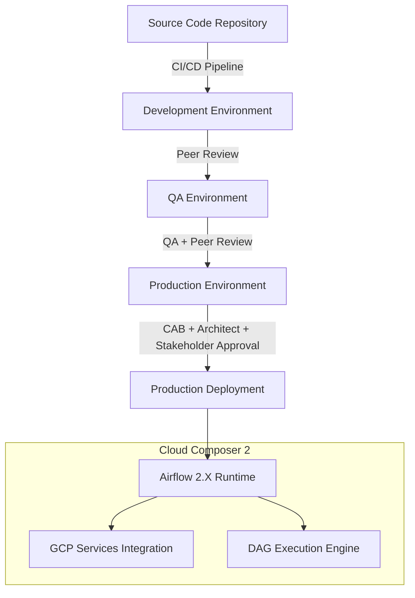

### Success Criteria

| Category | Metrics |
|----------|---------|
| Performance | - DAG parsing time < 30 seconds<br>- Task execution latency matching or exceeding current system |
| Reliability | - 99.9% uptime<br>- Zero data loss during migration |
| Quality | - 100% functional parity<br>- All test cases passing |
| Deployment | - Successful implementation of multi-stage approval process<br>- Automated deployment to all environments |

## 1.3 SCOPE

### In-Scope Elements

| Category | Components |
|----------|------------|
| Core Features | - DAG code migration to Airflow 2.X<br>- CI/CD pipeline implementation<br>- Automated testing framework<br>- Multi-environment deployment process |
| Implementation Boundaries | - Existing DAG repository<br>- GCP Cloud Storage integration<br>- Approval workflow automation<br>- Test environment setup |
| Technical Requirements | - Airflow 2.X compatibility<br>- GCP service account configuration<br>- Environment-specific deployment rules<br>- Version control integration |

### Out-of-Scope Elements

| Category | Exclusions |
|----------|------------|
| Features | - New DAG development<br>- Business logic modifications<br>- External system changes |
| Infrastructure | - Non-Composer infrastructure changes<br>- Network topology modifications<br>- Database platform migrations |
| Integration | - New external system integrations<br>- Changes to existing data sources<br>- Modifications to downstream systems |

# 2. SYSTEM ARCHITECTURE

## 2.1 High-Level Architecture

```mermaid
C4Context
    title System Context Diagram (Level 0)
    
    Person(dev, "Developer", "Creates and maintains DAGs")
    Person(ops, "DevOps", "Manages deployments")
    Person(qa, "QA Engineer", "Validates DAGs")
    
    System_Boundary(composer2, "Cloud Composer 2") {
        System(airflow, "Airflow 2.X", "Workflow Orchestration")
        System(scheduler, "Airflow Scheduler", "Task Scheduling")
        System(worker, "Airflow Workers", "Task Execution")
    }
    
    System_Ext(gcs, "Google Cloud Storage", "DAG and Log Storage")
    System_Ext(cloudsql, "Cloud SQL", "Metadata Storage")
    System_Ext(secretmgr, "Secret Manager", "Credentials Storage")
    
    Rel(dev, airflow, "Develops DAGs", "HTTPS")
    Rel(ops, composer2, "Manages", "HTTPS/gRPC")
    Rel(qa, airflow, "Tests DAGs", "HTTPS")
    
    Rel(airflow, gcs, "Reads/Writes", "HTTPS")
    Rel(airflow, cloudsql, "Stores metadata", "PostgreSQL")
    Rel(airflow, secretmgr, "Retrieves secrets", "gRPC")
```

## 2.2 Component Details

### 2.2.1 Container Architecture

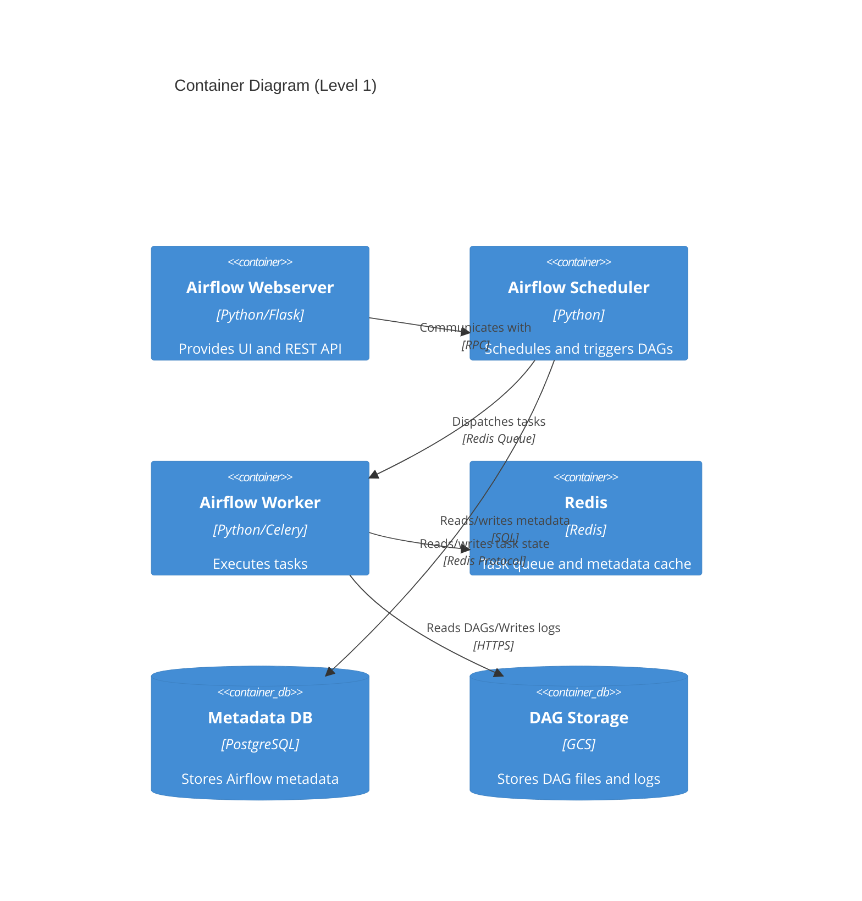

### 2.2.2 Component Specifications

| Component | Purpose | Technology | Scaling Strategy |
|-----------|---------|------------|------------------|
| Webserver | UI/API serving | Flask/Gunicorn | Horizontal scaling with load balancer |
| Scheduler | DAG/task orchestration | Python | Active/passive HA configuration |
| Worker | Task execution | Celery | Auto-scaling based on queue depth |
| Metadata DB | State management | PostgreSQL 13 | Vertical scaling with read replicas |
| Redis | Task queue | Redis 6.x | Master/replica configuration |
| DAG Storage | Code/log persistence | GCS | Automatic GCS scaling |

## 2.3 Technical Decisions

### 2.3.1 Architecture Patterns

| Pattern | Implementation | Justification |
|---------|---------------|---------------|
| Event-driven | Task scheduling | Enables loose coupling and scalability |
| Message Queue | Redis/Celery | Reliable task distribution and processing |
| Active/Passive | Scheduler HA | Ensures high availability with minimal complexity |
| Repository | DAG storage | Centralized, versioned code management |

### 2.3.2 Data Flow Architecture

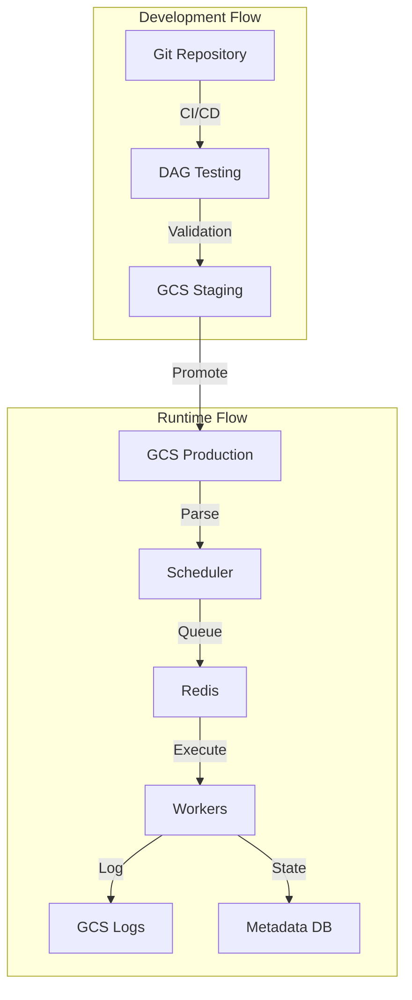

## 2.4 Cross-Cutting Concerns

### 2.4.1 Monitoring Architecture

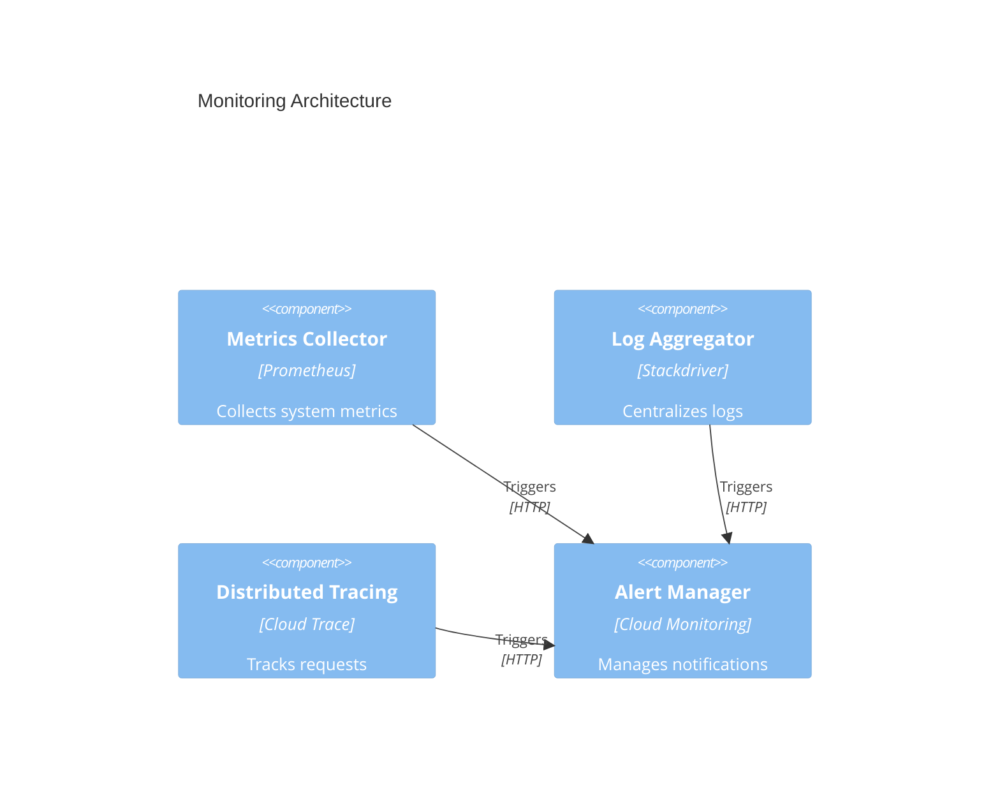

### 2.4.2 Security Architecture

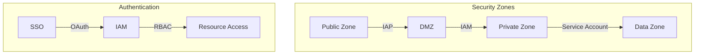

## 2.5 Deployment Architecture

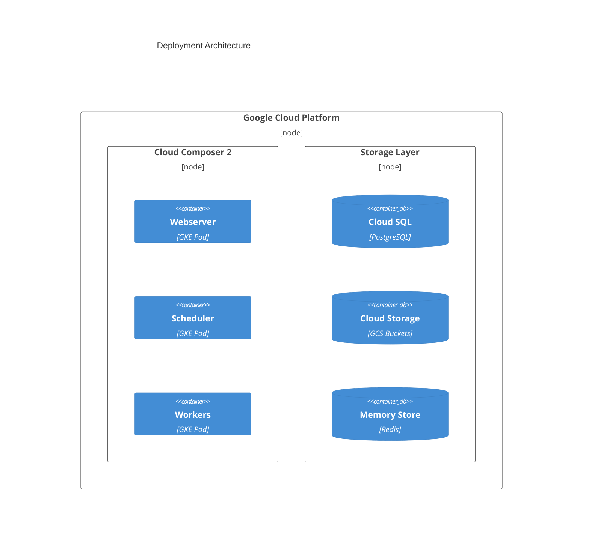

# 3. SYSTEM COMPONENTS ARCHITECTURE

## 3.1 USER INTERFACE DESIGN

### 3.1.1 Web Interface Specifications

| Component | Specification | Implementation |
|-----------|--------------|----------------|
| Layout | Responsive grid system | Bootstrap 5 Grid |
| Accessibility | WCAG 2.1 Level AA | ARIA labels, semantic HTML |
| Browser Support | Modern browsers, IE11+ | Progressive enhancement |
| Theme Support | Light/Dark modes | CSS variables |
| Responsiveness | Desktop, tablet, mobile | Breakpoints: 320px-1920px |
| Language | English primary | i18n ready architecture |

### 3.1.2 Critical User Flows

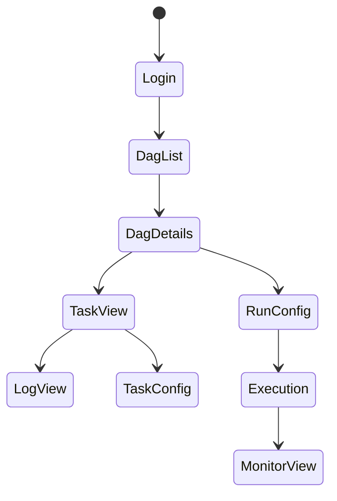

### 3.1.3 CLI Interface Design

| Command Category | Structure | Example |
|-----------------|-----------|---------|
| DAG Operations | `airflow dags [command] [options]` | `airflow dags list` |
| Task Management | `airflow tasks [command] [options]` | `airflow tasks test` |
| Configuration | `airflow config [command] [options]` | `airflow config list` |
| Development | `airflow dev [command] [options]` | `airflow dev parse` |

## 3.2 DATABASE DESIGN

### 3.2.1 Schema Design

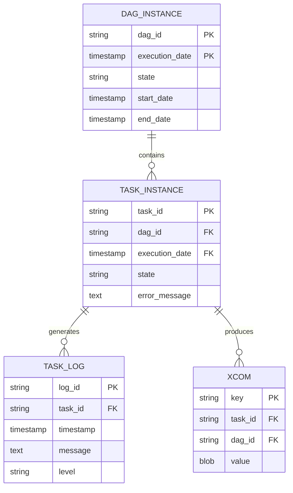

### 3.2.2 Data Management Strategy

| Aspect | Strategy | Implementation |
|--------|----------|----------------|
| Versioning | Schema versioning | Alembic migrations |
| Backup | Daily full, hourly incremental | Cloud SQL automated backups |
| Retention | 90 days online, 1 year archived | GCS cold storage |
| Archival | Monthly partition rotation | Automated archival jobs |
| Audit | Full audit logging | Cloud Audit Logs |

## 3.3 API DESIGN

### 3.3.1 API Architecture

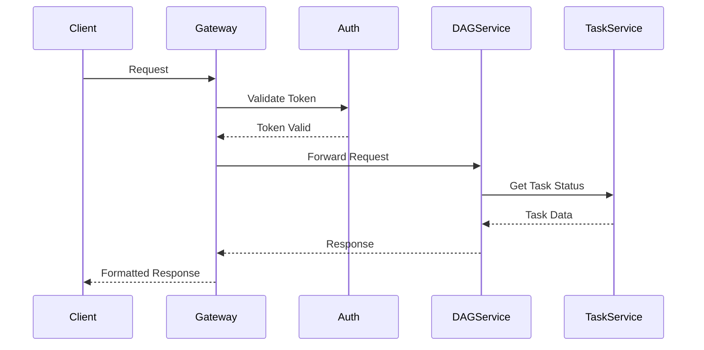

### 3.3.2 API Specifications

| Endpoint | Method | Purpose | Authentication |
|----------|--------|---------|----------------|
| /api/v1/dags | GET | List DAGs | JWT Bearer |
| /api/v1/dags/{dag_id} | GET | DAG details | JWT Bearer |
| /api/v1/dags/{dag_id}/tasks | GET | List tasks | JWT Bearer |
| /api/v1/dags/{dag_id}/dagRuns | POST | Trigger DAG | JWT Bearer |

### 3.3.3 Integration Patterns

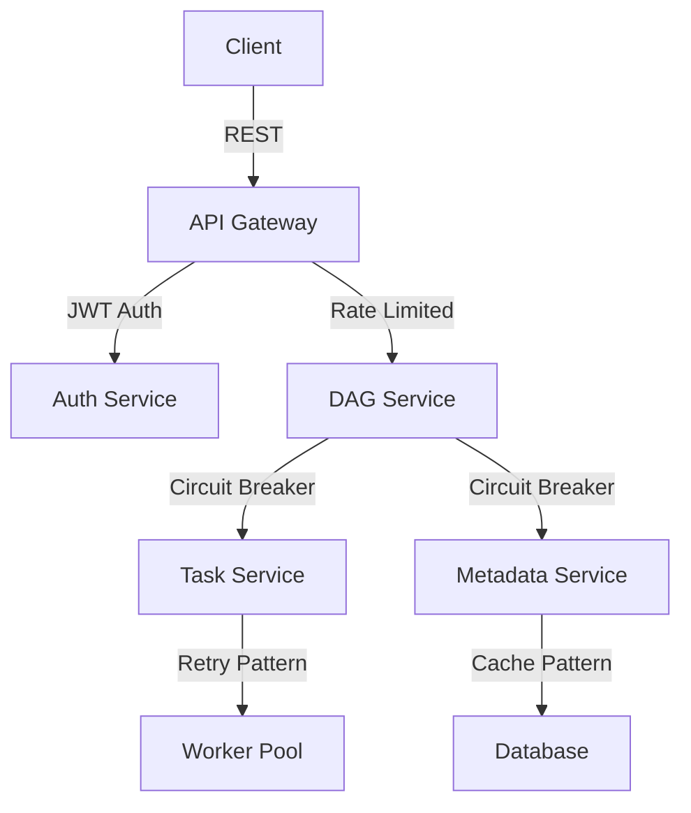

### 3.3.4 Security Controls

| Control | Implementation | Purpose |
|---------|----------------|---------|
| Authentication | JWT + OAuth2 | Identity verification |
| Authorization | RBAC | Access control |
| Rate Limiting | Token bucket | API protection |
| Input Validation | JSON Schema | Request validation |
| Output Sanitization | Response filtering | Data protection |
| Encryption | TLS 1.3 | Transport security |

# 4. TECHNOLOGY STACK

## 4.1 PROGRAMMING LANGUAGES

| Language | Version | Component | Justification |
|----------|---------|-----------|---------------|
| Python | 3.8+ | DAG Development, Airflow Core | - Native Airflow support<br>- Extensive GCP library support<br>- Strong data processing capabilities |
| SQL | PostgreSQL 13 | Metadata Storage | - Cloud SQL compatibility<br>- ACID compliance<br>- Enterprise-grade reliability |
| YAML | 1.2+ | Configuration, CI/CD | - Human-readable format<br>- Native Kubernetes support<br>- Pipeline configuration standard |
| Bash | 5.0+ | Shell Scripts, Automation | - System automation<br>- Deployment scripting<br>- Environment management |

## 4.2 FRAMEWORKS & LIBRARIES

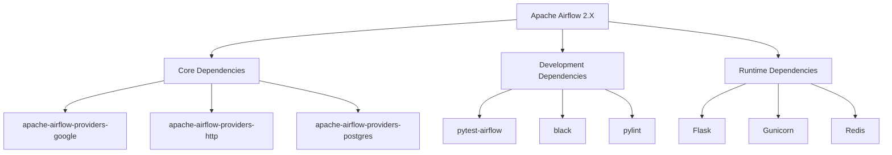

| Framework/Library | Version | Purpose | Justification |
|------------------|---------|---------|---------------|
| Apache Airflow | 2.X | Core Platform | - Industry standard<br>- GCP integration<br>- Robust scheduling |
| Flask | 2.0+ | Web Interface | - Airflow default<br>- Lightweight<br>- Extensible |
| Celery | 5.2+ | Task Distribution | - Scalable workers<br>- Redis integration<br>- Reliable queueing |
| Pytest | 6.0+ | Testing Framework | - Python standard<br>- DAG testing support<br>- CI integration |

## 4.3 DATABASES & STORAGE

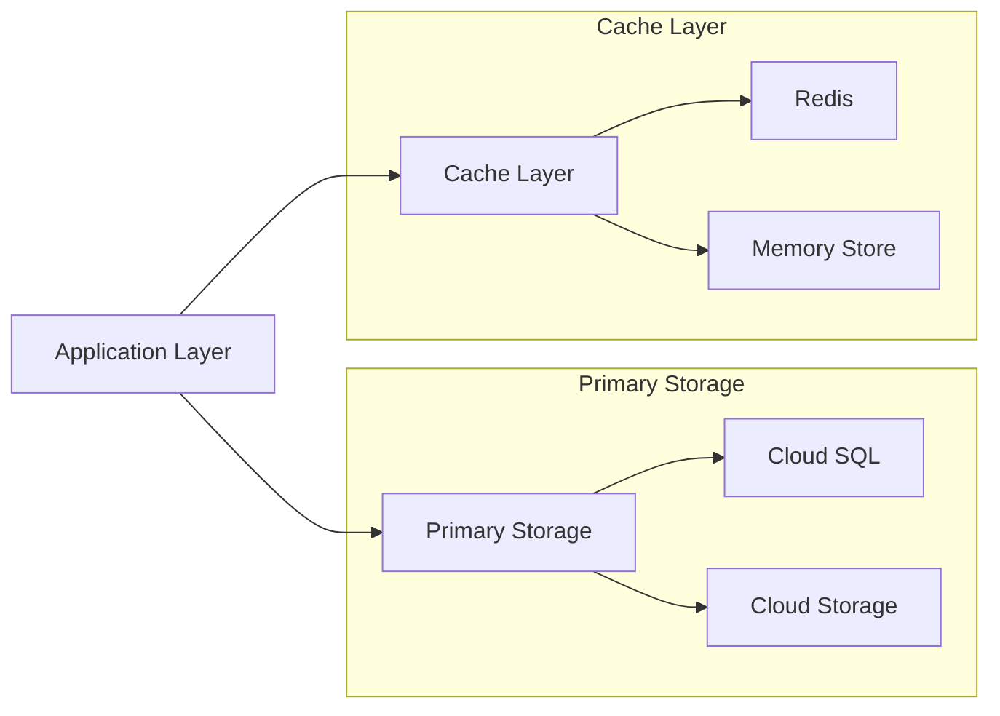

| Component | Technology | Version | Purpose |
|-----------|------------|---------|----------|
| Metadata DB | Cloud SQL PostgreSQL | 13.x | - Task state management<br>- DAG metadata<br>- User data |
| Object Storage | Cloud Storage | N/A | - DAG file storage<br>- Log persistence<br>- Task artifacts |
| Cache | Memory Store Redis | 6.x | - Task queuing<br>- Result caching<br>- Session management |
| Local Storage | Ephemeral Disk | N/A | - Temporary processing<br>- Worker scratch space |

## 4.4 THIRD-PARTY SERVICES

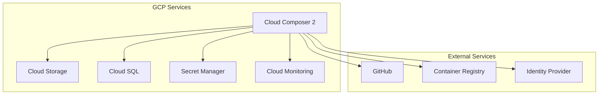

| Service | Provider | Integration | Purpose |
|---------|----------|-------------|----------|
| Cloud Composer 2 | GCP | Native | - Managed Airflow service<br>- Infrastructure management |
| Secret Manager | GCP | API | - Credentials storage<br>- Secure configuration |
| Cloud Monitoring | GCP | API | - Performance monitoring<br>- Alert management |
| Container Registry | GCP | Docker | - Image storage<br>- Version control |

## 4.5 DEVELOPMENT & DEPLOYMENT

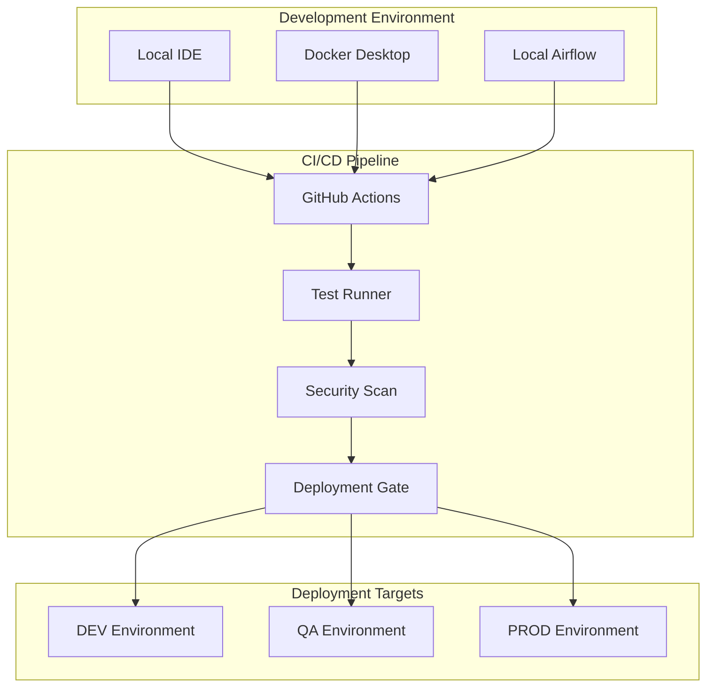

| Tool | Version | Purpose | Implementation |
|------|---------|---------|----------------|
| GitHub Actions | Latest | CI/CD Pipeline | - Automated workflows<br>- Environment deployments<br>- Quality gates |
| Docker | 20.10+ | Containerization | - Local development<br>- Test environments<br>- Consistent builds |
| Terraform | 1.0+ | Infrastructure | - Environment provisioning<br>- Configuration management |
| VS Code | Latest | Development | - Python support<br>- Git integration<br>- Remote debugging |

# 5. SYSTEM DESIGN

## 5.1 USER INTERFACE DESIGN

### 5.1.1 Airflow Web Interface

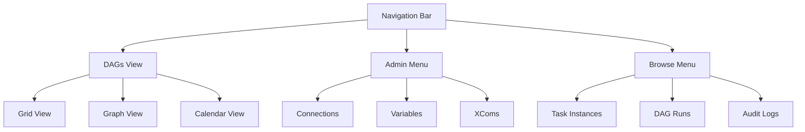

| Component | Description | Access Level |
|-----------|-------------|--------------|
| DAGs View | Primary interface for DAG management | All Users |
| Admin Menu | System configuration and variables | Admin Only |
| Browse Menu | Historical data and logs | Power Users |
| Task View | Individual task execution details | All Users |

### 5.1.2 Command Line Interface

```bash
# DAG Management Commands
airflow dags list
airflow dags trigger [dag_id]
airflow dags pause [dag_id]

# Task Management
airflow tasks test [dag_id] [task_id] [date]
airflow tasks clear [dag_id]

# Configuration
airflow config list
airflow variables set/get
```

## 5.2 DATABASE DESIGN

### 5.2.1 Core Schema

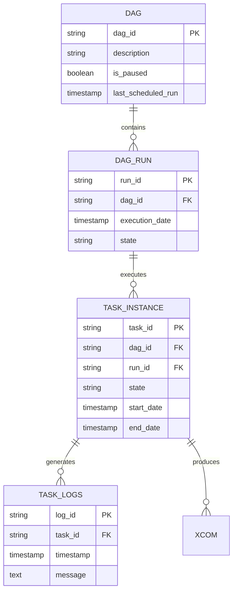

### 5.2.2 Data Storage Strategy

| Storage Type | Technology | Purpose |
|--------------|------------|----------|
| Metadata DB | Cloud SQL (PostgreSQL) | DAG and task state management |
| Log Storage | Cloud Storage | Task execution logs |
| Configuration | Secret Manager | Sensitive configuration data |
| Runtime Data | Redis | Task queue and XCom data |

## 5.3 API DESIGN

### 5.3.1 REST API Endpoints

| Endpoint | Method | Purpose | Authentication |
|----------|--------|---------|----------------|
| /api/v1/dags | GET | List all DAGs | JWT Bearer |
| /api/v1/dags/{dag_id}/runs | POST | Trigger DAG run | JWT Bearer |
| /api/v1/dags/{dag_id}/tasks | GET | List DAG tasks | JWT Bearer |
| /api/v1/variables | GET/POST | Manage variables | JWT Bearer |

### 5.3.2 API Flow Architecture

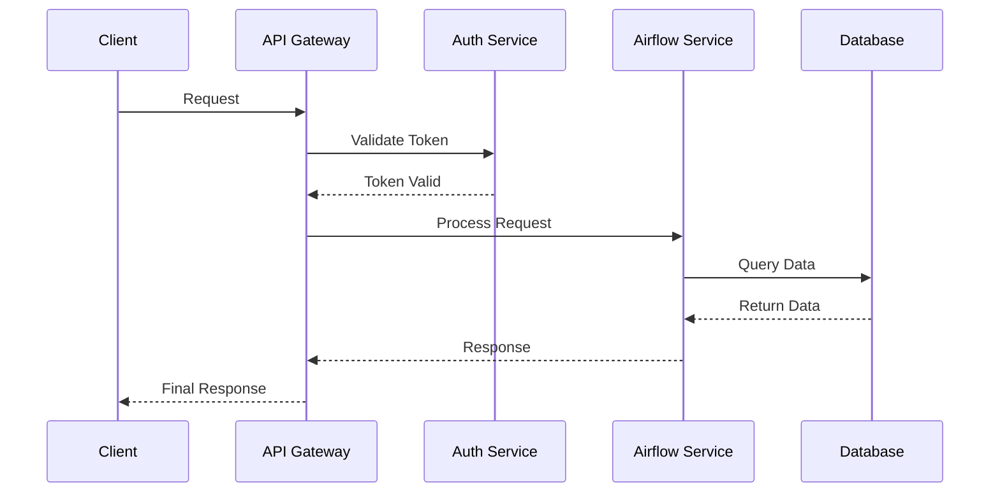

### 5.3.3 Integration Patterns

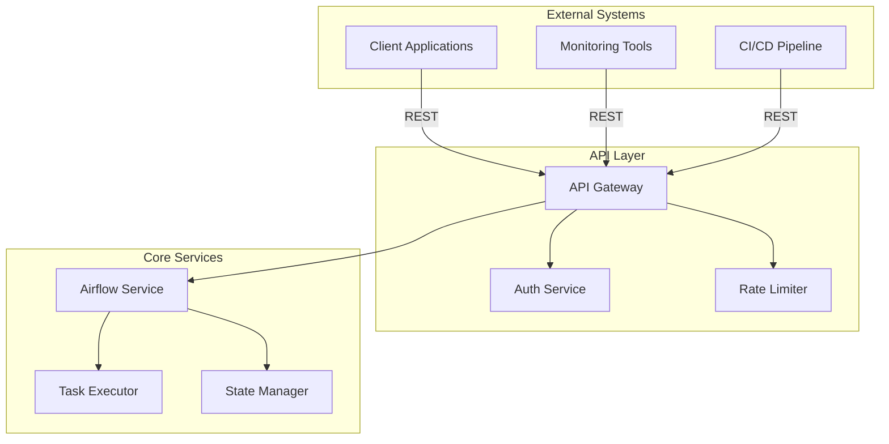

### 5.3.4 Error Handling

| Error Code | Description | Response Format |
|------------|-------------|-----------------|
| 400 | Bad Request | `{"error": "message", "details": {}}` |
| 401 | Unauthorized | `{"error": "Authentication required"}` |
| 403 | Forbidden | `{"error": "Insufficient permissions"}` |
| 404 | Not Found | `{"error": "Resource not found"}` |
| 500 | Server Error | `{"error": "Internal server error"}` |

## 5.4 SECURITY DESIGN

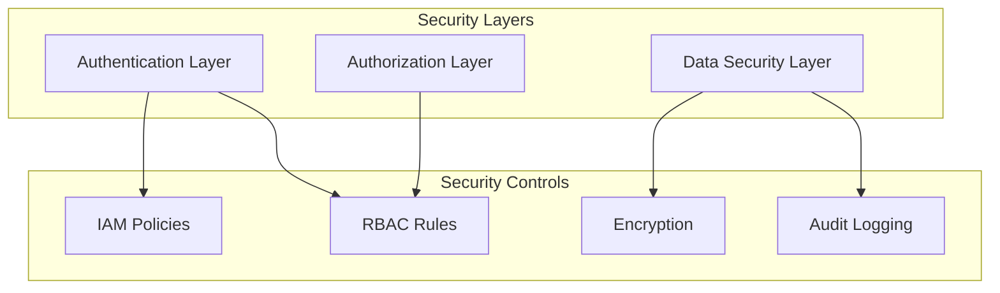

| Security Aspect | Implementation | Purpose |
|----------------|----------------|----------|
| Authentication | Cloud IAP + OAuth2 | User identity verification |
| Authorization | RBAC + IAM | Access control |
| Data Security | TLS + KMS | Data protection |
| Audit | Cloud Audit Logs | Compliance and tracking |

# 6. USER INTERFACE DESIGN

## 6.1 Web Interface Layout

### 6.1.1 Main Navigation

```
+----------------------------------------------------------+
|  [#] Cloud Composer 2 Dashboard                    [@] [=] |
+----------------------------------------------------------+
| +----------------+ +-----------------------------------+   |
| | DAGs          | | Active DAGs: 125    Failed: 2     |   |
| | [*] Favorites | | Success Rate: 99.8%  Pending: 5   |   |
| | [>] Active    | +-----------------------------------+   |
| | [>] Paused    |                                         |
| | [>] Failed    |     [Search DAGs...]                    |
| +----------------+                                         |
|                   +---------------+  +----------------+    |
|                   | Grid View [v] |  | Refresh [15s] |    |
|                   +---------------+  +----------------+    |
|                                                          |
| +------------------------------------------------+      |
| | DAG ID        | Schedule | Last Run | Status    |      |
| |-------------------------------------------------      |
| | etl_main      | @daily   | 2m ago  | [✓]       |      |
| | data_sync     | @hourly  | 15m ago | [✓]       |      |
| | reports_gen   | @weekly  | 1d ago  | [!]       |      |
| +------------------------------------------------+      |
+----------------------------------------------------------+
```

Key:
- [#] Dashboard icon
- [@] User profile
- [=] Settings menu
- [*] Favorite/star icon
- [>] Expandable menu
- [✓] Success status
- [!] Warning/error status

### 6.1.2 DAG Detail View

```
+----------------------------------------------------------+
| < Back to DAGs    DAG: etl_main                    [?]    |
+----------------------------------------------------------+
| [Run] [Pause] [Delete]                    Last run: 2m ago |
|                                                           |
| +------------------+  +----------------------+            |
| | Graph View    [v] |  | Auto-refresh: [x]   |            |
| +------------------+  +----------------------+            |
|                                                           |
|  +---------+     +---------+     +-----------+           |
|  | extract |---->| process |---->| load_data |           |
|  +---------+     +---------+     +-----------+           |
|      [✓]            [✓]             [✓]                  |
|                                                           |
| +------------------------------------------------+       |
| | Task Details                                    |       |
| |------------------------------------------------|       |
| | ID: extract                                     |       |
| | Type: PythonOperator                           |       |
| | Duration: 45s                                   |       |
| | Logs: [View] [Download]                        |       |
| +------------------------------------------------+       |
+----------------------------------------------------------+
```

### 6.1.3 Task Instance View

```
+----------------------------------------------------------+
| < Back to DAG    Task: extract    Run: 2023-01-01T00:00   |
+----------------------------------------------------------+
| Status: Success                           Duration: 45s    |
|                                                           |
| +------------------------------------------------+       |
| | Logs                                    [Download] |     |
| |------------------------------------------------|       |
| | [2023-01-01 00:00:15] Starting task            |       |
| | [2023-01-01 00:00:20] Connecting to source     |       |
| | [2023-01-01 00:00:45] Extracted 1000 records   |       |
| | [2023-01-01 00:01:00] Task completed          |       |
| +------------------------------------------------+       |
|                                                           |
| +------------------------------------------------+       |
| | XCom                                            |       |
| |------------------------------------------------|       |
| | Key: return_value                               |       |
| | Value: {"records": 1000, "status": "success"}   |       |
| +------------------------------------------------+       |
+----------------------------------------------------------+
```

## 6.2 Administrative Interface

### 6.2.1 Connection Management

```
+----------------------------------------------------------+
| Connections                                    [+ Add New] |
+----------------------------------------------------------+
| [Search connections...]                                    |
|                                                           |
| +------------------------------------------------+       |
| | ID          | Type      | Host          | Test  |       |
| |------------------------------------------------|       |
| | gcp_conn    | Google    | *.gcp.com     | [Test]|       |
| | postgres_db | Postgres  | 10.0.0.1      | [Test]|       |
| | sftp_source | SFTP      | sftp.org      | [Test]|       |
| +------------------------------------------------+       |
|                                                           |
| Connection Details:                                       |
| +------------------------------------------------+       |
| | Connection ID: [..............................]  |       |
| | Connection Type: [v]                            |       |
| | Host: [..............................]          |       |
| | Schema: [..............................]        |       |
| | Login: [..............................]         |       |
| | Password: [..............................]      |       |
| |                                                 |       |
| | [Test Connection]  [Save]  [Delete]            |       |
| +------------------------------------------------+       |
+----------------------------------------------------------+
```

## 6.3 Mobile Interface

### 6.3.1 Mobile DAG List

```
+------------------------+
| [#] DAGs         [@]  |
+------------------------+
| [Search...]           |
|                       |
| Status: All [v]       |
|                       |
| +--------------------+|
| | etl_main           ||
| | @daily  [✓] 2m ago ||
| +--------------------+|
| | data_sync          ||
| | @hourly [✓] 15m ago||
| +--------------------+|
| | reports_gen        ||
| | @weekly [!] 1d ago ||
| +--------------------+|
|                       |
| [Load More...]        |
+------------------------+
```

## 6.4 Interaction Specifications

| Element | Action | Response |
|---------|--------|----------|
| DAG row | Click | Navigate to DAG detail view |
| Task node | Click | Show task details panel |
| [Run] button | Click | Trigger DAG run with confirmation |
| [Test] button | Click | Test connection with status feedback |
| Search field | Type | Real-time filtering of displayed items |
| Refresh dropdown | Select | Change auto-refresh interval |

## 6.5 Responsive Breakpoints

| Screen Size | Layout Adjustments |
|-------------|-------------------|
| Desktop (>1200px) | Full layout with side navigation |
| Tablet (768px-1199px) | Condensed navigation, scrollable tables |
| Mobile (<767px) | Single column, collapsible sections |

## 6.6 Theme Support

```mermaid
graph TD
    A[Theme System] --> B[Light Theme]
    A --> C[Dark Theme]
    B --> D[Primary Colors]
    B --> E[Secondary Colors]
    C --> F[Dark Primary Colors]
    C --> G[Dark Secondary Colors]
    D --> H[Success: #28a745]
    D --> I[Error: #dc3545]
    F --> J[Success: #198754]
    F --> K[Error: #bb2d3b]
```

# 7. SECURITY CONSIDERATIONS

## 7.1 AUTHENTICATION AND AUTHORIZATION

```mermaid
graph TD
    A[User Access Request] --> B{Authentication}
    B -->|Success| C[Identity Verification]
    B -->|Failure| D[Access Denied]
    C --> E{Authorization}
    E -->|Authorized| F[Access Granted]
    E -->|Unauthorized| D
    
    subgraph "Authentication Methods"
    G[Google SSO]
    H[Service Accounts]
    I[API Keys]
    end
    
    subgraph "Authorization Levels"
    J[Viewer]
    K[Editor]
    L[Admin]
    M[Security Admin]
    end
```

| Role | Permissions | Access Level |
|------|------------|--------------|
| Viewer | Read-only access to DAGs and logs | Basic |
| Editor | DAG deployment to DEV/QA, variable management | Intermediate |
| Admin | Environment configuration, user management | Advanced |
| Security Admin | Security policy management, audit logs | Highest |

### Authentication Methods

| Method | Use Case | Implementation |
|--------|----------|----------------|
| Google SSO | User authentication | Cloud Identity integration |
| Service Accounts | Automated processes | GCP IAM service accounts |
| API Keys | External integrations | Secret Manager stored keys |
| OAuth 2.0 | Third-party access | Cloud Identity OAuth |

## 7.2 DATA SECURITY

```mermaid
graph LR
    A[Data Sources] --> B{Encryption Layer}
    B --> C[Data in Transit]
    B --> D[Data at Rest]
    
    C --> E[TLS 1.3]
    D --> F[Cloud KMS]
    
    subgraph "Security Controls"
    G[Access Controls]
    H[Audit Logging]
    I[Data Classification]
    end
    
    F --> G
    F --> H
    F --> I
```

| Data Type | Protection Method | Encryption Standard |
|-----------|------------------|-------------------|
| DAG Code | GCS Object Encryption | AES-256 |
| Credentials | Secret Manager | Cloud KMS |
| Connection Info | Encrypted Storage | AES-256 |
| Task Data | In-transit Encryption | TLS 1.3 |
| Metadata | Database Encryption | Cloud SQL TDE |

### Data Classification

| Classification | Description | Security Controls |
|----------------|-------------|-------------------|
| Public | Non-sensitive DAG metadata | Basic access controls |
| Internal | Business logic, configurations | Role-based access |
| Confidential | Credentials, connection strings | Encryption + access controls |
| Restricted | Security configurations | Strict access + audit logging |

## 7.3 SECURITY PROTOCOLS

```mermaid
flowchart TD
    A[Security Protocols] --> B[Access Control]
    A --> C[Monitoring]
    A --> D[Incident Response]
    
    B --> E[IAM Policies]
    B --> F[RBAC Rules]
    
    C --> G[Security Scanning]
    C --> H[Audit Logging]
    
    D --> I[Alert System]
    D --> J[Response Plan]
```

### Security Standards Compliance

| Standard | Implementation | Verification |
|----------|----------------|--------------|
| SOC 2 | Access controls, audit logs | Annual audit |
| GDPR | Data encryption, access controls | Continuous monitoring |
| ISO 27001 | Security management framework | Regular assessment |
| CIS Benchmarks | GCP security standards | Automated scanning |

### Security Monitoring and Response

| Component | Implementation | Frequency |
|-----------|----------------|-----------|
| Vulnerability Scanning | Cloud Security Scanner | Daily |
| Dependency Checks | Automated security updates | Weekly |
| Access Reviews | IAM policy validation | Monthly |
| Security Audits | Comprehensive review | Quarterly |
| Penetration Testing | Third-party assessment | Annually |

### Incident Response Protocol

| Phase | Actions | Responsibility |
|-------|---------|---------------|
| Detection | Automated alerts, monitoring | Security Team |
| Analysis | Impact assessment, classification | Security + DevOps |
| Containment | Access restriction, isolation | DevOps Team |
| Eradication | Vulnerability patching | Development Team |
| Recovery | Service restoration | Operations Team |
| Post-Incident | Review and documentation | All Teams |

# 8. INFRASTRUCTURE

## 8.1 DEPLOYMENT ENVIRONMENT

```mermaid
graph TD
    subgraph "Google Cloud Platform"
        A[Cloud Composer 2]
        B[Cloud Storage]
        C[Cloud SQL]
        D[Secret Manager]
        E[Container Registry]
        F[Cloud Build]
    end
    
    subgraph "Development Environment"
        G[Local Docker]
        H[VS Code]
        I[Git Repository]
    end
    
    G -->|Test| A
    H -->|Push| I
    I -->|Trigger| F
    F -->|Deploy| A
    A --> B
    A --> C
    A --> D
    F --> E
```

| Environment | Purpose | Configuration |
|-------------|---------|---------------|
| Development | Local development and testing | Docker Desktop, Local Airflow |
| Staging | Integration testing and validation | Cloud Composer 2 (n1-standard-2) |
| Production | Live workload execution | Cloud Composer 2 (n1-standard-4) |
| DR/Backup | Disaster recovery and failover | Cloud Composer 2 (Region: Secondary) |

## 8.2 CLOUD SERVICES

| Service | Purpose | Configuration |
|---------|---------|---------------|
| Cloud Composer 2 | Managed Airflow service | Multi-zone deployment, Private IP |
| Cloud Storage | DAG and artifact storage | Standard storage class, Versioning enabled |
| Cloud SQL | Metadata database | HA configuration, PostgreSQL 13 |
| Secret Manager | Credentials management | Automatic rotation, IAM integration |
| Container Registry | Image repository | Vulnerability scanning enabled |
| Cloud Build | CI/CD automation | Custom workers, Parallel execution |

## 8.3 CONTAINERIZATION

```mermaid
graph LR
    subgraph "Container Architecture"
        A[Base Image] --> B[Airflow Image]
        B --> C[Custom Operators]
        B --> D[Dependencies]
        
        E[Development Image] --> F[Local Testing]
        E[Development Image] --> G[CI Pipeline]
    end
```

| Component | Image Specification | Purpose |
|-----------|-------------------|----------|
| Base Image | python:3.8-slim | Minimal Python runtime |
| Airflow Image | apache/airflow:2.X | Core Airflow functionality |
| Custom Image | gcr.io/project/airflow-custom | Production deployment |
| Dev Image | gcr.io/project/airflow-dev | Local development |

## 8.4 ORCHESTRATION

```mermaid
graph TD
    subgraph "GKE Cluster"
        A[Webserver Pod] 
        B[Scheduler Pod]
        C[Worker Pods]
        D[Redis Pod]
        
        E[Autoscaler]
        F[Load Balancer]
        G[Node Pool]
    end
    
    F --> A
    E --> C
    G --> A
    G --> B
    G --> C
    G --> D
```

| Component | Configuration | Scaling Strategy |
|-----------|--------------|------------------|
| GKE Cluster | Regional, Private | Node auto-provisioning |
| Node Pools | n1-standard-4 | Horizontal pod autoscaling |
| Worker Pods | Custom resource requests | 2-10 replicas |
| Scheduler | Active-passive HA | Manual failover |
| Webserver | Load balanced | 2-4 replicas |

## 8.5 CI/CD PIPELINE

```mermaid
flowchart LR
    A[Git Repository] -->|Push| B[Cloud Build Trigger]
    
    B --> C{Run Tests}
    C -->|Fail| D[Notify Developers]
    C -->|Pass| E[Build Image]
    
    E --> F{Environment}
    F -->|DEV| G[Peer Review]
    F -->|QA| H[QA Review]
    F -->|PROD| I[CAB Approval]
    
    G -->|Approved| J[Deploy DEV]
    H -->|Approved| K[Deploy QA]
    I -->|Approved| L[Deploy PROD]
    
    J --> M[Validation Tests]
    K --> M
    L --> M
```

| Stage | Requirements | Automation |
|-------|--------------|------------|
| Build | - Lint checks<br>- Unit tests<br>- Security scan | Cloud Build |
| Test | - Integration tests<br>- DAG validation<br>- Dependency check | Pytest, Airflow CLI |
| Review | - Code review<br>- Architecture review<br>- Security review | GitHub Actions |
| Deploy | - Environment validation<br>- Smoke tests<br>- Rollback plan | Cloud Build, GCS |
| Monitor | - Health checks<br>- Performance metrics<br>- Alert rules | Cloud Monitoring |

# 9. APPENDICES

## 9.1 ADDITIONAL TECHNICAL INFORMATION

### 9.1.1 Migration Path Dependencies

```mermaid
graph TD
    A[Airflow 1.10.15] -->|Version Migration| B[Airflow 2.X]
    B -->|Infrastructure| C[Cloud Composer 2]
    
    subgraph "Migration Dependencies"
        D[Python 3.8+]
        E[PostgreSQL 13]
        F[Updated Providers]
        G[New Operators]
    end
    
    B --> D
    B --> E
    B --> F
    B --> G
```

### 9.1.2 Approval Workflow Details

```mermaid
stateDiagram-v2
    [*] --> CodeReview
    CodeReview --> DEV: Peer Review
    DEV --> QA: Peer + QA Review
    QA --> PROD: CAB + Architect + Stakeholder
    PROD --> [*]
    
    state CodeReview {
        [*] --> Review
        Review --> Tests
        Tests --> [*]
    }
```

## 9.2 GLOSSARY

| Term | Definition |
|------|------------|
| Airflow Provider | Packaged collection of hooks, operators, and sensors for specific services |
| Break Glass Access | Emergency privileged access procedure with audit trail |
| DAG Parsing | Process of reading and validating DAG files by Airflow |
| Environment Promotion | Process of moving DAGs through DEV/QA/PROD environments |
| Idempotency | Property where repeated task execution produces same result |
| Task Queue | System for distributing task workload across worker nodes |
| Worker Node | Compute instance responsible for executing Airflow tasks |
| XCom Push/Pull | Mechanism for passing small amounts of data between tasks |

## 9.3 ACRONYMS

| Acronym | Full Form |
|---------|-----------|
| API | Application Programming Interface |
| CAB | Change Advisory Board |
| CI/CD | Continuous Integration/Continuous Delivery |
| DAG | Directed Acyclic Graph |
| GCP | Google Cloud Platform |
| GCS | Google Cloud Storage |
| IAM | Identity and Access Management |
| IAP | Identity Aware Proxy |
| KMS | Key Management Service |
| RBAC | Role-Based Access Control |
| SLA | Service Level Agreement |
| SSO | Single Sign-On |
| TDE | Transparent Data Encryption |
| UI | User Interface |
| VPC | Virtual Private Cloud |

## 9.4 REFERENCE ARCHITECTURE

```mermaid
C4Context
    title Reference Architecture - Cloud Composer 2
    
    Person(dev, "Developer", "Creates and maintains DAGs")
    
    System_Boundary(composer, "Cloud Composer 2") {
        System(airflow, "Airflow 2.X", "Workflow Engine")
        System(workers, "Worker Pool", "Task Execution")
        System(scheduler, "Scheduler", "Task Scheduling")
    }
    
    System_Ext(gcs, "Cloud Storage", "DAG Storage")
    System_Ext(sql, "Cloud SQL", "Metadata DB")
    System_Ext(secret, "Secret Manager", "Secrets")
    
    Rel(dev, airflow, "Develops", "HTTPS/SSH")
    Rel(airflow, workers, "Dispatches Tasks", "Internal")
    Rel(airflow, scheduler, "Schedules", "Internal")
    Rel(airflow, gcs, "Reads/Writes", "HTTPS")
    Rel(airflow, sql, "Stores State", "PostgreSQL")
    Rel(airflow, secret, "Retrieves Secrets", "HTTPS")
```

## 9.5 MIGRATION CHECKLIST

| Category | Item | Description |
|----------|------|-------------|
| Code | Import Statements | Update to Airflow 2.X package structure |
| Code | Operator Migration | Replace deprecated operators with new versions |
| Code | TaskFlow API | Convert applicable Python functions to TaskFlow |
| Infrastructure | Environment Setup | Configure Cloud Composer 2 environments |
| Infrastructure | Network Configuration | Update VPC and firewall rules |
| Security | IAM Roles | Configure new service account permissions |
| Security | Secret Management | Migrate secrets to Secret Manager |
| Testing | Unit Tests | Update test cases for Airflow 2.X |
| Testing | Integration Tests | Verify end-to-end functionality |
| Documentation | Code Comments | Update docstrings and comments |
| Documentation | README | Update setup and deployment instructions |
| Monitoring | Alerts | Configure new monitoring rules |
| Monitoring | Dashboards | Update operational dashboards |