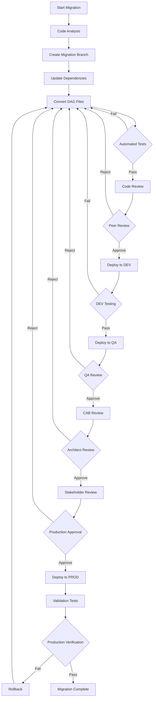
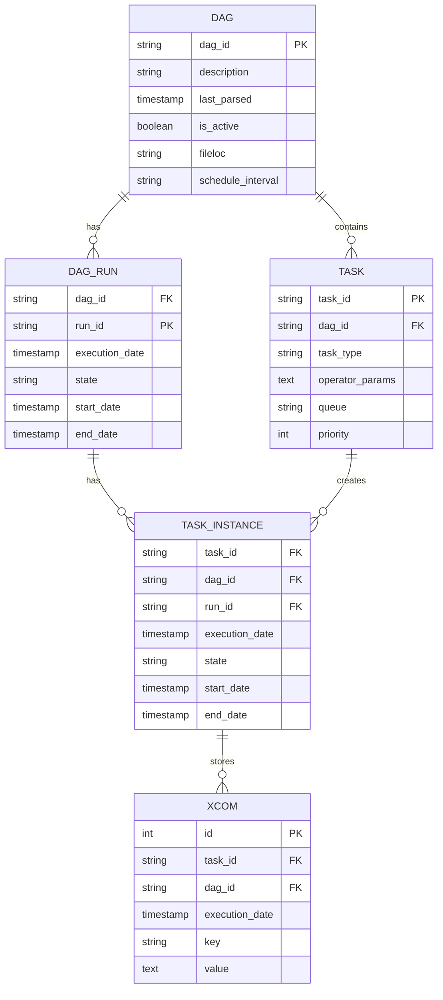
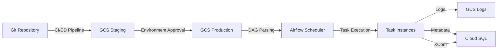
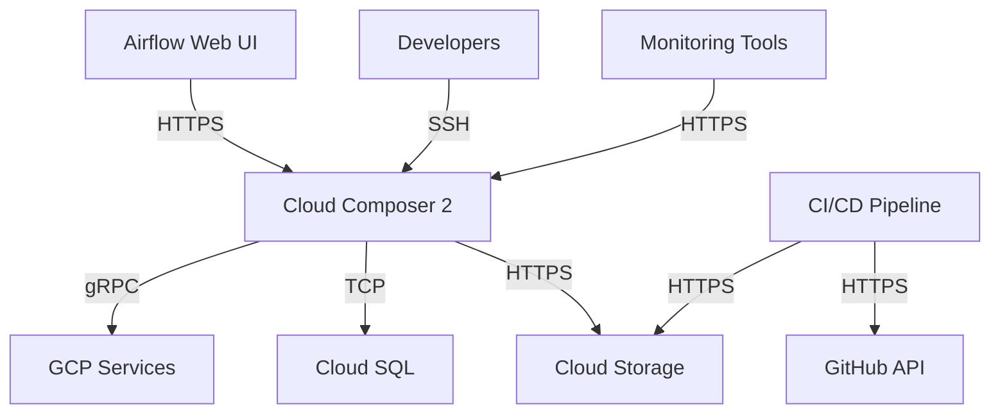

# Product Requirements Document (PRD)

# 1. INTRODUCTION

## 1.1 Purpose

This Product Requirements Document (PRD) specifies the requirements for migrating an existing Apache Airflow 1.10.15 codebase from Cloud Composer 1 to Cloud Composer 2 with Airflow 2.X. This document serves as a comprehensive guide for:

- Development teams executing the migration
- DevOps engineers implementing CI/CD pipelines
- QA teams validating the migration
- Project stakeholders and approvers
- System architects reviewing the technical approach

## 1.2 Scope

The scope of this migration project encompasses:

### 1.2.1 In Scope
- Migration of existing DAG files from Composer 1 (Airflow 1.10.15) to Composer 2 (Airflow 2.X)
- Implementation of CI/CD pipeline for DAG deployment to GCP GCS buckets
- Creation of automated test cases for DAG validation
- Dependency version updates and compatibility adjustments
- Documentation updates reflecting Airflow 2.X syntax and features

### 1.2.2 Out of Scope
- Addition of new DAG functionality or features
- Changes to existing business logic
- Modifications to external systems or dependencies
- Infrastructure changes beyond Composer version upgrade
- Changes to existing data pipelines' business outcomes

# 2. PRODUCT DESCRIPTION

## 2.1 Product Perspective
The Airflow migration project exists within Google Cloud Platform's managed Apache Airflow service ecosystem, transitioning from Cloud Composer 1 to Cloud Composer 2. This migration represents a version upgrade rather than a system change, maintaining integration with existing GCP services and external dependencies while leveraging improved infrastructure and features of Composer 2.

## 2.2 Product Functions
- DAG execution and scheduling using Apache Airflow 2.X runtime
- Automated deployment of DAGs through GCP Cloud Storage buckets
- Version control and code review processes through Git-based workflows
- Automated testing and validation of DAG configurations
- Multi-environment (DEV/QA/PROD) deployment management
- Role-based access control for deployment approvals
- Backward compatibility with existing data pipeline integrations

## 2.3 User Characteristics

| User Type | Expertise Level | Responsibilities |
|-----------|----------------|------------------|
| Development Team | Advanced | DAG development, code migration, unit testing |
| DevOps Engineers | Expert | CI/CD pipeline management, deployment automation |
| QA Engineers | Intermediate | Test execution, validation, regression testing |
| System Architects | Expert | Technical design review, approval of changes |
| CAB Members | Intermediate | Production deployment approval |
| Stakeholders | Basic | Business requirement validation, final approval |

## 2.4 Constraints
- Must maintain existing DAG naming conventions and structure
- Zero downtime requirement for production migration
- Compliance with GCP security and access control policies
- Limited to Airflow 2.X compatible operators and features
- Must preserve existing task dependencies and scheduling patterns
- Resource limitations of Cloud Composer 2 environment
- Migration must be completed within existing infrastructure budget

## 2.5 Assumptions and Dependencies
### Assumptions
- Existing DAGs are functionally correct and production-validated
- Source control access and permissions are properly configured
- Development team has necessary GCP access and permissions
- Current infrastructure can support parallel environments during migration

### Dependencies
- Access to GCP Cloud Composer 2 service
- GitHub or similar version control system
- CI/CD platform compatibility with GCP services
- Availability of test environments
- External system APIs and connections remain stable
- Support from GCP for Composer 2 service

# 3. PROCESS FLOWCHART

# 4. FUNCTIONAL REQUIREMENTS

## 4.1 DAG Migration
### ID: FR-001
### Description
Convert existing Airflow 1.10.15 DAGs to Airflow 2.X syntax while maintaining functionality
### Priority: High
### Requirements Table

| Requirement ID | Description | Acceptance Criteria |
|---------------|-------------|-------------------|
| FR-001.1 | Update import statements to Airflow 2.X packages | All imports reference correct Airflow 2.X modules |
| FR-001.2 | Convert deprecated operators to new equivalents | No deprecated operators remain in codebase |
| FR-001.3 | Implement task flow API where applicable | TaskFlow API used for Python-callable tasks |
| FR-001.4 | Update DAG configuration parameters | All DAG parameters conform to Airflow 2.X spec |
| FR-001.5 | Maintain existing task dependencies | Task dependency graphs match original DAGs |

## 4.2 CI/CD Pipeline
### ID: FR-002
### Description
Implement automated deployment pipeline for DAG files to GCP Cloud Storage
### Priority: High
### Requirements Table

| Requirement ID | Description | Acceptance Criteria |
|---------------|-------------|-------------------|
| FR-002.1 | Configure GitHub Actions workflow | Automated pipeline triggers on pull requests |
| FR-002.2 | Implement environment-specific deployments | Separate deployment paths for DEV/QA/PROD |
| FR-002.3 | Set up approval gates | Required approvals configured per environment |
| FR-002.4 | GCS bucket synchronization | DAGs automatically sync to correct environment bucket |
| FR-002.5 | Deployment logging and monitoring | All deployments tracked with status and metadata |

## 4.3 Testing Framework
### ID: FR-003
### Description
Create automated testing suite for DAG validation
### Priority: Medium
### Requirements Table

| Requirement ID | Description | Acceptance Criteria |
|---------------|-------------|-------------------|
| FR-003.1 | Implement unit tests for DAGs | Test coverage for all DAG components |
| FR-003.2 | Create integration test suite | End-to-end testing of DAG workflows |
| FR-003.3 | Set up local testing environment | Developers can test DAGs locally |
| FR-003.4 | Automated test execution in CI/CD | Tests run automatically on code changes |
| FR-003.5 | Test result reporting | Generated reports for test coverage and results |

## 4.4 Dependency Management
### ID: FR-004
### Description
Update and manage project dependencies for Airflow 2.X compatibility
### Priority: Medium
### Requirements Table

| Requirement ID | Description | Acceptance Criteria |
|---------------|-------------|-------------------|
| FR-004.1 | Update Python package versions | All dependencies compatible with Airflow 2.X |
| FR-004.2 | Maintain requirements.txt | Updated dependency list with pinned versions |
| FR-004.3 | Implement dependency scanning | Automated vulnerability and compatibility checks |
| FR-004.4 | Document dependency changes | Migration guide includes dependency updates |
| FR-004.5 | Version conflict resolution | No conflicting package versions |

## 4.5 Access Control
### ID: FR-005
### Description
Implement role-based access control for deployment processes
### Priority: High
### Requirements Table

| Requirement ID | Description | Acceptance Criteria |
|---------------|-------------|-------------------|
| FR-005.1 | Configure GitHub repository permissions | Role-based access implemented |
| FR-005.2 | Set up approval workflows | Required approvers configured per environment |
| FR-005.3 | Implement GCP IAM roles | Appropriate service account permissions |
| FR-005.4 | Audit logging | All access and approvals logged |
| FR-005.5 | Emergency access procedures | Break-glass process documented |

# 5. NON-FUNCTIONAL REQUIREMENTS

## 5.1 Performance
### ID: NFR-001
### Requirements Table

| Requirement ID | Description | Target Metric |
|---------------|-------------|---------------|
| NFR-001.1 | DAG parsing time | < 30 seconds for all DAGs combined |
| NFR-001.2 | Task instance execution latency | No additional latency compared to Composer 1 |
| NFR-001.3 | CI/CD pipeline execution time | < 15 minutes for complete deployment cycle |
| NFR-001.4 | GCS bucket sync time | < 5 minutes for full DAG folder sync |
| NFR-001.5 | Resource utilization | < 80% CPU/Memory usage during peak loads |

## 5.2 Safety
### ID: NFR-002
### Requirements Table

| Requirement ID | Description | Implementation |
|---------------|-------------|----------------|
| NFR-002.1 | Automated rollback capability | Immediate rollback on deployment failure |
| NFR-002.2 | DAG state preservation | Maintain task instance history during migration |
| NFR-002.3 | Environment isolation | Strict separation between DEV/QA/PROD |
| NFR-002.4 | Backup and recovery | Daily backups with 30-day retention |
| NFR-002.5 | Failure notification system | Real-time alerts for critical failures |

## 5.3 Security
### ID: NFR-003
### Requirements Table

| Requirement ID | Description | Implementation |
|---------------|-------------|----------------|
| NFR-003.1 | Authentication | GCP IAM integration with SSO |
| NFR-003.2 | Authorization | Role-based access control (RBAC) |
| NFR-003.3 | Data encryption | At-rest and in-transit encryption |
| NFR-003.4 | Secrets management | GCP Secret Manager integration |
| NFR-003.5 | Audit logging | Comprehensive activity logging in Cloud Audit Logs |

## 5.4 Quality
### ID: NFR-004
### Requirements Table

| Requirement ID | Attribute | Requirement |
|---------------|-----------|-------------|
| NFR-004.1 | Availability | 99.9% uptime for production environment |
| NFR-004.2 | Maintainability | Code documentation coverage > 80% |
| NFR-004.3 | Usability | Web UI response time < 2 seconds |
| NFR-004.4 | Scalability | Support for 200+ concurrent task instances |
| NFR-004.5 | Reliability | < 0.1% task failure rate due to system issues |

## 5.5 Compliance
### ID: NFR-005
### Requirements Table

| Requirement ID | Description | Standard/Regulation |
|---------------|-------------|-------------------|
| NFR-005.1 | Code versioning | Git-based version control |
| NFR-005.2 | Change management | ITIL-compliant change process |
| NFR-005.3 | Access controls | SOC 2 compliance requirements |
| NFR-005.4 | Data handling | GDPR/CCPA compliance where applicable |
| NFR-005.5 | Audit requirements | Maintain deployment audit trail for 1 year |

# 6. DATA REQUIREMENTS

## 6.1 Data Models

### 6.1.1 Airflow Metadata Database Schema

## 6.2 Data Storage

### 6.2.1 DAG Storage Requirements

| Storage Type | Location | Retention Period | Backup Frequency |
|--------------|----------|------------------|------------------|
| DAG Files | GCS dag_bucket | Indefinite | Daily |
| Task Logs | GCS log_bucket | 90 days | Weekly |
| Metadata DB | Cloud SQL | 180 days | Daily |
| XCom Data | Cloud SQL | 30 days | Daily |

### 6.2.2 Backup and Recovery

| Data Type | Backup Method | Recovery RTO | Recovery RPO |
|-----------|---------------|--------------|--------------|
| DAG Files | GCS Versioning | 1 hour | 5 minutes |
| Task Logs | GCS Bucket Replication | 4 hours | 1 hour |
| Metadata DB | Automated Backups | 2 hours | 15 minutes |
| Configurations | Source Control | 30 minutes | 0 minutes |

## 6.3 Data Processing

### 6.3.1 Data Flow

### 6.3.2 Data Security Requirements

| Data Category | Security Measure | Implementation |
|---------------|-----------------|----------------|
| DAG Code | Encryption at rest | GCS Default Encryption |
| Credentials | Secret Management | GCP Secret Manager |
| Connection Info | Encrypted Storage | Airflow Connections API |
| Task Data | Access Control | GCP IAM + Airflow RBAC |
| Metadata | Database Encryption | Cloud SQL TDE |

### 6.3.3 Data Retention Policies

| Data Type | Retention Period | Archival Policy | Purge Schedule |
|-----------|-----------------|-----------------|----------------|
| Success Logs | 30 days | Compressed after 7 days | Weekly cleanup |
| Error Logs | 90 days | Compressed after 14 days | Monthly cleanup |
| Task History | 180 days | Archived after 90 days | Quarterly cleanup |
| Audit Logs | 365 days | Archived after 180 days | Annual cleanup |
| XCom Data | 30 days | No archival | Daily cleanup |

# 7. EXTERNAL INTERFACES

## 7.1 User Interfaces

### 7.1.1 Airflow Web UI Requirements

| Component | Requirement | Description |
|-----------|-------------|-------------|
| DAG View | Grid/Graph/Calendar/Tree | Maintain standard Airflow 2.X UI views |
| Task Instance Details | Task-level monitoring | Real-time status, logs, and XCom data access |
| Variable/Connection Management | Secure access | Role-based access to sensitive configurations |
| Version Information | Display in UI | Show current Airflow version and environment |
| Mobile Responsiveness | Basic support | Essential monitoring functions on mobile devices |

### 7.1.2 CI/CD Interface Requirements

| Interface | Requirement | Implementation |
|-----------|-------------|----------------|
| Pull Request UI | Review workflow | GitHub PR interface with required approval gates |
| Deployment Status | Real-time updates | GitHub Actions status indicators |
| Test Results | Automated reporting | Test coverage and results in PR comments |
| Environment Selection | Clear designation | Environment labels and deployment targets |

## 7.2 Hardware Interfaces

### 7.2.1 Cloud Infrastructure Requirements

| Component | Specification | Interface Type |
|-----------|--------------|----------------|
| GCP Compute Engine | n1-standard-4 minimum | Virtual Machine |
| Cloud SQL | db-n1-standard-2 | Managed Database |
| Cloud Storage | Standard storage class | Object Storage |
| Network Interface | 10Gbps minimum | Virtual Network |

## 7.3 Software Interfaces

### 7.3.1 External Service Integration

| Service | Interface Type | Protocol |
|---------|---------------|----------|
| Cloud Composer 2 | GCP API | REST/gRPC |
| Cloud Storage | GCS API | HTTPS |
| Cloud SQL | PostgreSQL | TCP/IP |
| Secret Manager | GCP API | REST/gRPC |
| Container Registry | Docker Registry API | HTTPS |

### 7.3.2 Version Compatibility

| Component | Required Version | Interface Method |
|-----------|-----------------|------------------|
| Python | 3.8+ | Runtime Environment |
| Apache Airflow | 2.X | Application Framework |
| PostgreSQL | 13+ | Database Protocol |
| Google Cloud SDK | Latest | CLI/API |

## 7.4 Communication Interfaces

### 7.4.1 Network Protocols

| Protocol | Usage | Port/Endpoint |
|----------|-------|--------------|
| HTTPS | API Communication | 443 |
| gRPC | GCP Services | 443 |
| TCP | Database Connections | 5432 |
| SSH | Remote Access | 22 |

### 7.4.2 Data Exchange Formats

| Format | Usage | Validation |
|--------|-------|------------|
| JSON | API Responses | JSON Schema |
| YAML | Configuration Files | YAML Lint |
| Avro | Data Serialization | Schema Registry |
| Protocol Buffers | GCP Communication | Proto Definitions |

# 8. APPENDICES

## 8.1 GLOSSARY

| Term | Definition |
|------|------------|
| DAG | Directed Acyclic Graph - A collection of tasks with directional dependencies |
| Operator | A class that defines a single task in Airflow |
| TaskFlow API | New Airflow 2.X feature for defining tasks using Python decorators |
| XCom | Cross-communication utility for sharing data between Airflow tasks |
| Task Instance | A specific run of a task within a DAG |
| Break-glass Process | Emergency procedure to bypass normal access controls |
| Service Account | Special Google Cloud account for automated processes |
| Task Dependencies | Relationships between tasks defining execution order |

## 8.2 ACRONYMS

| Acronym | Definition |
|---------|------------|
| CAB | Change Advisory Board |
| CI/CD | Continuous Integration/Continuous Deployment |
| DAG | Directed Acyclic Graph |
| GCP | Google Cloud Platform |
| GCS | Google Cloud Storage |
| IAM | Identity and Access Management |
| RBAC | Role-Based Access Control |
| RTO | Recovery Time Objective |
| RPO | Recovery Point Objective |
| SSO | Single Sign-On |
| TDE | Transparent Data Encryption |
| UI | User Interface |

## 8.3 ADDITIONAL REFERENCES

| Resource | Description | URL |
|----------|-------------|-----|
| Airflow 2.X Documentation | Official Apache Airflow documentation | https://airflow.apache.org/docs/apache-airflow/2.0.0/ |
| Cloud Composer 2 Migration Guide | Google official migration guide | https://cloud.google.com/composer/docs/composer-2/migrate-from-composer-1 |
| Airflow API Reference | Complete API documentation for Airflow 2.X | https://airflow.apache.org/docs/apache-airflow/stable/stable-rest-api-ref.html |
| GCP IAM Documentation | Google Cloud IAM documentation | https://cloud.google.com/iam/docs |
| GitHub Actions Documentation | CI/CD pipeline documentation | https://docs.github.com/en/actions |