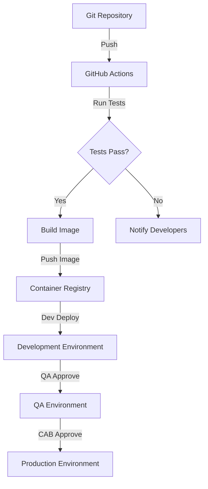

# Cloud Composer 2 / Airflow 2.X Migration Backend

This repository contains the backend implementation for migrating Apache Airflow 1.10.15 on Cloud Composer 1 to Apache Airflow 2.X on Cloud Composer 2. It includes DAGs, plugins, configuration files, deployment scripts, and test infrastructure.


## Introduction

This project implements the migration of existing Apache Airflow 1.10.15 workflows from Cloud Composer 1 to Cloud Composer 2 with Airflow 2.X. The migration addresses the critical need to modernize our workflow orchestration platform while maintaining existing business logic and functionality.

Key objectives of this project:

- Migrate all DAGs and plugins to be compatible with Airflow 2.X
- Implement industry-standard CI/CD practices for deployment
- Maintain strict governance controls for deployment processes
- Ensure zero data loss and 100% functional parity during migration
- Improve performance, security, and scalability through Cloud Composer 2

This backend repository contains all the necessary components, configurations, and tools to achieve these objectives.

## Getting Started

### Prerequisites

- [Docker](https://www.docker.com/get-started) (20.10+)
- [Docker Compose](https://docs.docker.com/compose/install/) (1.29+)
- [Python](https://www.python.org/downloads/) (3.8)
- [Git](https://git-scm.com/downloads)
- Google Cloud SDK (optional for cloud deployment)

### Quick Setup

1. Clone the repository:

```bash
git clone <repository-url>
cd src/backend
```

2. Create environment file from template:

```bash
cp .env.example .env
# Edit .env with your configuration
```

3. Start the local development environment:

```bash
docker-compose up -d
```

4. Access the Airflow web interface at http://localhost:8080 (default credentials: admin/admin)

### Verifying Installation

Check that all containers are running properly:

```bash
docker-compose ps
```

The output should show all services (webserver, scheduler, worker, etc.) as "Up" and healthy.

## Repository Structure

```
src/backend/
├── dags/                  # Airflow DAGs
│   ├── utils/            # DAG utilities
│   ├── example_dag_basic.py # Standard pattern example
│   └── README.md         # DAG-specific documentation
├── plugins/              # Airflow plugins
│   ├── hooks/            # Custom connection hooks
│   ├── operators/        # Custom operators
│   └── sensors/          # Custom sensors
├── providers/            # Custom provider packages
├── config/               # Configuration files
│   ├── variables.json    # Airflow variables
│   └── connections.json  # Airflow connections
├── migrations/           # Migration scripts and tools
├── scripts/              # Utility scripts
├── terraform/            # Infrastructure as code
├── ci-cd/                # CI/CD configuration
├── monitoring/           # Monitoring configuration
├── docs/                 # Documentation
├── .env.example          # Environment template
├── airflow.cfg           # Airflow configuration
├── docker-compose.yml    # Local development setup
├── Dockerfile            # Container definition
├── requirements.txt      # Python dependencies
└── README.md             # This file
```

For further details on specific components:
- [DAGs Documentation](./dags/README.md)
- [Migration Guide](./docs/migration_guide.md)
- [Architecture Overview](./docs/composer2_architecture.md)

## Local Development Environment

This project uses Docker to provide a consistent development environment that closely mirrors the Cloud Composer 2 production environment.

### Container Architecture

The `docker-compose.yml` file defines the following services:

- **webserver**: Airflow UI and REST API
- **scheduler**: Task scheduler
- **worker**: Task executor
- **flower**: Celery monitoring tool
- **postgres**: Metadata database
- **redis**: Task queue and result backend
- **init**: One-time initialization service

### Common Operations

#### Starting the Environment

```bash
docker-compose up -d
```

#### Stopping the Environment

```bash
docker-compose down
```

#### Viewing Logs

```bash
# All services
docker-compose logs -f

# Specific service
docker-compose logs -f scheduler
```

#### Running Airflow CLI Commands

```bash
docker-compose exec webserver airflow dags list
```

#### Testing a DAG

```bash
docker-compose exec webserver airflow dags test example_dag_basic $(date +%Y-%m-%d)
```

#### Accessing the Database

```bash
docker-compose exec postgres psql -U airflow -d airflow
```

### Volume Mounts

The following directories are mounted into the containers:

- `./dags`: Airflow DAG files (automatically loaded)
- `./plugins`: Airflow plugins
- `./config`: Configuration files
- `./logs`: Log output

Changes to these directories are reflected in real-time within the containers.

## Migration Guide

The migration from Airflow 1.10.15 to 2.X involves several key components:

### Key Migration Areas

1. **Code Changes**:
   - Update import paths to new provider packages
   - Replace deprecated operators with their new equivalents
   - Update DAG initialization patterns to use context manager style
   - Convert suitable Python functions to TaskFlow API

2. **Infrastructure Changes**:
   - Move from Cloud Composer 1 to Cloud Composer 2
   - Adapt to GKE-based architecture in Cloud Composer 2
   - Configure networking and security settings

3. **Database Migration**:
   - Schema updates for Airflow 2.X metadata
   - Data migration for existing workflows

4. **Deployment Process**:
   - Implement CI/CD pipeline with GitHub Actions
   - Set up multi-environment deployment workflow
   - Configure approval gates between environments

### Migration Tools

The following tools are available to assist with migration:

- `migrations/migration_airflow1_to_airflow2.py`: Automated code migration tool
- `scripts/validate_dags.py`: Validates DAGs for Airflow 2.X compatibility
- `scripts/backup_metadata.py`: Creates backups before migration

Detailed migration instructions are available in the [Migration Guide](./docs/migration_guide.md).

## Testing

Comprehensive testing is essential for ensuring a successful migration with 100% functional parity.

### Test Approach

This project uses a multi-layered testing approach:

1. **Unit Testing**: Testing individual components in isolation
2. **Integration Testing**: Testing component interactions
3. **Migration Testing**: Verifying migration correctness
4. **Performance Testing**: Comparing performance metrics
5. **End-to-End Testing**: Complete workflow validation

### Running Tests Locally

```bash
# Run all tests
python -m pytest src/test

# Run specific test categories
python -m pytest src/test/dag_tests
python -m pytest src/test/migration_tests

# Run with specific markers
python -m pytest src/test -m "migration and not integration"

# Run with coverage report
python -m pytest src/test --cov=src/backend --cov-report=html
```

### Test Structure

Tests are organized in the `src/test` directory, with subdirectories for different test categories. For more information, see the [Testing Documentation](../test/README.md).

## Deployment

The project implements a robust CI/CD pipeline for automated testing and deployment.

### CI/CD Pipeline

The deployment pipeline uses GitHub Actions to automate the process of testing, building, and deploying to different environments:

1. **Development**: Automated deployment after successful test run
2. **QA**: Deployment with peer review and QA approval
3. **Production**: Deployment with CAB, Architect, and Stakeholder approval

### Deployment Process



### Manual Deployment

For manual deployment to development:

```bash
bash src/backend/ci-cd/deploy-dev.sh
```

See the CI/CD configuration in the `ci-cd` directory for more details.

## Environment Configuration

### Environment Variables

The following environment variables can be configured:

| Variable | Description | Default |
|----------|-------------|--------|\n| `AIRFLOW__CORE__EXECUTOR` | Task executor | `CeleryExecutor` |\n| `AIRFLOW__DATABASE__SQL_ALCHEMY_CONN` | Database connection string | *varies by env* |\n| `AIRFLOW__CELERY__BROKER_URL` | Celery broker URL | *varies by env* |\n| `AIRFLOW__CORE__LOAD_EXAMPLES` | Load example DAGs | `False` |\n| `GOOGLE_APPLICATION_CREDENTIALS` | GCP credentials path | *required* |\n

See `.env.example` for a complete list of configurable variables.

### Environment-Specific Configuration

Configuration files for different environments are available in the `config` directory:

- `config/composer_dev.py`: Development environment settings
- `config/composer_qa.py`: QA environment settings
- `config/composer_prod.py`: Production environment settings

### Customizing Configuration

For local development, create a `.env` file from the template:

```bash
cp .env.example .env
# Edit .env with your settings
```

For Cloud Composer 2 environments, use the Terraform configurations in the `terraform` directory.

## Security

### Authentication

The following authentication methods are supported:

- **Google SSO**: For user authentication in Airflow web UI
- **Service Accounts**: For automated processes and API access
- **API Keys**: For external integrations

### Authorization

Role-Based Access Control (RBAC) is implemented with the following roles:

- **Viewer**: Read-only access to DAGs and logs
- **User**: Can trigger DAGs but cannot modify
- **Editor**: Can modify DAGs in development/QA
- **Admin**: Full access to all features

### Secrets Management

Sensitive information is stored in Google Cloud Secret Manager. For local development, sensitive values can be stored in the `.env` file (not committed to git).

### Security Best Practices

- All communications use TLS 1.3
- Service accounts use the principle of least privilege
- Network access is restricted by IP and VPC
- Authentication is required for all endpoints
- Regular security scans are performed on containers and dependencies

For detailed security guidelines, see [Security Guidelines](./docs/security_guidelines.md).

## Troubleshooting

### Common Issues

#### Cannot Start Docker Containers

```
Error: Bind for 0.0.0.0:8080 failed: port is already in use
```

**Solution**: Another service is using port 8080. Either stop that service or modify `docker-compose.yml` to use a different port.

#### DAG Import Errors

```
Error: [Errno 2] No module named 'apache_airflow_providers_google'
```

**Solution**: Missing provider package. Ensure the package is listed in `requirements.txt` and your container has the latest dependencies installed.

#### Database Migration Issues

```
Error: Database schema version mismatch
```

**Solution**: Run database initialization and migration:

```bash
docker-compose exec webserver airflow db init
```

#### Worker Not Processing Tasks

```
Solution**: Check Redis connection and Celery configuration:

```bash
docker-compose logs worker
docker-compose exec redis redis-cli ping
```

### Getting Help

For additional troubleshooting, consult:

- [Airflow Documentation](https://airflow.apache.org/docs/apache-airflow/2.5.1/)
- [Cloud Composer 2 Documentation](https://cloud.google.com/composer/docs)
- Submit an issue in the project repository

## References

### Project Documentation

- [DAGs Documentation](./dags/README.md)
- [Migration Guide](./docs/migration_guide.md)
- [Architecture Overview](./docs/composer2_architecture.md)
- [Operator Migration](./docs/operator_migration.md)
- [Deployment Guide](./docs/deployment_guide.md)
- [Testing Documentation](../test/README.md)

### External Resources

- [Apache Airflow Documentation](https://airflow.apache.org/docs/apache-airflow/2.5.1/)
- [Airflow 2.0 Migration Guide](https://airflow.apache.org/docs/apache-airflow/2.0.0/migration-guide.html)
- [Cloud Composer 2 Documentation](https://cloud.google.com/composer/docs)
- [Google Cloud SDK Documentation](https://cloud.google.com/sdk/docs)

### Change History

See the [Changelog](./docs/changelog.md) for version history and changes.