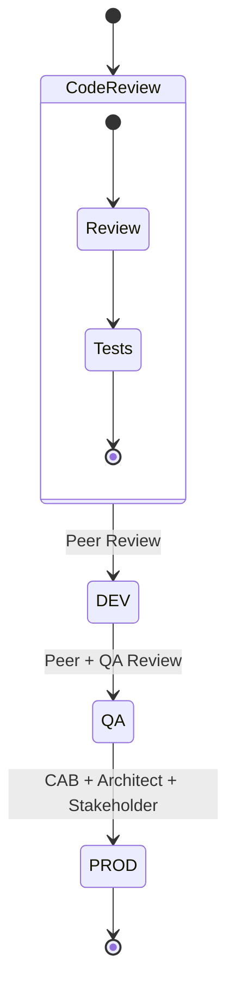

# DAGs Repository for Cloud Composer 2 / Airflow 2.X

This repository contains Apache Airflow Directed Acyclic Graphs (DAGs) that have been migrated from Airflow 1.10.15 on Cloud Composer 1 to Airflow 2.X on Cloud Composer 2. The migration follows best practices and patterns to ensure functional parity while leveraging the new features and improvements in Airflow 2.X.

## Repository Structure

The DAGs repository is organized as follows:

```
dags/
├── __init__.py             # DAGs package initialization
├── example_dag_basic.py    # Example DAG using standard pattern
├── example_dag_taskflow.py # Example DAG using TaskFlow API
├── data_sync.py            # Data synchronization workflow
├── etl_main.py             # Main ETL workflow
├── reports_gen.py          # Reporting workflow
├── utils/                  # Utility modules
│   ├── __init__.py         # Utils package initialization
│   ├── gcp_utils.py        # GCP integration utilities
│   ├── db_utils.py         # Database utilities
│   ├── alert_utils.py      # Alerting utilities
│   └── validation_utils.py # Validation utilities
└── README.md               # This documentation file
```

## Migration Patterns

This repository showcases two main patterns for Airflow 2.X DAG development:

1. **Standard Pattern** (example_dag_basic.py): Traditional approach using operators directly
2. **TaskFlow API Pattern** (example_dag_taskflow.py): Modern approach using Python function decorators

Each pattern has its advantages and appropriate use cases. The TaskFlow API generally results in cleaner, more Pythonic code with better type checking, while the standard pattern offers more explicit control and compatibility with all operator types.

### Key Changes from Airflow 1.10.15 to Airflow 2.X

1. **Import Path Changes**: Many operators have moved to provider packages
2. **Parameter Renaming**: Some parameters have been renamed for consistency
3. **TaskFlow API**: New decorators for simplifying Python task definitions
4. **Typed XComs**: Better typing support for data passing between tasks
5. **New Scheduler**: Improved scheduler architecture and performance

### Migration Checklist

- [ ] Update import statements to Airflow 2.X package structure
- [ ] Replace deprecated operators with their new versions
- [ ] Update DAG parameters to conform to Airflow 2.X requirements
- [ ] Convert applicable Python functions to TaskFlow API
- [ ] Update connection and variable references
- [ ] Test for functional parity with Airflow 1.10.15 version
- [ ] Verify DAG parsing and execution in Airflow 2.X environment
- [ ] Update documentation with Airflow 2.X specifics
- [ ] Implement improved error handling available in Airflow 2.X

## DAG Development Guidelines

### Airflow 2.X Best Practices

1. **Use descriptive DAG and task IDs**
   - Use clear, descriptive IDs that reflect the purpose of the DAG or task
   - Follow a consistent naming convention across all DAGs

2. **Properly document DAGs and tasks**
   - Include docstrings for DAGs and tasks with purpose, inputs, and outputs
   - Use the `doc_md` parameter for rich documentation

3. **Configure proper DAG parameters**
   - Use `catchup=False` unless backfilling is specifically required
   - Set appropriate `max_active_runs` to prevent overwhelming resources
   - Define tags for better organization and filtering

4. **Implement error handling**
   - Configure appropriate retries and retry delays
   - Use on_failure_callback for error notification and handling
   - Ensure idempotent task execution

5. **Follow updated import conventions**
   - Use new provider package imports (e.g., `airflow.providers.google.cloud.operators.bigquery`)
   - Update deprecated operator imports (e.g., `airflow.operators.python` instead of `airflow.operators.python_operator`)

6. **Leverage Airflow 2.X features**
   - TaskFlow API for Python functions
   - Typed parameters and returns
   - Custom timetables for complex scheduling

### Operator Migration Reference

| Airflow 1.10.15 Operator | Airflow 2.X Equivalent | Import Path | Parameter Changes |
|--------------------------|------------------------|-------------|-------------------|
| BashOperator | BashOperator | airflow.operators.bash | N/A |
| PythonOperator | PythonOperator | airflow.operators.python | provide_context removed |
| DummyOperator | DummyOperator | airflow.operators.dummy | N/A |
| EmailOperator | EmailOperator | airflow.operators.email | N/A |
| SQLOperator | SQLExecuteQueryOperator | airflow.providers.common.sql.operators.sql | N/A |
| GoogleCloudStorageToBigQueryOperator | GCSToBigQueryOperator | airflow.providers.google.cloud.transfers.gcs_to_bigquery | N/A |
| BigQueryOperator | BigQueryExecuteQueryOperator | airflow.providers.google.cloud.operators.bigquery | use_legacy_sql=False by default |
| BaseSensorOperator | BaseSensor | airflow.sensors.base | N/A |

## Example DAGs

### Standard Pattern Example (example_dag_basic.py)

This DAG demonstrates the traditional Airflow pattern using operators directly:

```python
from airflow import DAG
from airflow.operators.python import PythonOperator
from airflow.operators.bash import BashOperator
from airflow.operators.dummy import DummyOperator
from airflow.utils.dates import days_ago

with DAG(
    'example_dag_basic',
    schedule_interval='@daily',
    start_date=days_ago(1),
    catchup=False,
    tags=['example', 'basic', 'migration'],
) as dag:
    start = DummyOperator(task_id='start')
    process = PythonOperator(task_id='process', python_callable=process_func)
    finish = BashOperator(task_id='finish', bash_command='echo "Done!"')
    
    start >> process >> finish
```

### TaskFlow API Example (example_dag_taskflow.py)

This DAG demonstrates the new TaskFlow API pattern using Python decorators:

```python
from airflow.decorators import dag, task
from airflow.utils.dates import days_ago

@dag(
    schedule_interval='@daily',
    start_date=days_ago(1),
    catchup=False,
    tags=['example', 'taskflow', 'migration'],
)
def example_taskflow_dag():
    
    @task
    def extract():
        # task implementation
        return {'value': 42}
    
    @task
    def process(extracted_value):
        # task implementation
        return {'processed_value': extracted_value['value'] * 10}
    
    @task
    def load(processed_value):
        # task implementation
        print(f"Result: {processed_value['processed_value']}")
    
    # Define the task dependencies
    load(process(extract()))

# Instantiate the DAG
example_dag = example_taskflow_dag()
```

### Converting from Standard Pattern to TaskFlow API

Here's an example of converting a traditional PythonOperator pattern to TaskFlow API:

**Before (Airflow 1.10.15):**
```python
def extract_data(**context):
    # Implementation
    return {'value': 42}
    
def process_data(**context):
    ti = context['ti']
    extracted_value = ti.xcom_pull(task_ids='extract_data')
    # Implementation
    return {'processed_value': extracted_value['value'] * 10}
    
def load_data(**context):
    ti = context['ti']
    processed_value = ti.xcom_pull(task_ids='process_data')
    # Implementation
    print(f"Result: {processed_value['processed_value']}")

with DAG('example_dag', ...) as dag:
    extract = PythonOperator(
        task_id='extract_data',
        python_callable=extract_data,
        provide_context=True,
    )
    
    process = PythonOperator(
        task_id='process_data',
        python_callable=process_data,
        provide_context=True,
    )
    
    load = PythonOperator(
        task_id='load_data',
        python_callable=load_data,
        provide_context=True,
    )
    
    extract >> process >> load
```

**After (Airflow 2.X with TaskFlow API):**
```python
@dag(...)
def example_dag():
    @task
    def extract_data():
        # Implementation
        return {'value': 42}
    
    @task
    def process_data(extracted_value):
        # Implementation
        return {'processed_value': extracted_value['value'] * 10}
    
    @task
    def load_data(processed_value):
        # Implementation
        print(f"Result: {processed_value['processed_value']}")
    
    # Define the task dependencies
    load_data(process_data(extract_data()))

# Instantiate the DAG
example_dag_instance = example_dag()
```

## Utilities and Helpers

The `utils/` directory contains several helpful modules for DAG development:

- **gcp_utils.py**: Functions for interacting with Google Cloud Platform services
- **db_utils.py**: Database interaction utilities
- **alert_utils.py**: Functions for sending alerts and notifications
- **validation_utils.py**: Validation and testing utilities

These utilities are designed to work with Airflow 2.X and Cloud Composer 2, handling proper error handling, logging, and security practices.

### Example: Using GCP Utilities

```python
from airflow import DAG
from airflow.operators.python import PythonOperator
from .utils.gcp_utils import gcs_file_exists, gcs_download_file

def check_and_download(**kwargs):
    bucket_name = 'my-bucket'
    object_name = 'my-file.csv'
    local_path = '/tmp/my-file.csv'
    
    # Check if file exists
    exists = gcs_file_exists(bucket_name, object_name)
    
    if exists:
        # Download the file
        local_file = gcs_download_file(bucket_name, object_name, local_path)
        return local_file
    return None

with DAG('example_gcp_utils', ...) as dag:
    task = PythonOperator(
        task_id='check_and_download',
        python_callable=check_and_download
    )
```

### Example: Using Alert Utilities

```python
from airflow import DAG
from airflow.operators.python import PythonOperator
from .utils.alert_utils import configure_dag_alerts, AlertLevel, send_alert

def task_with_custom_alerts(**kwargs):
    context = kwargs
    try:
        # Task implementation
        result = perform_operation()
        
        # Send success alert with custom message
        send_alert(
            alert_level=AlertLevel.INFO,
            context=context,
            email_to=['success-team@example.com'],
            subject_template="Success: {{ dag_id }} completed successfully"
        )
        return result
    except Exception as e:
        # Send detailed failure alert
        send_alert(
            alert_level=AlertLevel.ERROR,
            context=context,
            exception=e,
            email_to=['failure-team@example.com'],
            slack_channel='#airflow-alerts'
        )
        raise

with DAG('example_alerts', ...) as dag:
    # Configure alerts for the entire DAG
    dag = configure_dag_alerts(
        dag=dag,
        on_failure_alert=True,
        on_retry_alert=True,
        on_success_alert=False,
        email_recipients=['team@example.com'],
        slack_channel='#airflow-notifications'
    )
    
    task = PythonOperator(
        task_id='task_with_alerts',
        python_callable=task_with_custom_alerts
    )
```

## CI/CD Integration

DAGs in this repository follow a strict CI/CD process:

1. **Development**: Changes are made in feature branches
2. **Validation**: Automated testing via GitHub Actions
3. **Review**: Pull requests are reviewed by peers
4. **Deployment**: Approved changes are deployed to environments in sequence:
   - Development -> QA -> Production

Each environment has appropriate safeguards and validation steps.

### Approval Workflow



### CI/CD Pipeline Components

| Stage | Requirements | Automation |
|-------|--------------|------------|
| Build | - Lint checks<br>- Unit tests<br>- Security scan | GitHub Actions |
| Test | - Integration tests<br>- DAG validation<br>- Dependency check | Pytest, Airflow CLI |
| Review | - Code review<br>- Architecture review<br>- Security review | Pull Requests |
| Deploy | - Environment validation<br>- Smoke tests<br>- Rollback plan | GitHub Actions, GCS |
| Monitor | - Health checks<br>- Performance metrics<br>- Alert rules | Cloud Monitoring |

## Testing Strategies

Testing DAGs is critical for ensuring reliability. This repository uses several testing approaches:

1. **DAG Validation**: Verifies DAG structure and imports
2. **Unit Testing**: Tests individual task functions
3. **Integration Testing**: Tests interactions between tasks
4. **End-to-End Testing**: Tests complete DAG execution

See the `src/test/` directory for test implementations and examples.

### DAG Testing Methods

| Test Type | Purpose | Implementation | Examples |
|-----------|---------|----------------|----------|
| Static Analysis | Code quality, style | pylint, flake8 | `pylint dags/` |
| DAG Import Test | Valid DAG structure | pytest | `test_dag_import.py` |
| Unit Tests | Test task functions | pytest | `test_task_functions.py` |
| Integration Tests | Test task interactions | pytest-airflow | `test_task_integration.py` |
| DAG Run Tests | Test end-to-end execution | Airflow CLI | `airflow dags test` |

### Example: Testing a TaskFlow Function

```python
from airflow.decorators import task
import pytest

@task
def add_numbers(a, b):
    return a + b

def test_add_numbers():
    # Test the function directly
    result = add_numbers.function(5, 3)
    assert result == 8
    
    # Test with the Airflow context
    from airflow.utils.session import create_session
    from airflow.models import TaskInstance, DagRun
    
    # Setup would depend on your testing framework
    # This is a simplified example
    with create_session() as session:
        # Create necessary objects
        # Execute the task
        # Verify results
        pass
```

## Common Pitfalls and Solutions

### Import Errors

**Problem**: Import paths have changed in Airflow 2.X
**Solution**: Refer to the [Airflow 2.0 migration guide](https://airflow.apache.org/docs/apache-airflow/2.0.0/migration-guide.html) for updated import paths

### Task Dependencies

**Problem**: Task dependencies syntax has been streamlined
**Solution**: Use the `>>` and `<<` operators consistently or use the TaskFlow API

### XCom Usage

**Problem**: XComs work differently with TaskFlow API
**Solution**: Return values from TaskFlow functions automatically become XComs

### Connection Handling

**Problem**: Connection handling changes in Airflow 2.X
**Solution**: Use provider-specific hooks with appropriate connection IDs

### provide_context Parameter Removed

**Problem**: The `provide_context=True` parameter is removed in Airflow 2.X
**Solution**: Context is automatically provided to all Python callables in Airflow 2.X

### Task Name Collisions with TaskFlow API

**Problem**: TaskFlow API uses function names as task_ids by default
**Solution**: Use the `task_id` parameter of the `@task` decorator to set a custom task_id

## References

- [Migration Guide](../docs/migration_guide.md) - Comprehensive migration guide
- [Best Practices](../docs/best_practices.md) - Best practices for Airflow 2.X
- [Operator Migration](../docs/operator_migration.md) - Operator migration details
- [Apache Airflow Documentation](https://airflow.apache.org/docs/apache-airflow/stable/index.html) - Official Airflow 2.X documentation
- [Cloud Composer 2 Documentation](https://cloud.google.com/composer/docs) - Official Cloud Composer 2 documentation
- [Airflow 2.0 Migration Guide](https://airflow.apache.org/docs/apache-airflow/2.0.0/migration-guide.html) - Official migration guide from Apache Airflow