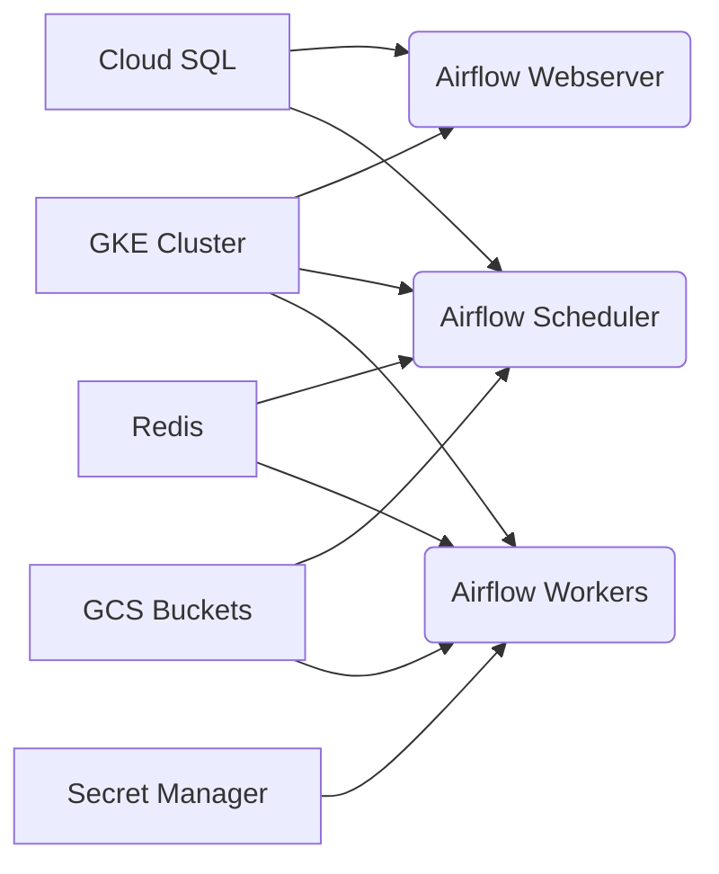
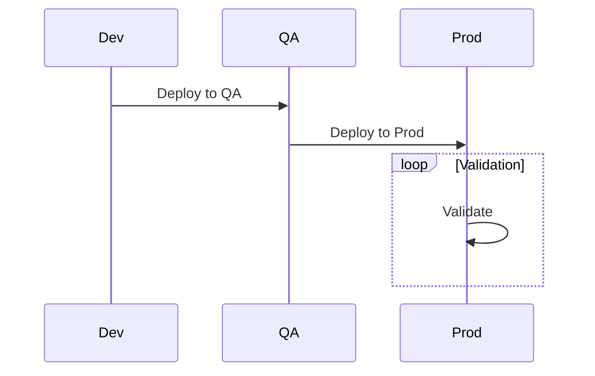

# Migration Guide: Airflow 1.10.15 to Airflow 2.X on Cloud Composer 2

## Introduction

This document provides a comprehensive guide for migrating from Apache Airflow 1.10.15 on Cloud Composer 1 to Airflow 2.X on Cloud Composer 2. It covers code migration, database schema changes, deployment procedures, validation methods, and best practices for a successful transition.

This migration aims to modernize the workflow orchestration platform, improve performance, enhance security features, and provide better scalability through Cloud Composer 2's modern infrastructure.

### Migration Goals

-   Upgrade Airflow from version 1.10.15 to a supported 2.X version.
-   Migrate from Cloud Composer 1 to Cloud Composer 2.
-   Ensure 100% functional parity with the existing Airflow 1.10.15 implementation.
-   Implement a robust CI/CD pipeline for Airflow DAGs.
-   Automate the deployment process across multiple environments (Dev, QA, Prod).
-   Minimize downtime during the migration.
-   Ensure zero data loss during the migration process.

### Benefits of Migrating to Airflow 2.X on Cloud Composer 2

-   **Improved Performance**: Airflow 2.X offers significant performance improvements, including faster DAG parsing and task execution.
-   **Enhanced Security**: Cloud Composer 2 provides enhanced security features, such as workload identity and private IP networking.
-   **Better Scalability**: Cloud Composer 2's container-based infrastructure allows for better scalability and resource utilization.
-   **Modernized Infrastructure**: Cloud Composer 2 is built on Google Kubernetes Engine (GKE), providing a modern and scalable infrastructure for Airflow.
-   **Community Support**: Airflow 2.X is actively maintained by the Apache Airflow community, ensuring access to the latest features and security updates.
-   **Provider Packages**: Airflow 2.X uses provider packages, which allows for more modularity and easier dependency management.

### Prerequisites

-   Familiarity with Apache Airflow and Cloud Composer.
-   Access to a Google Cloud Platform (GCP) project with Cloud Composer enabled.
-   Basic understanding of CI/CD principles and tools.
-   A backup of the existing Airflow 1.10.15 environment.
-   A Cloud Composer 2 environment to migrate to.

## Cloud Composer 2 Architecture Overview

Cloud Composer 2 leverages Google Kubernetes Engine (GKE) to provide a scalable and resilient platform for Airflow. Key components include:

-   **GKE Cluster**: Hosts Airflow components in Docker containers.
-   **Airflow Webserver**: Provides a user interface for managing and monitoring DAGs.
-   **Airflow Scheduler**: Schedules and triggers DAG runs.
-   **Airflow Workers**: Execute Airflow tasks.
-   **Cloud SQL**: Stores Airflow metadata.
-   **Redis**: Task queue for Celery executor.
-   **GCS Buckets**: Stores DAG files and logs.
-   **Secret Manager**: Manages sensitive configuration.



## Migration Planning

### Assessment

-   **Inventory**: Create a detailed inventory of all DAGs, plugins, connections, and variables in the existing Airflow 1.10.15 environment.
-   **Dependencies**: Identify any external dependencies or custom code used in the DAGs.
-   **Complexity**: Assess the complexity of each DAG and estimate the migration effort.
-   **Testing**: Create a comprehensive set of test cases to validate the migrated DAGs.
-   **Performance**: Baseline performance metrics of the current environment to ensure the migrated system meets or exceeds those metrics.

### Timing and Resources

-   **Timeline**: Estimate the time required for each migration phase, including assessment, code migration, testing, and deployment.
-   **Team**: Assemble a team with the necessary skills and expertise, including Airflow developers, DevOps engineers, and QA engineers.
-   **Budget**: Allocate a budget for the migration project, including resources for tools, training, and infrastructure.

### Risk Assessment

-   **Downtime**: Identify potential downtime during the migration and develop a mitigation plan.
-   **Data Loss**: Implement measures to prevent data loss during the migration, such as database backups and replication.
-   **Compatibility**: Assess the compatibility of existing DAGs and plugins with Airflow 2.X and develop a migration strategy.
-   **Security**: Ensure that the migrated environment meets the organization's security requirements.

## Environment Preparation

### GCP Environment Setup

-   Create a new GCP project or use an existing one for Cloud Composer 2.
-   Enable the Cloud Composer API and other necessary APIs, such as Cloud Storage, Cloud SQL, and Secret Manager.
-   Configure IAM roles and permissions for the migration team and the Cloud Composer service account.
-   Set up a Cloud Composer 2 environment with the desired Airflow version and configuration.

### Backup Existing System

-   Create a full backup of the existing Airflow 1.10.15 metadata database.
-   Download all DAG files, plugins, connections, and variables from the existing environment.
-   Store the backup in a secure location, such as a Cloud Storage bucket.

### Set Up Migration Tools

-   Install the Airflow 2.X CLI and other necessary tools on a local machine or a cloud-based development environment.
-   Configure the Airflow CLI to connect to the Cloud Composer 2 environment.
-   Set up a code repository for managing the migrated DAGs and plugins.

## Code Migration

### DAG Code Migration

-   **Import Statements**: Update import statements to reflect the new Airflow 2.X package structure.
-   **Operator Migration**: Replace deprecated operators with their Airflow 2.X equivalents.
-   **TaskFlow API**: Convert suitable PythonOperators to the TaskFlow API for simplified DAG creation.
-   **Parameter Changes**: Update DAG and task parameters to match the Airflow 2.X API.
-   **XComs**: Review and update XCom usage patterns to ensure compatibility with Airflow 2.X.
-   **Timezones**: Ensure all DAGs are timezone aware.

### Plugins Migration

-   **Custom Operators**: Update custom operators to inherit from the Airflow 2.X base classes.
-   **Custom Hooks**: Migrate custom hooks to the new Airflow 2.X hook interface.
-   **Custom Sensors**: Update custom sensors to the Airflow 2.X sensor interface.
-   **Provider Packages**: Package custom operators, hooks, and sensors into provider packages for easier management.

### Connections Migration

-   **Connection Format**: Migrate connection definitions to the new Airflow 2.X format.
-   **Provider Packages**: Use provider packages for connections to external systems, such as GCP services, databases, and APIs.
-   **Secret Management**: Store sensitive connection information, such as passwords and API keys, in Secret Manager.

### Variables Migration

-   **Variable Format**: Migrate variable definitions to the new Airflow 2.X format.
-   **Environment Variables**: Use environment variables for configuration settings that vary across environments.
-   **Secret Management**: Store sensitive variable information in Secret Manager.

## Database Migration

### Schema Migration

-   **Backup**: Back up the existing Airflow 1.10.15 metadata database.
-   **Alembic**: Use Alembic to migrate the database schema to the Airflow 2.X format.
-   **Validation**: Verify that the database schema has been migrated successfully.

### Data Migration

-   **Data Transfer**: Transfer data from the existing Airflow 1.10.15 metadata database to the new Airflow 2.X database.
-   **Data Integrity**: Verify that all data has been transferred correctly and that there is no data loss.

## Infrastructure Migration

### Cloud Composer 1 to Cloud Composer 2

-   **Environment Setup**: Set up a new Cloud Composer 2 environment with the desired Airflow version and configuration.
-   **Network Configuration**: Configure the network settings for the Cloud Composer 2 environment, including VPC, subnets, and firewall rules.
-   **Security Configuration**: Configure the security settings for the Cloud Composer 2 environment, including IAM roles, service accounts, and encryption keys.
-   **Scaling Configuration**: Configure the scaling settings for the Cloud Composer 2 environment, including the number of workers, scheduler resources, and web server resources.

## Testing and Validation

### Unit Tests

-   **Operator Tests**: Write unit tests for all migrated operators to ensure they function correctly.
-   **Hook Tests**: Write unit tests for all migrated hooks to ensure they can connect to external systems.
-   **Sensor Tests**: Write unit tests for all migrated sensors to ensure they can detect events.

### Integration Tests

-   **DAG Tests**: Write integration tests for all migrated DAGs to ensure they can run successfully and produce the expected results.
-   **End-to-End Tests**: Write end-to-end tests to validate the entire workflow, including data ingestion, processing, and storage.

### Validation Steps

-   **DAG Parsing**: Validate that all DAG files parse correctly in the Cloud Composer 2 environment.
-   **Task Execution**: Verify that all tasks execute successfully and produce the expected results.
-   **Data Integrity**: Validate that all data has been migrated correctly and that there is no data loss.
-   **Performance**: Verify that the migrated environment meets the performance requirements.
-   **Security**: Verify that the migrated environment meets the security requirements.

## Deployment Strategy

### Phased Deployment

-   **Development**: Deploy the migrated DAGs and plugins to a development environment for initial testing and validation.
-   **QA**: Deploy the migrated DAGs and plugins to a QA environment for more thorough testing and validation.
-   **Production**: Deploy the migrated DAGs and plugins to a production environment after successful testing and validation in the QA environment.

### Rollback Procedures

-   **Backup**: Create a backup of the existing Airflow 1.10.15 environment before deploying to production.
-   **Rollback Plan**: Develop a detailed rollback plan in case of issues during the production deployment.
-   **Rollback Steps**: Document the steps required to roll back to the existing Airflow 1.10.15 environment.

### Cut-Over Planning

-   **Downtime**: Minimize downtime during the cut-over to the Cloud Composer 2 environment.
-   **Monitoring**: Set up monitoring and alerting for the Cloud Composer 2 environment to detect any issues after the cut-over.
-   **Communication**: Communicate the cut-over plan to all stakeholders and provide regular updates on the progress.



## Post-Migration Activities

### Monitoring

-   **Performance**: Monitor the performance of the Cloud Composer 2 environment, including DAG parsing time, task execution time, and resource utilization.
-   **Reliability**: Monitor the reliability of the Cloud Composer 2 environment, including uptime, error rates, and task retries.
-   **Security**: Monitor the security of the Cloud Composer 2 environment, including access logs, security alerts, and vulnerability scans.

### Performance Tuning

-   **Resource Allocation**: Adjust the resource allocation for the Cloud Composer 2 environment, such as the number of workers, scheduler resources, and web server resources, to optimize performance.
-   **Configuration Settings**: Tune the Airflow configuration settings to improve performance, such as the DAG parsing interval, task concurrency, and XCom settings.
-   **Code Optimization**: Optimize the DAG code to improve performance, such as reducing the number of tasks, using more efficient operators, and minimizing data transfer.

### Cleanup Procedures

-   **Remove Old Environment**: Remove the existing Airflow 1.10.15 environment after the migration is complete and the Cloud Composer 2 environment is stable.
-   **Remove Backup**: Remove the backup of the existing Airflow 1.10.15 environment after it is no longer needed.
-   **Update Documentation**: Update the documentation to reflect the new Airflow 2.X environment and the migration process.

## Common Issues and Solutions

| Issue | Cause | Solution |
|-------|-------|----------|
| DAG parsing failures | Import path changes | Update import statements according to Airflow 2.X structure |
| Task failures | Operator parameter changes | Remove deprecated parameters and update to new formats |
| Database connection errors | Connection information format changes | Update connection definitions to new provider format |
| Missing modules | Provider packages | Install appropriate provider packages |
| Scheduler errors | Configuration changes | Update scheduler configuration for Airflow 2.X |
| Performance issues | Resource allocation | Adjust resource allocation in Cloud Composer 2 |

## References

-   [Apache Airflow Documentation](https://airflow.apache.org/docs/)
-   [Cloud Composer Documentation](https://cloud.google.com/composer/docs/)
-   [Airflow 2.X Upgrade Guide](https://airflow.apache.org/docs/apache-airflow/stable/upgrading-from-1-10/index.html)
-   [Cloud Composer 1 to 2 Migration Guide](https://cloud.google.com/composer/docs/composer-2/composer-1-to-2-overview)

## Appendices

### Detailed Code Examples

#### Airflow 1.X DAG

```python
from airflow import DAG
from airflow.operators.bash_operator import BashOperator
from airflow.operators.python_operator import PythonOperator
from datetime import datetime

default_args = {
    'owner': 'airflow',
    'start_date': datetime(2023, 1, 1),
    'provide_context': True
}

dag = DAG(
    'example_dag',
    default_args=default_args,
    schedule_interval='@daily'
)

def process_data(**kwargs):
    print('Processing data')
    return 'Processed'

start = BashOperator(
    task_id='start',
    bash_command='echo "Starting process"',
    dag=dag
)

process = PythonOperator(
    task_id='process',
    python_callable=process_data,
    dag=dag
)

start >> process
```

#### Airflow 2.X DAG

```python
from airflow import DAG
from airflow.operators.bash import BashOperator
from airflow.operators.python import PythonOperator
from datetime import datetime

with DAG(
    'example_dag',
    default_args={
        'owner': 'airflow',
    },
    start_date=datetime(2023, 1, 1),
    schedule_interval='@daily',
) as dag:

    def process_data(**kwargs):
        print('Processing data')
        return 'Processed'

    start = BashOperator(
        task_id='start',
        bash_command='echo "Starting process"'
    )

    process = PythonOperator(
        task_id='process',
        python_callable=process_data
    )

    start >> process
```

#### TaskFlow API Conversion

##### Traditional Approach

```python
def extract(**kwargs):
    return {"count": 50}

def transform(count, **kwargs):
    return {"count": count * 2}

def load(count, **kwargs):
    print(f"Final count: {count}")

extract_task = PythonOperator(
    task_id='extract',
    python_callable=extract,
    dag=dag,
)

transform_task = PythonOperator(
    task_id='transform',
    python_callable=transform,
    op_kwargs={'count': '{{ task_instance.xcom_pull(task_ids="extract")["count"] }}'},
    dag=dag,
)

load_task = PythonOperator(
    task_id='load',
    python_callable=load,
    op_kwargs={'count': '{{ task_instance.xcom_pull(task_ids="transform")["count"] }}'},
    dag=dag,
)

extract_task >> transform_task >> load_task
```

##### TaskFlow API

```python
from airflow.decorators import task

@task
def extract():
    return {"count": 50}

@task
def transform(count):
    return {"count": count * 2}

@task
def load(count):
    print(f"Final count: {count}")

with DAG('example_dag_taskflow', start_date=datetime(2023, 1, 1)) as dag:
    extract_result = extract()
    transform_result = transform(extract_result["count"])
    load(transform_result["count"])
```

#### Database Migration Example

```bash
# Back up existing database
$ python src/backend/scripts/backup_metadata.py --env dev

# Run migration script
$ python src/backend/migrations/migration_airflow1_to_airflow2.py --steps database --env dev

# Verify migration success
$ python src/backend/scripts/validate_dags.py --validation-level ERROR
```

#### Automated Migration Script

```bash
$ ./infrastructure/scripts/migrate_composer1_to_composer2.sh \
  --source-env composer1-dev \
  --target-env composer2-dev \
  --project my-gcp-project \
  --env-type dev \
  --backup-dir /path/to/backups
```

### Migration Checklist

#### Pre-Migration Checklist

-   [ ] Inventory all DAGs, plugins, connections, and variables
-   [ ] Baseline performance metrics of current environment
-   [ ] Back up all configurations and database
-   [ ] Create test cases covering critical DAG functionality
-   [ ] Set up Cloud Composer 2 test environment
-   [ ] Ensure all developers have required permissions
-   [ ] Document current Airflow configuration settings
-   [ ] Update GCP IAM roles for Cloud Composer 2
-   [ ] Schedule migration window with stakeholders
-   [ ] Review resource requirements for Cloud Composer 2

#### Code Migration Checklist

-   [ ] Update import statements to Airflow 2.X package structure
-   [ ] Replace deprecated operators with new versions
-   [ ] Update DAG initialization to use with DAG context manager
-   [ ] Remove provide_context parameter from PythonOperators
-   [ ] Convert suitable PythonOperators to TaskFlow API
-   [ ] Update custom plugins to match Airflow 2.X interfaces
-   [ ] Migrate connections to provider package format
-   [ ] Review and update XCom usage patterns
-   [ ] Verify sensor timeout behavior conforms to Airflow 2.X
-   [ ] Update SubDagOperators to TaskGroups where appropriate

#### Testing Checklist

-   [ ] Validate all DAG files parse correctly in Airflow 2.X
-   [ ] Test execution of each migrated DAG
-   [ ] Verify all task dependencies execute in correct order
-   [ ] Compare task execution times with baseline
-   [ ] Validate external system connections work properly
-   [ ] Test error handling and retry mechanisms
-   [ ] Verify custom plugins function correctly
-   [ ] Validate scheduler behavior matches expectations
-   [ ] Test concurrent task execution behavior
-   [ ] Validate web UI functionality for migrated DAGs

#### Deployment Checklist

-   [ ] Deploy to development environment first
-   [ ] Verify all functionality in development
-   [ ] Get approval to proceed to QA environment
-   [ ] Deploy to QA and perform full validation
-   [ ] Schedule production deployment window
-   [ ] Back up production environment before migration
-   [ ] Deploy to production with enhanced monitoring
-   [ ] Verify critical DAGs operate correctly
-   [ ] Monitor system performance post-migration
-   [ ] Document any required post-migration adjustments

### Reference Tables

#### Operator Migration Reference

| Airflow 1.X Operator | Airflow 2.X Operator | Import Path | Notes |
|----------------------|----------------------|-------------|-------|
| BashOperator | BashOperator | airflow.operators.bash | Moved to new package location |
| PythonOperator | PythonOperator | airflow.operators.python | provide_context removed; consider TaskFlow API |
| DummyOperator | DummyOperator | airflow.operators.dummy | Consider EmptyOperator instead |
| BigQueryOperator | BigQueryExecuteQueryOperator | airflow.providers.google.cloud.operators.bigquery | Part of google provider package |
| GoogleCloudStorageToGoogleCloudStorageOperator | GCSToBigQueryOperator | airflow.providers.google.cloud.transfers.gcs_to_gcs | Renamed for consistency |
| SubDagOperator | SubDagOperator | airflow.operators.subdag | Consider using TaskGroups instead |

#### Parameter Changes

| Parameter | Airflow 1.X | Airflow 2.X | Notes |
|-----------|-------------|-------------|-------|
| provide_context | Required for PythonOperator context | Always enabled by default | Remove this parameter |
| schedule_interval | In DAG constructor or default_args | Only in DAG constructor | Move to DAG constructor |
| on_success_callback | Function name | Function name | Signature change in some cases |
| sla | timedelta in task | timedelta in task | Behavior slightly modified |
| execution_timeout | timedelta in task | timedelta in task | More strictly enforced |

#### Environment Configuration Comparison

| Feature | Cloud Composer 1 | Cloud Composer 2 | Migration Consideration |
|-----------------|--------------------|--------------------|-------------------------|
| Airflow Version | 1.10.15 | 2.X | Code compatibility required |
| Infrastructure | VMs with agents | GKE | Different scaling model |
| Networking | Legacy networking | VPC-native | New networking configuration |
| Scaling | VM-based scaling | Container-based scaling | Different resource planning |
| Python Version | 3.6 or 3.7 | 3.8+ | Verify Python compatibility |
| Security | Basic IAM | Enhanced with Workload Identity | Updated IAM configuration required |

#### Common Issues and Solutions

| Issue | Cause | Solution |
|-----------------------|---------------------------------|-----------------------------------------------------------------|
| DAG parsing failures | Import path changes | Update import statements according to Airflow 2.X structure |
| Task failures | Operator parameter changes | Remove deprecated parameters and update to new formats |
| Database connection errors | Connection information format changes | Update connection definitions to new provider format |
| Missing modules | Provider packages | Install appropriate provider packages |
| Scheduler errors | Configuration changes | Update scheduler configuration for Airflow 2.X |
| Performance issues | Resource allocation | Adjust resource allocation in Cloud Composer 2 |

### Command Examples

#### Environment Setup

```bash
./infrastructure/scripts/setup_environments.sh --env dev
```

Sets up Cloud Composer 2 environment for development

#### Database Migration

```bash
python src/backend/migrations/migration_airflow1_to_airflow2.py --steps database --env dev
```

Migrates the database schema from Airflow 1.X to 2.X

#### DAG Validation

```bash
python src/backend/scripts/validate_dags.py --dags-folder /path/to/dags --validation-level ERROR
```

Validates DAGs for Airflow 2.X compatibility

#### Full Migration

```bash
./infrastructure/scripts/migrate_composer1_to_composer2.sh --source-env composer1-dev --target-env composer2-dev --project my-gcp-project
```

Performs complete migration from Composer 1 to Composer 2

### Architecture Diagrams

#### Cloud Composer 2

Detailed architecture of Cloud Composer 2 environment showing core components


##### Components

-   **GKE Cluster**: Kubernetes cluster that hosts Airflow components
-   **Airflow Webserver**: Web UI and REST API for Airflow
-   **Airflow Scheduler**: Schedules and triggers DAG runs
-   **Airflow Workers**: Execute Airflow tasks
-   **Cloud SQL**: Stores Airflow metadata
-   **Redis**: Task queue for Celery executor
-   **GCS Buckets**: Stores DAG files and logs
-   **Secret Manager**: Manages sensitive configuration

##### Relationships

-   Airflow Webserver reads/writes to Cloud SQL
-   Airflow Scheduler reads/writes to Cloud SQL
-   Airflow Scheduler reads DAGs from GCS Buckets
-   Airflow Scheduler queues tasks to Redis
-   Airflow Workers consume tasks from Redis
-   Airflow Workers read DAGs/write logs to GCS Buckets
-   Airflow Workers retrieve secrets from Secret Manager

#### Migration Architecture

Architecture diagram illustrating the migration process

```mermaid
graph LR
    A[Source Environment] --> B(Migration Tools)
    B --> C{Backup}
    C --> D[Backup Storage]
    B --> E{Transform}
    E --> F[Target Environment]
    F --> G{Deploy}
    G --> H[Validation System]
    H --> I{Test and Verify}
    I --> J{Cutover}