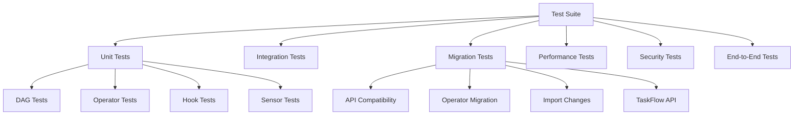
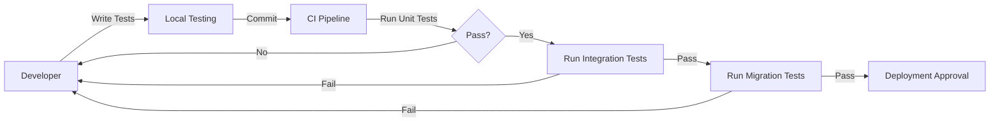

# Test Suite Overview

This directory contains the comprehensive test suite for validating the migration from Apache Airflow 1.10.15 running on Cloud Composer 1 to Apache Airflow 2.X on Cloud Composer 2. The test suite is designed to validate functionality, ensure backward compatibility, and verify performance improvements across the migration process.

# Test Directory Structure

The test suite is organized into specialized subdirectories that target different aspects of testing:

- **config/**: Test configuration files including pytest.ini and coverage settings
- **docs/**: Detailed documentation for different test categories and approaches
- **fixtures/**: Reusable test fixtures, mock data, and testing utilities
- **utils/**: Helper functions and test utilities for implementing tests
- **dag_tests/**: Tests specific to DAG functionality and structure
- **operator_tests/**: Tests for operators, including migration compatibility tests
- **hook_tests/**: Tests for hooks, including migration compatibility tests
- **sensor_tests/**: Tests for sensors, including migration compatibility tests
- **migration_tests/**: Tests specifically focused on migration compatibility and validation
- **integration_tests/**: Tests for integration with external systems and services
- **performance_tests/**: Tests for measuring and validating performance improvements
- **security_tests/**: Tests for validating security controls and compliance
- **e2e/**: End-to-end tests across complete workflows
- **ci/**: CI/CD integration scripts and utilities for test automation

# Test Categories

The test suite includes the following categories of tests:

- **Unit Tests**: Tests for individual components in isolation
- **Integration Tests**: Tests for interactions between components and external systems
- **Migration Tests**: Tests specifically designed to validate migration compatibility
- **Performance Tests**: Tests to measure and compare performance metrics
- **Security Tests**: Tests to validate security controls and compliance
- **End-to-End Tests**: Tests for complete workflow validation

# Test Environment Setup

Instructions for setting up and configuring different test environments

- **Local Development Environment**: Setting up a local environment for test development and execution
- **CI/CD Environment**: How tests run in automated CI/CD pipelines

# Running Tests

Instructions for running tests in different environments and configurations

- **Running All Tests**: Commands for running the entire test suite
```bash
cd $(git rev-parse --show-toplevel)
pytest src/test/
```
- **Running Test Categories**: Commands for running specific test categories
```bash
cd $(git rev-parse --show-toplevel)
pytest -m migration src/test/
```
- **Running with Coverage**: Commands for running tests with coverage reporting
```bash
cd $(git rev-parse --show-toplevel)
pytest --cov=src/backend src/test/ --cov-report=html
```
- **Using CI scripts to run tests**:
```bash
cd $(git rev-parse --show-toplevel)
src/test/ci/run_unit_tests.sh
```

# Test Markers

Pytest markers used to categorize and selectively run tests

# Migration Testing

Specific approach for testing migration-related aspects

# CI/CD Integration

Details on how tests are integrated into the CI/CD pipelines and affect deployment processes

# Test Coverage Requirements

Minimum coverage thresholds and measurement approach

| Component | Minimum Coverage | Critical Paths |
|---|---|---|
| DAGs | 90% | Task dependencies, Error handling |
| Operators | 85% | Execute method, Parameter validation |
| Hooks | 85% | Connection handling, API interaction |
| Sensors | 85% | Poke method, Timeout handling |
| Utilities | 80% | Helper functions, Validation logic |
| Plugins | 80% | Registration, Functionality |

# Testing Best Practices

Guidelines for writing effective tests for this project

# Additional Resources

Links to more detailed testing documentation and resources

# Test Implementation Checklist

- [ ] Test follows naming conventions (test_*.py)
- [ ] Test has clear, descriptive docstring
- [ ] Test uses appropriate markers (@pytest.mark.category)
- [ ] Test is isolated and doesn't depend on other tests
- [ ] Test cleans up after itself (no lingering resources)
- [ ] Test has clear assertions with meaningful error messages
- [ ] Test covers both success and failure cases
- [ ] Test is efficient and doesn't waste resources
- [ ] Test doesn't contain hardcoded paths or credentials
- [ ] Test dependencies and fixtures are clearly defined

# Migration Test Checklist

- [ ] Imports updated to Airflow 2.X patterns
- [ ] Deprecated operators replaced with new equivalents
- [ ] Parameter names updated for compatibility
- [ ] TaskFlow API used where appropriate
- [ ] DAG parses successfully in Airflow 2.X
- [ ] Task dependencies maintained correctly
- [ ] XCom functionality verified
- [ ] Execution behavior matches Airflow 1.X
- [ ] Performance metrics meet or exceed baselines
- [ ] Integration with GCP services verified

# Example migration test
```python
import pytest
from airflow.operators.bash import BashOperator
from airflow.models import DAG
from datetime import datetime

@pytest.mark.migration
def test_bashoperator_migration():
    """Test that BashOperator works correctly after migration to Airflow 2.X."""
    dag = DAG('test_dag', start_date=datetime(2023, 1, 1))
    
    # Create operator with Airflow 2.X import
    task = BashOperator(
        task_id='test_task',
        bash_command='echo "Hello, Airflow 2.X!"',
        dag=dag
    )
    
    # Verify operator properties
    assert task.task_id == 'test_task'
    assert task.bash_command == 'echo "Hello, Airflow 2.X!"'
```

# Test Categories Hierarchy


# Test Execution Flow


# Test Categories and Commands

| Category | Description | Command |
|---|---|---|
| All Tests | Run the complete test suite | pytest src/test/ |
| Unit Tests | Tests for individual components | pytest -m unit src/test/ |
| Integration Tests | Tests for component interactions | pytest -m integration src/test/ |
| Migration Tests | Tests for migration compatibility | pytest -m migration src/test/ |
| Performance Tests | Tests for performance metrics | pytest -m performance src/test/ |
| Security Tests | Tests for security controls | pytest -m security src/test/ |
| End-to-End Tests | Tests for complete workflows | pytest -m e2e src/test/ |