# Testing Guide: Apache Airflow Migration Project

## Introduction

Overview of the testing approach for the Apache Airflow migration project from version 1.10.15 to 2.X on Cloud Composer 2.

### Purpose

Explanation of the testing philosophy, goals, and importance in ensuring a successful migration.

### Success Criteria

Definition of what constitutes successful testing for this migration project, aligned with the project's technical specifications.

### Testing Scope

Description of what is included and excluded from the testing strategy.

## Testing Framework Overview

Description of the pytest-based testing framework implemented for this project.

### Framework Selection

Explanation of why pytest was chosen and its advantages for Airflow testing.

### Framework Setup

How to install and configure the testing framework and its dependencies.

### Configuration

Details of `pytest.ini` configuration settings and their purposes.

## Test Categories

Comprehensive overview of different test types used in the project.

### Unit Tests

Tests that validate individual components in isolation.

### Integration Tests

Tests that validate interactions between components.

### Migration Tests

Tests specifically designed to validate migration compatibility.

### Performance Tests

Tests that measure and compare performance metrics before and after migration.

### Security Tests

Tests that validate security aspects and controls.

### End-to-End Tests

Tests that validate complete workflows across the system.

## Test Organization

Description of the test directory structure and organization principles.

### Directory Structure

Explanation of the test directory hierarchy and organization.

```mermaid
flowchart TD
    A[src/test/] --> B[config/]
    A --> C[docs/]
    A --> D[fixtures/]
    A --> E[utils/]
    A --> F[dag_tests/]
    A --> G[operator_tests/]
    A --> H[hook_tests/]
    A --> I[sensor_tests/]
    A --> J[migration_tests/]
    A --> K[integration_tests/]
    A --> L[performance_tests/]
    A --> M[security_tests/]
    A --> N[e2e/]
    
    B --> B1[pytest.ini]
    B --> B2[conftest.py]
    B --> B3[.coveragerc]
    
    C --> C1[TESTING.md]
    C --> C2[MIGRATION_TESTING.md]
    C --> C3[TEST_EXAMPLES.md]
    
    D --> D1[mock_data.py]
    D --> D2[dag_fixtures.py]
    
    E --> E1[test_helpers.py]
    E --> E2[airflow2_compatibility_utils.py]
    
    F --> F1[test_dag_integrity.py]
    F --> F2[test_dag_migration.py]
```



### Naming Conventions

Standards for naming test files, functions, and classes.

### Test Discovery

How tests are automatically discovered and selected for execution.

## Test Environment

Details on setting up and managing test environments.

### Local Development Environment

Setting up a local environment for test development and execution.

### CI/CD Environment

How tests run in automated CI/CD pipelines.

### Environment Isolation

Techniques for ensuring tests don't interfere with each other.

### Test Data Management

Approaches for managing test data and fixtures.

## Writing Tests

Guide to creating effective tests for the migration project.

### Test Structure

Standard patterns and structure for test implementation.

### Using Fixtures

How to create and use test fixtures for consistent testing.

### Mocking External Services

Techniques for isolating tests from external dependencies.

### Parametrized Testing

Creating data-driven tests with multiple inputs and expected outputs.

### Assertions and Validations

Best practices for verifying test results and writing clear assertions.

## Testing DAGs

Specific approaches for testing Airflow DAGs during migration.

### DAG Integrity Testing

Validating DAG structure and dependencies.

### Task Testing

Testing individual tasks within DAGs.

### Operator Testing

Testing operators and their behavior before and after migration.

### Execution Testing

Testing the execution flow of DAGs.

### XCom Testing

Testing data passing between tasks using XComs.

## Migration-Specific Testing

Testing strategies specifically focused on migration validation.

### Import Statement Migration

Testing updated import patterns required by Airflow 2.X.

### Operator Migration

Testing migrated operators from deprecated to new versions.

### TaskFlow API Testing

Testing implementations of the new TaskFlow API.

### Configuration Testing

Testing updated configuration settings and parameters.

## Running Tests

Instructions for executing tests in different environments.

### Command Line Execution

Running tests via CLI commands.

### IDE Integration

Running and debugging tests from popular IDEs.

### Test Selection

Selecting specific tests or test categories for execution.

### Parallel Execution

Running tests in parallel for faster feedback.

## Test Coverage

Approaches for measuring and ensuring comprehensive test coverage.

### Coverage Requirements

Minimum coverage thresholds for different components.

### Coverage Measurement

Tools and techniques for measuring code coverage.

### Coverage Reporting

Generating and interpreting coverage reports.

### Coverage Enforcement

Ensuring coverage standards are maintained.

## Test Automation

Integration of tests with automated CI/CD pipelines.

### GitHub Actions Integration

How tests are executed in GitHub Actions workflows.

### Pipeline Stages

How tests are distributed across CI/CD pipeline stages.

### Approval Gates

Test-based criteria for progressing through deployment stages.

### Test Reporting

Automated generation and distribution of test results.

## Test Utilities

Helper functions and tools available for test implementation.

### Test Helpers

Overview of utility functions in `test_helpers.py`.

### DAG Testing Utilities

Specialized utilities for DAG testing.

### Migration Testing Utilities

Utilities specific to migration testing.

### Assertion Utilities

Helpers for complex assertions and validations.

## Troubleshooting

Common testing issues and their solutions.

### Common Test Failures

Frequent issues encountered in tests and how to resolve them.

### Debugging Techniques

Strategies for diagnosing and fixing test problems.

### Environment Issues

Resolving test environment configuration problems.

## Best Practices

Guidelines and recommendations for effective testing.

### Test-First Development

Writing tests before implementing changes.

### Test Independence

Ensuring tests can run in any order without dependencies.

### Test Readability

Writing clear, maintainable tests.

### Continuous Testing

Integrating testing into the development workflow.

### Documentation

Documenting tests and test strategies.

## Examples

Practical examples of tests for different scenarios.

### Unit Test Example

Example of a basic unit test.

```python
import pytest
from src.backend.dags.utils.gcp_utils import validate_gcs_path

def test_validate_gcs_path():
    """Test the GCS path validation function."""
    # Valid path scenarios
    assert validate_gcs_path('gs://bucket/path') == True
    assert validate_gcs_path('gs://my-bucket/folder/file.txt') == True
    
    # Invalid path scenarios
    assert validate_gcs_path('bucket/path') == False
    assert validate_gcs_path('https://bucket/path') == False
    assert validate_gcs_path(None) == False
```

### DAG Test Example

Example of a DAG integration test.

```python
import pytest
from airflow.models import DagBag

def test_dag_integrity():
    """Test that DAGs load without errors after migration."""
    dag_bag = DagBag(dag_folder='src/backend/dags', include_examples=False)
    
    # Assert that there are no import errors
    assert len(dag_bag.import_errors) == 0, f"DAG import errors: {dag_bag.import_errors}"
    
    # Assert specific DAGs are present
    assert 'etl_main' in dag_bag.dags
    assert 'data_sync' in dag_bag.dags
    assert 'reports_gen' in dag_bag.dags
```

### Migration Test Example

Example of a migration compatibility test.

```python
import pytest
from airflow.models import DAG
from datetime import datetime

from airflow.providers.google.cloud.operators.bigquery import BigQueryExecuteQueryOperator

def test_bigquery_operator_migration():
    """Test that BigQueryOperator migrates correctly to Airflow 2.X."""
    dag = DAG('test_dag', start_date=datetime(2023, 1, 1))
    
    # Create an operator using Airflow 2.X conventions
    task = BigQueryExecuteQueryOperator(
        task_id='bq_query',
        sql='SELECT COUNT(*) FROM `dataset.table`',
        use_legacy_sql=False,
        location='us-central1',
        dag=dag
    )
    
    # Validate the operator properties
    assert task.task_id == 'bq_query'
    assert 'use_legacy_sql' in task.__dict__
    assert task.use_legacy_sql == False
    assert 'location' in task.__dict__
```

### Performance Test Example

Example of a performance benchmark test.

```python
import pytest
import time
from airflow.models import DagBag

@pytest.mark.performance
def test_dag_parsing_performance():
    """Test that DAG parsing meets performance requirements after migration."""
    start_time = time.time()
    
    # Parse the DAGs
    dag_bag = DagBag(dag_folder='src/backend/dags', include_examples=False)
    
    # Calculate parsing time
    parsing_time = time.time() - start_time
    
    # Assert that parsing completes within 30 seconds as per requirements
    assert parsing_time < 30, f"DAG parsing took {parsing_time} seconds, which exceeds the 30 second requirement"
    
    # Assert number of DAGs parsed
    assert len(dag_bag.dags) > 0, "No DAGs were parsed"
    print(f"Parsed {len(dag_bag.dags)} DAGs in {parsing_time:.2f} seconds")
```

### Using Test Helpers Example

```python
import pytest
from datetime import datetime
from src.test.utils.test_helpers import AirflowTestEnvironment, create_mock_connection, run_dag_task

from src.backend.dags.data_sync import dag

def test_data_sync_extract_task():
    """Test the extract task from the data_sync DAG."""
    # Set up test environment with mocked connections
    with AirflowTestEnvironment(
        env_vars={'AIRFLOW__CORE__DAGS_FOLDER': 'src/backend/dags'},
        connections=[
            create_mock_connection(
                conn_id='gcp_conn',
                conn_type='google_cloud_platform',
                conn_params={'project': 'test-project'}
            )
        ]
    ):
        # Run the extract task and verify results
        execution_date = datetime(2023, 1, 1)
        result = run_dag_task(dag, 'extract_data', execution_date)
        
        assert result is not None
        assert 'records' in result
        assert result['records'] > 0
```

## Resources

Additional resources and references for testing.

### Documentation

Links to relevant project and external documentation.

### Learning Resources

Tutorials, guides, and learning materials.

### Community Support

Forums and community resources for help.

## Appendices

Additional reference materials.

### Glossary

Definitions of testing terms and concepts.

### Checklists

Testing checklists for different scenarios.

### Configuration Reference

Detailed reference for pytest configuration options.